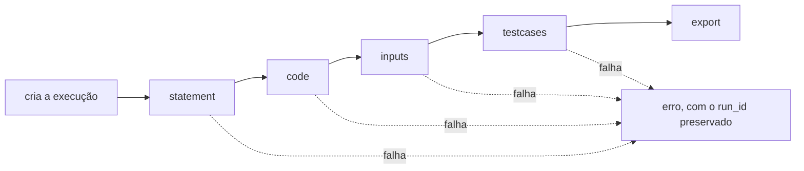

# `POST /create_question`

<p class="lead">As cinco etapas numa chamada. Cria a execução, gera tudo, exporta o XML e devolve o resultado de cada etapa — incluindo o <code>run_id</code>, para poder inspecionar o que ficou no disco.</p>

## Pedido

<span class="ce-badge ce-badge--post">POST</span> `/create_question`

```json
{
  "statement_request": {
    "difficulty": "facil",
    "can_has_repetition": true
  },
  "qty": 10
}
```

| Campo | Tipo | Obrigatório | Omissão | Efeito |
| --- | --- | --- | --- | --- |
| `statement_request` | objeto | <span class="ce-badge ce-badge--opt">Não</span> | `{}` | As restrições pedagógicas. Os mesmos campos de [`/gen_statement`](generation.md#gen_statement) |
| `qty` | `int` | <span class="ce-badge ce-badge--opt">Não</span> | `10` | Quantas entradas de teste gerar (1 a 100) |
| `input_request` | objeto | <span class="ce-badge ce-badge--opt">Não</span> | `null` | Forma alternativa de indicar `qty`, por compatibilidade: `{"qty": 5}` |

Exemplo mínimo:

```bash
curl -X POST http://127.0.0.1:8000/create_question \
  -H "Content-Type: application/json" \
  -d '{"statement_request": {}, "qty": 5}'
```

## Execução



!!! info "As etapas são chamadas como funções"
    Não há pedidos HTTP internos — o orquestrador invoca `generation.create_question`, que chama cada etapa por ordem. Ver [Arquitetura](../architecture/index.md#o-orquestrador-chama-funcoes).

!!! success "Uma falha a meio não apaga o trabalho feito"
    O diretório da execução mantém tudo o que as etapas anteriores produziram, e o `run_id` vem no erro. Retome a partir do endpoint individual correspondente — ver [Retomar a meio](../guides/step-by-step-pipeline.md#retomar-a-meio).

## Resposta

<span class="ce-badge">200</span> `CreateQuestionResponse`

```json
{
  "run_id": "20260918T221305Z-1a2b3c4d",
  "statement": {
    "name": "Soma dos numeros pares",
    "statement": "Soma dos numeros pares\n\nLeia..."
  },
  "code": "#include <stdio.h>\n...",
  "inputs": ["5\n1\n2\n3\n4\n5\n"],
  "testcases": [
    { "input": "5\n1\n2\n3\n4\n5\n", "output": "6\n" }
  ],
  "export": {
    "run_id": "20260918T221305Z-1a2b3c4d",
    "file_path": "var/questions/Moodle_Questionnaire.xml",
    "question_count": 1
  }
}
```

Para inspecionar o que ficou no disco:

```bash
RUN=20260918T221305Z-1a2b3c4d
cat var/runs/$RUN/meta.json      # modelo, versões de prompt, restrições pedidas
cat var/runs/$RUN/solution.c
```

## Erros

O erro da etapa que falhou é devolvido tal e qual, com o mesmo estado que o endpoint individual devolveria:

| Estado | Etapa típica | Causa |
| --- | --- | --- |
| `422` | 1 | `difficulty` inválida ou `qty` fora de 1–100 |
| `422` | 4 | A solução gerada não compila, ou uma entrada não termina |
| `502` | 1, 2 ou 3 | O fornecedor falhou depois das tentativas |
| `503` | 1 | Falta `CODEEXPERT_LLM_API_KEY` |

A tabela completa está em [Erros](errors.md).

!!! warning "Uma falha na etapa 4 é frequente e informativa"
    `422` com `stderr` de compilação significa que o modelo gerou código inválido. Regerar costuma resolver. Se acontecer com frequência para as mesmas restrições, o problema está no prompt — e o `meta.json` da execução diz qual foi a versão usada.

## Considerações de utilização

| Aspeto | Realidade |
| --- | --- |
| Duração | Dezenas de segundos: três chamadas ao modelo, uma compilação e `qty` execuções |
| Concorrência | Suportada. Cada chamada tem o seu diretório de execução |
| Custo | Três chamadas ao modelo por questão. Sem cache |
| Idempotência | Nenhuma. Cada chamada cria uma execução nova e acrescenta uma questão ao XML |

## Exemplo: um questionário de dificuldade crescente

```bash
for d in "muito facil" "facil" "medio"; do
  curl -sX POST http://127.0.0.1:8000/create_question \
    -H "Content-Type: application/json" \
    -d "{\"statement_request\": {\"difficulty\": \"$d\", \"can_has_repetition\": true}, \"qty\": 5}" \
    | jq -r '"\(.export.question_count)  \(.statement.name)"'
done
```

!!! tip "As três questões acumulam no mesmo ficheiro"
    Prontas para uma única importação no Moodle. É assim que se constrói um questionário inteiro sem tocar no XML à mão.
