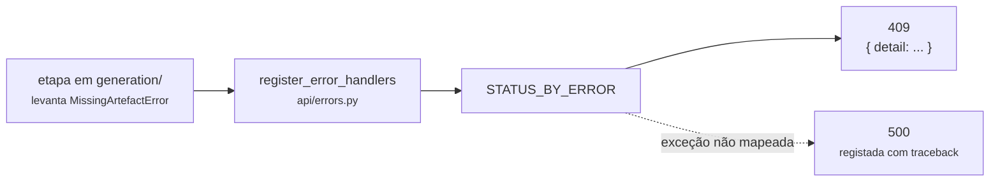

# Erros

<p class="lead">Um formato, uma tabela. Os serviços levantam exceções de domínio e uma única tabela em <code>api/errors.py</code> traduz cada uma num código de estado — não há tratamento de erros espalhado pelos endpoints.</p>

## Formato

Toda a resposta de erro tem a mesma forma:

```json
{ "detail": "'solution.c' not found in run 20260918T221305Z-1a2b3c4d. Generate a solution first (POST /gen_code)." }
```

As mensagens são escritas para serem lidas por uma pessoa e dizem **o que falta e o que fazer**. Chegam ao cliente tal como foram escritas no código.

## O percurso de um erro



Nenhum endpoint tem `try/except`. A etapa levanta a exceção de domínio, um único *handler* procura-a na tabela, e o que não estiver na tabela é `500` com *traceback* no log.

## A tabela

| Exceção de domínio | Estado | Significado |
| --- | --- | --- |
| `RunNotFoundError` | `404` | O `run_id` não existe, ou tem forma inválida |
| `MissingArtefactError` | `409` | A execução existe, mas as etapas foram pedidas fora de ordem |
| `ConfigurationError` | `503` | O servidor não está pronto — falta uma definição |
| `LLMError` | `502` | O fornecedor de modelos falhou |
| `CompilationError` | `422` | O código gerado não compila |
| `ExecutionError` | `422` | A execução não foi possível — sem compilador, ou um programa que não termina |
| *(validação do Pydantic)* | `422` | O corpo do pedido não respeita o esquema |
| *(qualquer outra)* | `500` | Falha não prevista. Fica registada com *traceback* |

!!! info "Acrescentar um tipo de erro"
    Uma exceção nova em `errors.py` e uma linha em `STATUS_BY_ERROR`. Nunca um `try/except` dentro de um endpoint — ver [`.agents/rules/code.md`](https://github.com/HugoRosa29/coderunner_v2/blob/main/.agents/rules/code.md).

---

## `404` — execução desconhecida

```json
{ "detail": "Run '20260918T120000Z-deadbeef' not found. Start a new one with POST /gen_statement." }
```

!!! success "Um `run_id` malformado também é `404`, e não `500`"
    Incluindo tentativas de travessia de caminhos como `../../etc`. A validação acontece em `RunWorkspace`, **antes** de o `run_id` se tornar um caminho no disco — e há um teste só para isso. Ver [Workspace de execução](../architecture/cache-and-state.md).

Para ver que execuções existem:

```bash
ls var/runs/
```

---

## `409` — etapas fora de ordem

```json
{ "detail": "'inputs.json' not found in run 20260918T221305Z-1a2b3c4d. Generate inputs first (POST /gen_inputs)." }
```

A execução existe; o que falta é uma etapa anterior. A mensagem nomeia sempre o endpoint que a produz.

!!! tip "Um `409` não perde trabalho nenhum"
    O diretório da execução continua intacto. Corra a etapa em falta e retome de onde estava — ver [Retomar a meio](../guides/step-by-step-pipeline.md#retomar-a-meio).

| Chamou | Sem ter corrido |
| --- | --- |
| `/gen_code` | `/gen_statement` |
| `/gen_inputs` | `/gen_statement` ou `/gen_code` |
| `/gen_testcases` | `/gen_code` ou `/gen_inputs` |
| `/export_moodle_xml_question` | Qualquer uma das anteriores |

---

## `422` — validação {#422-validacao}

Produzido pelo Pydantic antes de o endpoint correr:

```json
{
  "detail": [
    {
      "type": "enum",
      "loc": ["body", "difficulty"],
      "msg": "Input should be 'muito facil', 'facil', 'medio', 'dificil' or 'muito dificil'"
    }
  ]
}
```

| Campo | Regra |
| --- | --- |
| `difficulty` | Um dos cinco valores |
| `qty` | Inteiro entre 1 e 100 |
| `run_id` | Obrigatório em todas as etapas exceto a primeira |

!!! note "Este é o único erro cujo `detail` não é uma string"
    A validação do Pydantic devolve uma lista de objetos. Todos os outros erros deste documento devolvem `detail` como texto.

---

## `422` — compilação e execução {#422-compilacao-e-execucao}

```json
{ "detail": "Compilation failed:\nsolution.c:5:5: error: expected ';' before '}' token" }
```

A mensagem do compilador chega inteira — é a informação mais útil que existe para perceber o que o modelo gerou mal.

```json
{ "detail": "Input 2 of 5 did not terminate within the time limit. The generated solution probably loops forever on it; regenerate the solution or drop the input." }
```

Antes de existirem limites de tempo, este caso não dava erro nenhum: o pedido ficava pendurado para sempre. Ver [ADR-0004](../adr/0004-execution-behind-a-runner-protocol.md).

```json
{ "detail": "'gcc' was not found on PATH. Install a C compiler to generate test cases." }
```

---

## `502` — falha do fornecedor {#502-falha-do-fornecedor}

```json
{ "detail": "Call to the model provider failed — HTTP 429: {\"error\": {\"message\": \"Rate limit reached\"}}" }
```

Chega aqui depois de esgotadas as tentativas (`CODEEXPERT_LLM_MAX_RETRIES`, 3 por omissão) para estados repetíveis. Estados como `401` falham à primeira, sem repetir.

Também é `502` quando a resposta tem uma forma inesperada:

```json
{ "detail": "Unexpected response shape from the provider: {...}" }
```

---

## `503` — configuração em falta

```json
{ "detail": "CODEEXPERT_LLM_API_KEY is not set. Copy .env.example to .env and fill it in, or export the variable in your shell." }
```

`503` e não `500`: não é um erro do pedido, é o servidor a não estar pronto. `GET /config` diz o mesmo sem custar uma chamada falhada.

---

## Casos que não produzem erro

!!! danger "Os silêncios são mais perigosos do que os erros"
    Todos os casos seguintes devolvem `200`. Só se descobrem ao olhar para o resultado — e o primeiro é a lacuna central do protótipo.

| Situação | O que acontece |
| --- | --- |
| A solução usa uma estrutura proibida | `200`. Nada verifica as restrições |
| O modelo devolve menos entradas do que `qty` | `200`, com a lista mais curta |
| As entradas não correspondem ao que o programa lê | `200`, com todas as saídas vazias |
| O enunciado ignora o formato de blocos pedido | `200`, com o texto inteiro como corpo |
| O modelo devolve prosa em vez de um array JSON | `200`, com as linhas interpretadas como entradas |

Cada um está em [Resolução de problemas](../development/troubleshooting.md). A primeira é a lacuna central do protótipo: [análise de lacunas](../product/gap-analysis.md#as-restricoes-nao-sao-verificadas).
