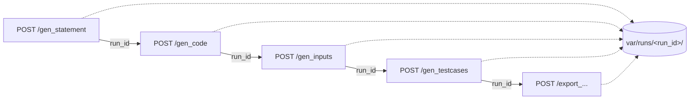

# API

<p class="lead">Oito endpoints: dois de diagnóstico, cinco etapas do pipeline e um orquestrador. Todos públicos, todos síncronos, todos ligados por um <code>run_id</code>.</p>

## Base URL

```text
http://127.0.0.1:8000
```

!!! tip "O caminho mais rápido para explorar a API"
    A raiz redireciona (`307`) para `/docs`, o Swagger UI gerado pelo FastAPI: todos os endpoints, com corpos de exemplo e um botão para os disparar. Não confundir com o `docs/` deste site.

## Autenticação

Não existe. Nenhum endpoint exige credenciais.

!!! danger "O serviço não pode ser exposto"
    Sem autenticação, qualquer máquina que alcance a porta consome a sua chave de API — e provoca compilação e execução de código na sua máquina. Ligue apenas ao *loopback*. Ver [Executar o servidor](../getting-started/running.md).

## Cabeçalhos

```text
Content-Type: application/json
```

Nada mais. As respostas são sempre JSON.

## Os endpoints

| Método | Rota | O que faz |
| --- | --- | --- |
| <span class="ce-badge ce-badge--get">GET</span> | `/health` | Sonda de vida. Não toca em nada externo |
| <span class="ce-badge ce-badge--get">GET</span> | [`/config`](config.md) | Configuração efetiva, opcionalmente verificada contra o fornecedor |
| <span class="ce-badge ce-badge--post">POST</span> | [`/gen_statement`](generation.md#gen_statement) | Etapa 1 — **cria a execução** e devolve o `run_id` |
| <span class="ce-badge ce-badge--post">POST</span> | [`/gen_code`](generation.md#gen_code) | Etapa 2 |
| <span class="ce-badge ce-badge--post">POST</span> | [`/gen_inputs`](generation.md#gen_inputs) | Etapa 3 |
| <span class="ce-badge ce-badge--post">POST</span> | [`/gen_testcases`](generation.md#gen_testcases) | Etapa 4 |
| <span class="ce-badge ce-badge--post">POST</span> | [`/export_moodle_xml_question`](generation.md#export_moodle_xml_question) | Etapa 5 |
| <span class="ce-badge ce-badge--post">POST</span> | [`/create_question`](create-question.md) | As cinco etapas de uma vez |

## O `run_id` liga as etapas



`POST /gen_statement` cria uma execução e devolve o seu identificador. Todas as etapas seguintes recebem-no no corpo do pedido:

```bash
RUN=$(curl -sX POST localhost:8000/gen_statement \
        -H 'Content-Type: application/json' \
        -d '{"difficulty": "facil"}' | jq -r .run_id)

curl -X POST localhost:8000/gen_code -H 'Content-Type: application/json' -d "{\"run_id\": \"$RUN\"}"
```

É o que permite a duas pessoas usarem o mesmo servidor ao mesmo tempo sem se atropelarem. Ver [Workspace de execução](../architecture/cache-and-state.md).

## Estado partilhado

Nenhum, entre execuções. Dentro de uma execução, as etapas comunicam por ficheiros no diretório dessa execução.

!!! info "Chamar uma etapa fora de ordem é `409`, não `500`"
    A resposta nomeia o artefacto em falta **e** o endpoint que o produz. Nada do que já foi gerado se perde. Ver [Erros](errors.md#409-etapas-fora-de-ordem).

## Convenções de resposta

Toda a resposta com sucesso inclui o `run_id`, o que permite continuar o pipeline a partir de qualquer ponto:

```json
{
  "run_id": "20260918T221305Z-1a2b3c4d",
  "name": "Soma de dois numeros",
  "statement": "..."
}
```

Todo o erro tem a mesma forma:

```json
{ "detail": "mensagem escrita para ser lida por uma pessoa" }
```

Ver [Erros](errors.md) para a tabela completa de estados.

## Tempos de resposta

| Endpoint | Ordem de grandeza | Dominado por |
| --- | --- | --- |
| `/health` | milissegundos | Nada |
| `/config` | milissegundos, ou ~1 s com `?verify=true` | A chamada ao fornecedor |
| `/gen_statement`, `/gen_code`, `/gen_inputs` | segundos | O modelo |
| `/gen_testcases` | segundos | Compilação, mais `qty` × até 5 s |
| `/create_question` | dezenas de segundos | A soma de tudo o resto |

Todos são síncronos: o pedido fica aberto até ao fim. Não há filas nem *webhooks* — a plataforma alvo tem-nos; este protótipo não.
