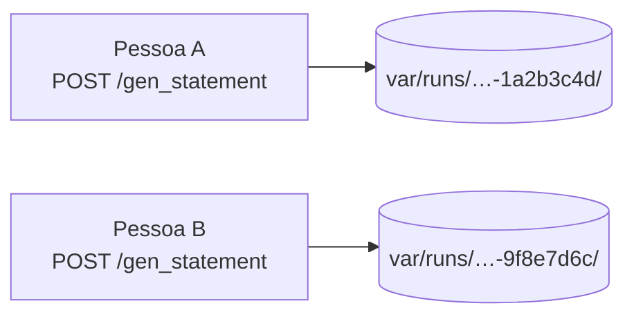

# Workspace de execução

<p class="lead">Cada geração tem o seu próprio diretório, identificado por um <code>run_id</code>. É a unidade de isolamento do serviço: duas execuções em paralelo não se veem.</p>

## O diretório

```text
var/runs/20260918T221305Z-1a2b3c4d/
├── meta.json        restrições, modelo, versões de prompt, reviewed
├── statement.json   {"name": ..., "statement": ...}
├── solution.c       o código C gerado
├── solution         o binário compilado
├── inputs.json      {"inputs": [...]}
└── testcases.json   {"testcases": [{"input": ..., "output": ...}]}
```

O `run_id` é `<timestamp>-<8 hex>`, o que torna a ordem alfabética igual à ordem cronológica:

```bash
ls var/runs/ | tail -5      # as cinco execuções mais recentes
```

## O contrato de ficheiros

| Etapa | Lê | Escreve |
| --- | --- | --- |
| `gen_statement` | — | `statement.json`, `meta.json` |
| `gen_code` | `statement.json` | `solution.c` |
| `gen_inputs` | `statement.json`, `solution.c` | `inputs.json` |
| `gen_testcases` | `solution.c`, `inputs.json` | `solution`, `testcases.json` |
| `export_moodle_xml_question` | `statement.json`, `solution.c`, `testcases.json`, `meta.json` | o XML, fora do *workspace* |

## Chamar uma etapa fora de ordem

`RunWorkspace.require()` diz o que falta **e** o que fazer:

```json
{
  "detail": "'solution.c' not found in run 20260918T221305Z-1a2b3c4d. Generate a solution first (POST /gen_code)."
}
```

O código de estado é `409`: a execução existe, mas o cliente pediu os passos por outra ordem. Um `run_id` desconhecido — ou malformado — é `404`.

### Verificação de existência, não de coerência

O sistema confirma que um ficheiro existe, não que faz sentido. Se editar `solution.c` à mão e voltar a correr a etapa 4, os casos de teste passam a refletir o código novo — enquanto o `statement.json` continua a descrever o problema antigo. Isso é intencional: é o que torna o pipeline editável passo a passo.

## Concorrência

Duas execuções em paralelo escrevem em diretórios diferentes e nunca se tocam:



!!! danger "Antes havia um `cache/` só"
    Todas as execuções partilhavam um diretório, esvaziado no início de cada `POST /create_question`. Duas pessoas a gerar ao mesmo tempo produziam silenciosamente uma questão cujo enunciado e solução vinham de execuções diferentes — sem erro nenhum.

    O motivo da mudança, e o que a torna verificável, está em [ADR-0003](../adr/0003-one-workspace-per-run.md). Há um teste que gera duas execuções em paralelo e confirma que os resultados não se misturam.

## O `run_id` vem do cliente

Todos os endpoints depois do primeiro recebem o `run_id` no corpo do pedido, e esse valor torna-se um segmento de caminho no disco. `RunWorkspace.open()` valida-o contra um padrão fixo antes de tocar no sistema de ficheiros: uma tentativa de travessia (`../../etc`) é um `404`, e existe um teste parametrizado para isso.

## Rastreabilidade: `meta.json`

```json
{
  "run_id": "20260918T221305Z-1a2b3c4d",
  "created_at": "2026-09-18T22:13:05.412Z",
  "constraints": { "can_has_if": true, "difficulty": "facil", "...": "..." },
  "input_quantity": 5,
  "steps": [
    { "step": "statement", "prompt_version": "2026-09-18.1", "model": "gpt-4o-mini", "finished_at": "..." },
    { "step": "code", "prompt_version": "2026-09-18.1", "model": "gpt-4o-mini", "finished_at": "..." }
  ],
  "reviewed": false
}
```

É o que permite responder a "que prompt produziu esta questão?" meses depois, e o pré-requisito do portão de aprovação humana — o campo `reviewed` já existe; falta o fluxo que o altera. Ver [análise de lacunas](../product/gap-analysis.md#o-portao-humano-nao-existe).

## Limpeza

Nada é apagado automaticamente. `var/runs/` cresce a cada geração.

```bash
make clean          # remove var/, .dist/, caches de ferramentas
rm -rf var/runs/*   # só as execuções
```

!!! warning "Falta uma política de retenção"
    Aceitável enquanto isto corre na máquina de cada um. Deixa de ser aceitável no primeiro ambiente partilhado — está registado como lacuna em [Desenvolvimento](../development/index.md#lacunas-conhecidas).

## Nada disto entra no Git {#ficheiros-versionados-que-nao-deviam-estar}

`var/` está inteiro no `.gitignore`, e `make check` recusa uma árvore em que artefactos de execução ou segredos estejam a ser seguidos pelo Git.

!!! info "Historicamente estiveram"
    `cache/` era versionado, incluindo um binário `solution.exe` compilado numa máquina Windows, e `git status` ficava sujo depois de cada execução. Os ficheiros foram removidos do índice; o histórico antigo ainda os contém, o que é inofensivo — não são segredos.

## Diretório de saída

O XML não vive no *workspace* da execução, porque é acumulado entre execuções:

```text
var/questions/Moodle_Questionnaire.xml
```

Ver [Templates Moodle XML](moodle-xml.md#acumulacao).
