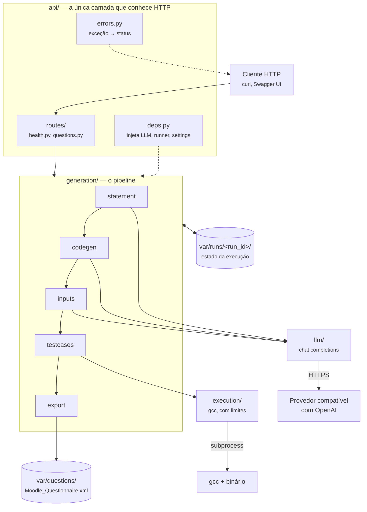
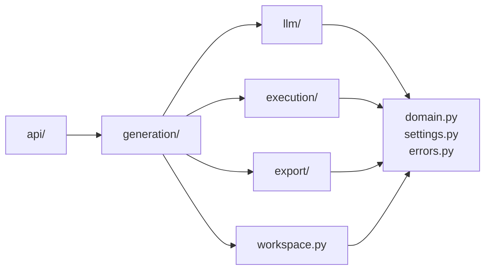
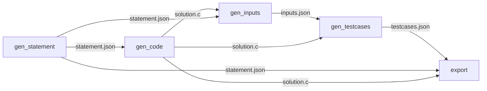
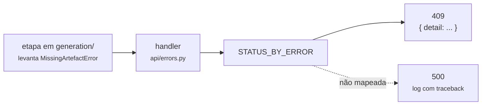

# Arquitetura

<p class="lead">Como o sistema funciona hoje, segundo o código de <code>main</code>. Um único processo FastAPI encadeia cinco etapas; cada etapa lê e escreve arquivos no diretório da execução. Não há banco, fila, front-end nem autenticação.</p>

!!! info "Esta página descreve o presente"
    A arquitetura prevista para 30/11 está em [Roadmap](../product/roadmap.md#arquitetura-esperada-em-3011). A da plataforma completa, em [Arquitetura-alvo (SAD)](../product/target-architecture.md).

## Componentes



| Componente | Responsabilidade | Não faz |
| --- | --- | --- |
| `api/` | Valida o pedido, abre ou cria a execução, traduz exceções em status HTTP | Lógica de geração |
| `generation/` | As etapas e seu encadeamento (`pipeline.py`); todos os prompts (`prompts.py`) | HTTP, `subprocess` |
| `llm/` | Único ponto de contato com o provedor de modelos | Interpretar as respostas |
| `execution/` | Compilar e executar C com limites de tempo e de saída | Saber o que está compilando |
| `export/` | Renderizar o XML do CodeRunner a partir de três templates | Gerar conteúdo |
| `workspace.py` | O diretório da execução e seus arquivos | Saber o que cada arquivo significa |
| `domain.py`, `settings.py`, `errors.py` | Tipos, configuração e exceções | Qualquer efeito externo |

As cinco etapas estão detalhadas em [Pipeline de geração](pipeline.md).

## Direção das dependências



| Invariante | Por quê |
| --- | --- |
| Nada abaixo de `api/` importa FastAPI | Cada etapa continua chamável de um script, de um teste ou de um futuro worker |
| Nada fora de `llm/` chama um modelo | A suíte roda sem rede e sem chave; trocar de provedor não toca nas etapas |
| Nada fora de `execution/` chama `subprocess` | É onde um sandbox real entra — [ADR-0004](../adr/0004-execution-behind-a-runner-protocol.md) |

Nenhuma das três é verificada por ferramenta; quem garante é a revisão. `LLMClient` e `CodeRunner` são `Protocol`, injetados por `api/deps.py` — os testes trocam por `FakeLLM` e `FakeRunner`.

## Fluxo de dados

Nenhuma etapa passa dados para a seguinte em memória. Cada uma escreve um arquivo; a seguinte lê.



Consequências: o pipeline é **retomável** (edita-se um arquivo e roda-se só a etapa seguinte), **inspecionável** (cada resultado é um arquivo) e **ordenado** (chamar uma etapa sem o arquivo de entrada dá `409`). `POST /create_question` chama as mesmas funções em sequência, sem requisições HTTP internas.

## O diretório da execução {#o-diretorio-da-execucao}

```text
var/runs/20260918T221305Z-1a2b3c4d/
├── meta.json        restrições pedidas, modelo e versão de prompt por etapa, reviewed
├── statement.json   {"name": ..., "statement": ...}
├── solution.c       a solução gerada
├── solution         o binário compilado
├── inputs.json      {"inputs": [...]}
└── testcases.json   {"testcases": [{"input": ..., "output": ...}]}
```

| Etapa | Lê | Escreve |
| --- | --- | --- |
| 1 `gen_statement` | — | `statement.json`, `meta.json` |
| 2 `gen_code` | `statement.json` | `solution.c` |
| 3 `gen_inputs` | `statement.json`, `solution.c` | `inputs.json` |
| 4 `gen_testcases` | `solution.c`, `inputs.json` | `solution`, `testcases.json` |
| 5 `export_moodle_xml_question` | `statement.json`, `solution.c`, `testcases.json`, `meta.json` | `var/questions/Moodle_Questionnaire.xml` |

- **`run_id`** é `<timestamp UTC>-<8 hex>`, então `ls var/runs/` lista em ordem cronológica. O cliente envia o `run_id` e ele vira caminho no disco; `RunWorkspace.open()` valida o formato antes, e qualquer outra coisa (inclusive `../../etc`) é `404`.
- **Concorrência:** duas execuções escrevem em diretórios diferentes e não se misturam ([ADR-0003](../adr/0003-one-workspace-per-run.md)). O XML de saída, porém, é um arquivo único lido e reescrito a cada exportação.
- **Rastreabilidade:** `meta.json` registra as restrições, e para cada etapa com prompt, o modelo e a versão (`PROMPT_VERSIONS`). Não registra tokens nem custo.
- **Limpeza:** nada é apagado automaticamente. `make clean` remove `var/` inteiro.

```json title="meta.json"
{
  "run_id": "20260918T221305Z-1a2b3c4d",
  "created_at": "2026-09-18T22:13:05.412Z",
  "constraints": { "can_has_if": true, "difficulty": "facil", "...": "..." },
  "input_quantity": 5,
  "steps": [
    { "step": "statement", "prompt_version": "2026-09-18.1", "model": "gpt-4o-mini", "finished_at": "..." },
    { "step": "testcases", "prompt_version": null, "model": null, "finished_at": "..." }
  ],
  "reviewed": false
}
```

## Erros

Os serviços levantam exceções de `errors.py`. Um único handler em `api/errors.py` procura a exceção na tabela `STATUS_BY_ERROR` e responde `{"detail": "..."}`. Nenhuma rota tem `try/except`.



A tabela completa de status está em [API § Erros](../reference/api.md#erros).

## Integrações externas

| Integração | Usada por | Se falhar |
| --- | --- | --- |
| Provedor de modelos (`/chat/completions` compatível com OpenAI) | Etapas 1, 2, 3 e `GET /config?verify=true` | Até `CODEEXPERT_LLM_MAX_RETRIES` tentativas em erros transitórios; depois `502` |
| `gcc` local | Etapa 4 | `422` com o `stderr` do compilador, ou avisando que o `gcc` não está no `PATH` |
| Sistema de arquivos local (`var/`) | Todas as etapas | Exceção não mapeada, `500` |

## O que não existe

| Aspecto | Hoje | Previsto até 30/11 |
| --- | --- | --- |
| Autenticação e autorização | Nenhuma. Todos os endpoints são públicos | Acesso por convite, cota por usuário — [G8](../product/roadmap.md#acesso-e-custo) |
| Banco de dados | Nenhum. Estado em arquivos locais | Postgres como fonte de verdade — [G0-4, G1](../product/roadmap.md#estado-da-geracao) |
| Front-end | Só o Swagger UI em `/docs` | Interface do professor — [G4](../product/roadmap.md#interface-do-professor) |
| Processamento assíncrono | Nenhum. O pedido fica aberto até o fim; as rotas são `async def` executando código síncrono, o que serializa os pedidos no processo | Geração como job com estado no banco — [G0-8](../product/roadmap.md#estado-da-geracao) |
| Isolamento da execução | Limite de tempo e de saída; sem limite de memória, processos, rede ou sistema de arquivos | Continua assim; risco aceito e documentado — [G8-3](../product/roadmap.md#execucao-de-codigo) |
| Deploy | Nenhum em produção ainda. Roda com `make run` ou na [imagem Docker](../guides/docker.md); o [workflow de deploy](../guides/deploy.md) existe e aguarda a configuração do GCP | Cloud Run com deploy contínuo — [G0-2](../product/roadmap.md#infraestrutura-e-deploy) |

!!! danger "Não exponha o serviço"
    Sem autenticação, qualquer máquina que alcance a porta gasta a chave de API e faz o servidor compilar e executar código. Rode em `127.0.0.1`.

## Entrega hoje

| O quê | Como |
| --- | --- |
| Aplicação | `make run` → `uvicorn codeexpert.api.app:app --reload --port 8000`. `python -m codeexpert` e `python main.py` também funcionam, sem reload e escutando em `0.0.0.0` (todas as interfaces) |
| CI | `.github/workflows/ci.yml` roda `./scripts/check.sh` em push para `main` e em todo PR, e valida título e corpo do PR |
| Documentação | `.github/workflows/docs.yml` constrói este site e publica no GitHub Pages a partir de `main` — ver [Documentação](../reference/docs.md#publicacao) |

As decisões por trás desta forma estão nas [ADRs](../adr/index.md).
