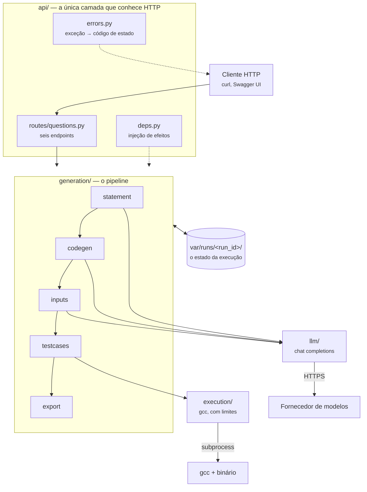
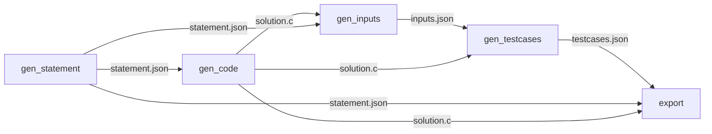

# Arquitetura

Um serviço FastAPI que encadeia cinco etapas. Cada etapa lê o diretório da execução, trabalha e volta a escrever nele — e só uma delas produz verdade em vez de texto gerado.

## Visão geral

!!! quote "Duas coisas que o diagrama diz e vale a pena sublinhar"
    **A etapa 4 não fala com o modelo** — fala com o compilador. E **todo o estado passa pelo diretório da execução**, nunca por memória partilhada.

## Camadas e responsabilidades

| Camada | Responsabilidade | Não faz |
| --- | --- | --- |
| `api/` | Validar o pedido, abrir ou criar a execução, traduzir exceções | Lógica de geração |
| `generation/` | As cinco etapas e o seu encadeamento | Falar HTTP, chamar `subprocess` |
| `llm/` | O único ponto de contacto com um fornecedor de modelos | Interpretar o conteúdo das respostas |
| `execution/` | Compilar e executar, com limites | Saber o que está a compilar |
| `export/` | Renderizar o XML do CodeRunner | Gerar conteúdo |
| `workspace.py` | O diretório da execução e os seus artefactos | Saber o que cada ficheiro significa |
| `domain.py`, `settings.py`, `errors.py` | Tipos, configuração e exceções | Qualquer efeito externo |

A direção das dependências e as três invariantes que a sustentam estão em [Estrutura do projeto](../development/project-structure.md#a-direcao-das-dependencias).

## Comunicação entre etapas

Nenhuma etapa devolve dados à seguinte em memória. Cada uma escreve um ficheiro; a seguinte lê-o.

Três consequências práticas:

- **Retomável.** Se a etapa 3 produziu entradas más, edita-se `inputs.json` à mão e chama-se só a etapa 4.
- **Inspecionável.** O resultado de cada etapa é um ficheiro que se lê.
- **Ordenada.** Chamar uma etapa fora de ordem devolve `409` com o nome da etapa em falta, porque o ficheiro de entrada não existe.

Ver [Workspace de execução](cache-and-state.md).

## O orquestrador chama funções

`POST /create_question` corre as cinco etapas chamando diretamente as funções de `generation/`. Não há pedidos HTTP internos.

!!! note "Nem sempre foi assim"
    A versão anterior usava `fastapi.testclient.TestClient` para chamar os seus próprios endpoints — cinco pedidos de *loopback* para executar cinco chamadas de função, com um caminho de produção a depender de um utilitário de teste. Ver [ADR-0002](../adr/0002-modular-monolith-src-layout.md).

## Rastreabilidade

Cada execução escreve um `meta.json` com as restrições pedidas, o modelo usado, a versão de cada prompt e um campo `reviewed`. É o que permite ligar uma questão problemática ao prompt que a produziu — e o pré-requisito do portão de aprovação humana que o EPIC-017 exige.

## Fluxos que dependem de sistemas externos

| Etapa | Depende de | O que acontece se falhar |
| --- | --- | --- |
| 1, 2, 3 | Fornecedor de modelos | Três tentativas com recuo exponencial em falhas transitórias; depois `502` |
| 4 | `gcc` na máquina | `422`, com a mensagem do compilador ou o *input* que não terminou |
| 5 | Nada | Só sistema de ficheiros |

## Autenticação e autorização

!!! danger "Não existem"
    Todos os endpoints são públicos, e o serviço compila e executa código na máquina onde corre. Não o exponha — ver [Executar o servidor](../getting-started/running.md) e [Deploy](../deployment/index.md).

## Nesta secção

-   :material-pipe: **[Pipeline de geração](pipeline.md)**

    ---

    As cinco etapas em detalhe: o prompt de cada uma, a resposta esperada e como é interpretada.

-   :material-folder-clock-outline: **[Workspace de execução](cache-and-state.md)**

    ---

    O diretório por execução, o contrato de ficheiros entre etapas e o que garante que duas gerações não colidem.

-   :material-robot-outline: **[Integração com o LLM](llm-integration.md)**

    ---

    O cliente, as tentativas, a estratégia de *prompting* e como trocar de fornecedor.

-   :material-file-xml-box: **[Templates Moodle XML](moodle-xml.md)**

    ---

    Os três templates, as substituições, a acumulação de questões e as etiquetas.

-   :material-scale-balance: **[Decisões (ADR)](../adr/index.md)**

    ---

    Porque é que a arquitetura está assim, e o que faria mudar de ideias.

