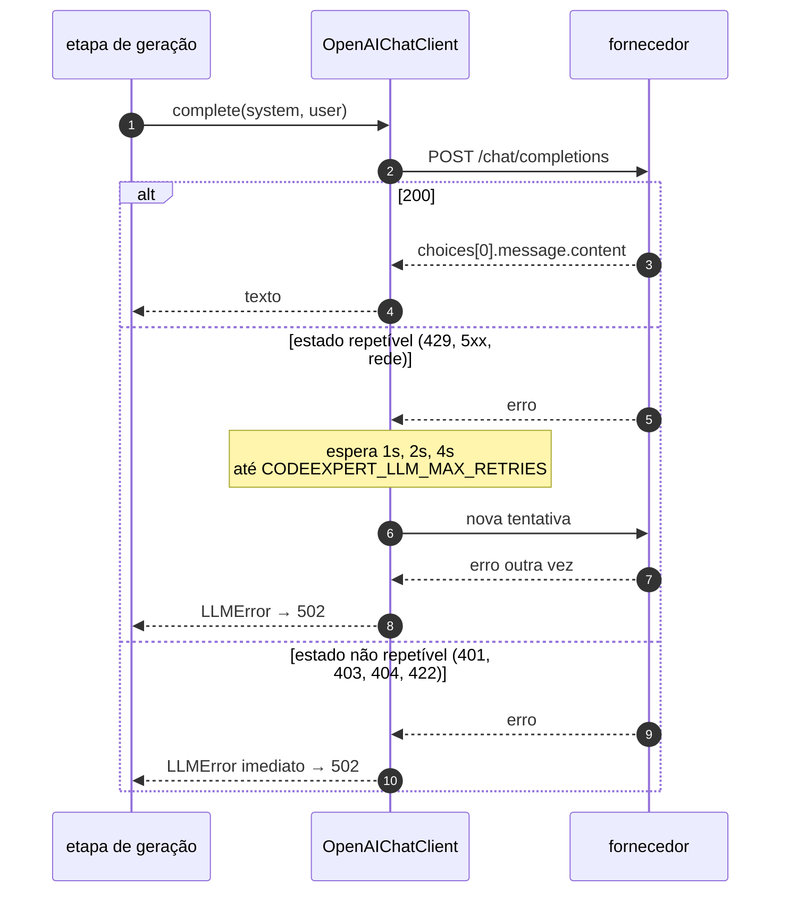

# Integração com o LLM

<p class="lead">Um módulo, uma função, um protocolo. Tudo o resto do código depende da abstração, e é isso que permite à suite de testes correr sem rede e sem chave.</p>

## O cliente

`src/codeexpert/llm/client.py` é o único sítio do projeto que fala com um fornecedor de modelos.

!!! info "A fronteira que torna a suite offline possível"
    Nada fora de `llm/` faz um pedido a um modelo. Não é preferência de arrumação: é o que permite correr os testes todos sem rede e sem chave, e o que deixa trocar de fornecedor sem tocar numa única etapa do pipeline.

```python
class LLMClient(Protocol):
    def complete(self, *, system: str, user: str, temperature: float = 0.7) -> str: ...
```

Duas implementações existem: `OpenAIChatClient`, que faz o pedido real, e o `FakeLLM` dos testes, que devolve respostas guionadas. Nenhum módulo de `generation/` sabe qual está a usar — recebe-o por injeção.

```python title="O pedido"
POST {CODEEXPERT_LLM_BASE_URL}/chat/completions
{
  "model": "<CODEEXPERT_LLM_MODEL>",
  "messages": [
    {"role": "system", "content": "<system prompt da etapa>"},
    {"role": "user", "content": "<prompt construído>"}
  ],
  "temperature": 0.7
}
```

A resposta é reduzida a `choices[0].message.content`, com `strip()`. Uma resposta com outra forma levanta `LLMError`, que a API traduz em `502` — não um `KeyError` opaco.

## Tentativas



Falhas transitórias são repetidas com recuo exponencial: `CODEEXPERT_LLM_MAX_RETRIES` tentativas (3 por omissão), com 1s, 2s, 4s entre elas.

| Situação | Repete? |
| --- | --- |
| Erro de rede ou *timeout* | Sim |
| `408`, `409`, `429`, `500`, `502`, `503`, `504` | Sim |
| `401`, `403`, `404`, `422` | Não — falha de imediato |

A razão é concreta: um fornecedor indisponível a abortar o pipeline na quarta etapa desperdiça o trabalho e o custo das três primeiras. É a mitigação do risco R7 da [análise de lacunas](../product/gap-analysis.md).

!!! warning "As tentativas não são gratuitas"
    Uma etapa que falha três vezes demora 7 segundos só à espera. Com `CODEEXPERT_LLM_TIMEOUT_SECONDS` a 60, o pior caso de uma etapa é perto de três minutos.

## Estratégia de prompting por etapa

Todos os prompts vivem em `generation/prompts.py`. Nenhum outro módulo contém texto de prompt.

| Etapa | System prompt | Formato pedido | Quem interpreta |
| --- | --- | --- | --- |
| `statement` | Gerador de enunciados, texto simples | Blocos `[Título]`, `[Descrição]`, … | `parse_statement` |
| `code` | Gerador de C, sem markdown | Código C em bruto | `strip_code_fences` |
| `inputs` | Gerador de entradas de teste | Array JSON de strings | `parse_inputs` |

Duas convenções deliberadas:

- **As restrições de formato aparecem nos dois prompts**, no *system* e no *user*. É redundância intencional: custa pouco e a taxa de conformidade melhora.
- **Os prompts de conteúdo são em português**, porque o enunciado é para alunos lusófonos. Os de código e de entradas são em inglês, porque produzem código e dados.

### Robustez das respostas

O modelo ignora instruções com regularidade suficiente para justificar defesas explícitas:

| O que o modelo faz | Defesa |
| --- | --- |
| Envolve o código em ` ```c ` apesar de ambos os prompts o proibirem | `strip_code_fences` remove a cerca antes de gravar o `.c` |
| Devolve o array JSON dentro de prosa | `parse_inputs` tenta JSON, depois uma linha com parênteses retos, depois uma entrada por linha |
| Devolve o enunciado sem os blocos pedidos | `parse_statement` usa a primeira linha não vazia como título |

!!! danger "Estas defesas falham em silêncio"
    Se um prompt mudar de forma sem que o analisador acompanhe, nada levanta uma exceção: sai um título errado, uma lista vazia, um ficheiro que não compila. É por isso que são a primeira coisa que a suite testa, e porque alterar um prompt obriga a confirmar o analisador correspondente.

## Versão do prompt

```python
PROMPT_VERSIONS = {"statement": "2026-09-18.1", "code": "2026-09-18.1", "inputs": "2026-09-18.1"}
```

Alterar um prompt obriga a incrementar a entrada correspondente no mesmo *commit*. A versão é gravada no `meta.json` de cada execução; sem isso, ligar um lote de questões más ao prompt que as produziu deixa de ser possível.

## Custo e latência

Uma questão completa faz **três** chamadas ao modelo — enunciado, solução e entradas. A quarta etapa não chama nada: compila e executa.

!!! warning "Não há cache, contabilização de *tokens* nem limite de gasto"
    Cada questão custa três chamadas ao modelo, independentemente de quantas já foram geradas para as mesmas restrições — uma geração em lote paga tudo outra vez.

    É o risco R6 da [análise de lacunas](../product/gap-analysis.md), e a plataforma alvo resolve-o com cache por *hash* e cota por instituição.

## Trocar de provedor {#trocar-de-provedor}

Qualquer serviço com `/chat/completions` no formato da OpenAI funciona sem tocar em código:

=== "Ollama"

    ```bash title=".env"
    CODEEXPERT_LLM_BASE_URL=http://127.0.0.1:11434/v1
    CODEEXPERT_LLM_MODEL=qwen2.5-coder
    CODEEXPERT_LLM_API_KEY=nao-usada-mas-obrigatoria
    ```

=== "vLLM / LM Studio"

    ```bash title=".env"
    CODEEXPERT_LLM_BASE_URL=http://127.0.0.1:8001/v1
    CODEEXPERT_LLM_MODEL=o-nome-do-modelo-servido
    CODEEXPERT_LLM_API_KEY=nao-usada-mas-obrigatoria
    ```

!!! tip "Um modelo local é a forma barata de testar alterações a prompts"
    Trocar `CODEEXPERT_LLM_BASE_URL` chega. A qualidade do enunciado será pior, mas o formato da resposta — que é o que os analisadores exigem — dá para exercitar sem gastar nada.

Para um fornecedor com outro formato de API — o Vertex AI da plataforma alvo, por exemplo — escreve-se uma classe que satisfaça `LLMClient` e escolhe-se em `get_llm_client()`. Nenhuma etapa muda.

## Tratamento de erros

| Situação | Exceção | Resposta |
| --- | --- | --- |
| Chave ausente | `ConfigurationError` | `503`, nomeando a variável |
| Falha de rede ou estado repetível, esgotadas as tentativas | `LLMError` | `502` |
| Estado não repetível (`401`, por exemplo) | `LLMError` | `502`, sem repetir |
| Resposta com forma inesperada | `LLMError` | `502` |

Nenhuma destas é apanhada dentro das etapas. Sobem até `api/errors.py`, que tem a tabela única de tradução.
