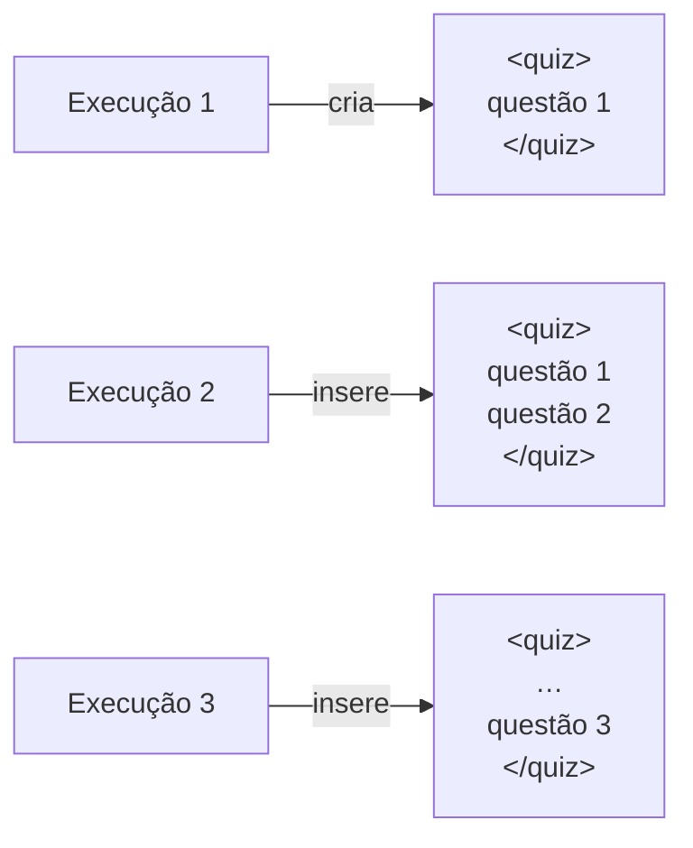

# Templates Moodle XML

<p class="lead">Três ficheiros de texto com marcadores <code>Macro_*</code>, substituídos por texto escapado. O resultado é um ficheiro de questionário que o Moodle importa, e ao qual cada exportação acrescenta mais uma questão.</p>

## Os três templates

Vivem dentro do pacote, em `src/codeexpert/export/templates/`, e são lidos por `importlib.resources` — o que faz o exportador funcionar a partir de um *wheel* instalado, e não só da raiz do repositório.

| Ficheiro | Papel |
| --- | --- |
| `questionnaire.xml` | O invólucro `<quiz>`, com um marcador `Macro_Question` |
| `question.xml` | Uma questão `type="coderunner"` completa |
| `case.xml` | Um `<testcase>` |

## Substituições

### Nível do caso de teste

| Marcador | Substituído por |
| --- | --- |
| `Macro_StdIn` | A entrada, com `strip()` e escapada para XML |
| `Macro_OutputExpected` | A saída real capturada, com `strip()` e escapada |
| `Macro_UseAsExample` | `"1"` nos três primeiros casos, `"0"` nos restantes |
| `Macro_Display` | Vazio |

!!! info "O escape é recente e necessário"
    Entradas e saídas entram em elementos `<text>` simples. Uma saída contendo `<` ou `&` produzia XML inválido, que só falhava na importação. Há um teste que gera uma saída com `a < b && c > d` e confirma que o ficheiro continua a analisar-se.

### Nível da questão

| Marcador | Substituído por |
| --- | --- |
| `Macro_QuestionNumber` | A posição da questão no ficheiro, contada a partir do que já lá está |
| `Macro_QuestionName` | O título do enunciado, escapado |
| `Macro_QuestionTextinHTML` | O enunciado, escapado, com `\n` → `<br>` |
| `Macro_Hidden` | `0` |
| `Macro_CoderunnerType` | `c_program` |
| `Macro_Answer` | O código C, dentro de CDATA |
| `Macro_TestCases` | Os `<testcase>` concatenados |
| `Macro_Tags` | As etiquetas — ver abaixo |

!!! info "Porque é que o código não é escapado"
    `Macro_Answer` e `Macro_QuestionTextinHTML` ficam dentro de secções CDATA: escapar o código C romperia a compilação no Moodle. Em troca, um `]]>` literal no código é neutralizado, para não fechar a secção por engano.

## Etiquetas

As etiquetas descrevem o que realmente aconteceu à questão:

```xml
<tags>
  <tag><text>Gerado por IA</text></tag>
  <tag><text>Facil</text></tag>
  <tag><text>Nao revisado</text></tag>
</tags>
```

!!! warning "Hoje nada põe `reviewed: true`"
    `Nao revisado` passa a `Revisado` quando o `meta.json` da execução tiver `reviewed: true`. O campo existe; o fluxo que o altera é que não — o portão de aprovação humana ainda não foi construído. É uma das [lacunas que aceitam contribuição](../contributing/index.md#lacunas-que-aceitam-contribuicao).

!!! danger "O template afirmava uma revisão que nunca acontecia"
    Até esta versão, `question.xml` tinha `Fácil` e `Revisado` fixos no ficheiro. Todas as questões exportadas — de qualquer dificuldade, nunca vistas por ninguém — chegavam ao Moodle marcadas como revisadas.

    Não era cosmético: era a distância entre este protótipo e o requisito FEAT-024 a ser afirmada ao contrário. Ver [análise de lacunas](../product/gap-analysis.md#o-portao-humano-nao-existe).

## Acumulação {#acumulacao}

A primeira exportação cria o ficheiro a partir de `questionnaire.xml`. As seguintes inserem a questão nova antes de `</quiz>`:



O número da questão é contado a partir das que já estão no ficheiro, e a resposta traz `question_count`.

!!! tip "Para começar um questionário novo"
    ```bash
    rm var/questions/Moodle_Questionnaire.xml
    ```
    A exportação seguinte recria-o com uma só questão.

## Valores fixos no template

Continuam com valores literais em `question.xml`, adequados a exercícios introdutórios e a alterar no ficheiro se necessário:

| Campo | Valor | Efeito |
| --- | --- | --- |
| `defaultgrade` | `1` | Cotação da questão |
| `penalty` | `0` | Sem penalização por tentativa |
| `allornothing` | `0` | Pontuação parcial por caso de teste |
| `answerboxlines` | `18` | Altura da caixa de resposta |
| `validateonsave` | `1` | O Moodle valida a solução ao gravar |

## Limitações conhecidas

- **Uma linguagem.** `c_program` está fixo. Alterá-lo é um dos quatro pontos descritos em [Estrutura do projeto](../development/project-structure.md#acrescentar-outra-linguagem).
- **Sem categorias.** Todas as questões vão para a categoria por omissão da importação.
- **Sem `generalfeedback`.** O elemento existe, vazio.
- **Os três primeiros casos são exemplos**, por posição e não por critério pedagógico.
