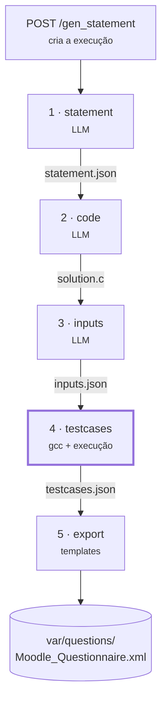
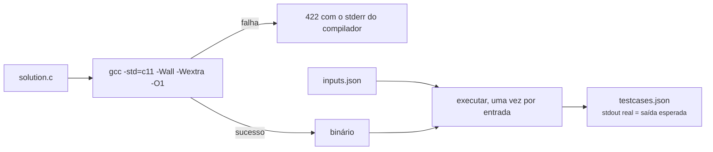

# Pipeline de geração

<p class="lead">Cinco etapas, três chamadas ao modelo e uma compilação. A quarta etapa é a única que produz factos; as outras produzem texto que um humano deve rever.</p>

## Panorama



| # | Endpoint | Depende de | Produz |
| --- | --- | --- | --- |
| 1 | `POST /gen_statement` | Modelo | `statement.json` |
| 2 | `POST /gen_code` | Modelo | `solution.c` |
| 3 | `POST /gen_inputs` | Modelo | `inputs.json` |
| 4 | `POST /gen_testcases` | `gcc` | `solution`, `testcases.json` |
| 5 | `POST /export_moodle_xml_question` | — | o XML |

`POST /create_question` corre as cinco por ordem, chamando as funções diretamente.

## 1 · `gen_statement`

Cria a execução — a resposta traz o `run_id` que todas as etapas seguintes exigem — e gera o enunciado.

### Das restrições ao prompt

Cinco eixos combináveis e cinco níveis de dificuldade traduzem-se em linhas de requisito, em português:

| Campo | Valor | Linha gerada |
| --- | --- | --- |
| `can_has_if: false` | — | `NÃO deve usar estruturas condicionais (if)` |
| `can_has_if: true`, `can_has_else: false` | — | `DEVE usar if mas NÃO deve usar else` |
| `can_has_if: true`, `can_has_else: true` | — | `DEVE usar estruturas condicionais completas (if e else)` |
| `can_has_repetition` | `true` / `false` | `DEVE` / `NÃO deve usar estruturas de repetição` |
| `can_has_function` | `true` / `false` | `DEVE` / `NÃO deve usar funções` |
| `can_has_matrix` | `true` / `false` | `DEVE` / `NÃO deve usar vetores ou matrizes` |
| `difficulty` | `muito facil` … `muito dificil` | `A questão deve ser de nivel …` |

`difficulty` é um conjunto fechado: um valor fora dele é `422`, não um prompt silenciosamente sem a linha de nível.

!!! info "A mesma lista serve a verificação que falta"
    `describe_constraints()` devolve as linhas separadamente do prompt precisamente porque a verificação de escopo (FEAT-024) vai precisar da mesma lista para confrontar a solução gerada com o que foi pedido.

### O formato pedido

O prompt pede blocos entre parênteses retos:

```text
[Título do problema]

[Descrição do problema]

[Descrição das entradas]

[Descrição das saídas]
```

E proíbe explicitamente exemplos de entrada/saída, markdown e acentos — os últimos porque o enunciado acaba em ficheiros consumidos por código C.

### Interpretação da resposta

`parse_statement` percorre as linhas, abre um bloco a cada `[…]` e junta os blocos com linha em branco. O título é a primeira linha não vazia do resultado.

!!! danger "Ignorar o formato não dá erro"
    Se o modelo não usar os blocos, o texto inteiro vira corpo e a primeira linha vira título. Sai um `200` e uma questão de aspeto estranho — nunca uma exceção. É uma degradação silenciosa, e é a razão de esta função ter testes.

## 2 · `gen_code`

Recebe o enunciado e pede código C puro, que lê de `stdin` sem imprimir mensagens de *prompt* — o formato que o CodeRunner espera.

!!! tip "A cerca de markdown é removida, não re-pedida"
    `strip_code_fences` tira a cerca envolvente se o modelo a acrescentou apesar de ambos os prompts a proibirem. Era a causa mais comum de falha de compilação, e remover é mais barato do que gastar outra chamada a pedir de novo.

!!! warning "Nada verifica as restrições"
    O código gerado pode usar um `for` numa questão pedida sem repetição. O serviço não repara, e o XML sai na mesma. É a lacuna principal do protótipo — ver [análise de lacunas](../product/gap-analysis.md#as-restricoes-nao-sao-verificadas).

## 3 · `gen_inputs`

Recebe o enunciado **e** a solução, e pede `qty` entradas válidas em JSON. Ver a solução é o que permite ao modelo respeitar o formato exato que os `scanf` esperam.

### Interpretação em três níveis

`parse_inputs` tenta, por ordem de confiança:

1. **JSON válido** que seja uma lista — o caso normal;
2. **uma linha entre parênteses retos** que não seja JSON válido (vírgula a mais, aspas irregulares);
3. **uma entrada por linha**, ignorando linhas de cerca de markdown.

!!! info "`qty` trunca, não garante"
    A lista é cortada a `qty`, mas nada obriga o modelo a produzir tantas. E um array vazio é uma resposta legítima: significa que o programa não lê nada de `stdin`.

## 4 · `gen_testcases`

**A única etapa que não fala com o modelo.** Compila e executa.



O `stdout` capturado torna-se a saída esperada da questão. Não se pergunta ao modelo qual seria — compila-se e corre-se.

!!! quote "A regra que atravessa todo o produto"
    O que é verificável, verifica-se por execução. É a mesma regra que, na plataforma alvo, proíbe qualquer saída de modelo de entrar no cálculo de uma nota.

### Limites desta etapa

A execução é limitada, mas **não isolada**:

| Limite | Omissão | Variável |
| --- | --- | --- |
| Tempo de compilação | 20 s | `CODEEXPERT_COMPILE_TIMEOUT_SECONDS` |
| Tempo de cada execução | 5 s | `CODEEXPERT_RUN_TIMEOUT_SECONDS` |
| Saída capturada | 64 KiB | `CODEEXPERT_RUN_MAX_OUTPUT_BYTES` |

Ao esgotar o tempo, o grupo de processos inteiro é morto — um programa que faça `fork` não sobrevive ao pedido — e a etapa devolve `422` a dizer qual das entradas não terminou.

!!! danger "Limitado não é isolado"
    O que **não** é limitado: sistema de ficheiros, rede, memória, chamadas de sistema. O binário corre com os privilégios de quem arrancou o servidor.

    É por isso que o executor está atrás de um protocolo — para que um *sandbox* real entre no lugar dele sem tocar no pipeline. Ver [ADR-0004](../adr/0004-execution-behind-a-runner-protocol.md) e [Deploy](../deployment/index.md#execucao-de-codigo-nao-confiavel).

## 5 · `export_moodle_xml`

Junta enunciado, solução e casos de teste nos três templates e acrescenta a questão ao ficheiro, sem substituir o que já lá está. Detalhe em [Templates Moodle XML](moodle-xml.md).

!!! tip "Cada etapa pode ser repetida isoladamente"
    O estado vive em ficheiros: cada etapa lê o que a anterior escreveu no diretório da execução. Dá para repetir só a etapa 3, ou editar o `solution.c` à mão antes de correr a 4. Ver [Workspace de execução](cache-and-state.md) e [Pipeline passo a passo](../guides/step-by-step-pipeline.md).
