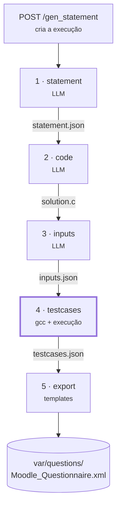
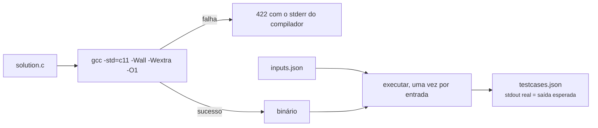
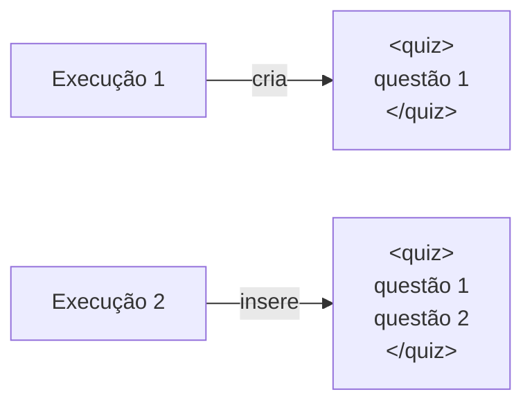
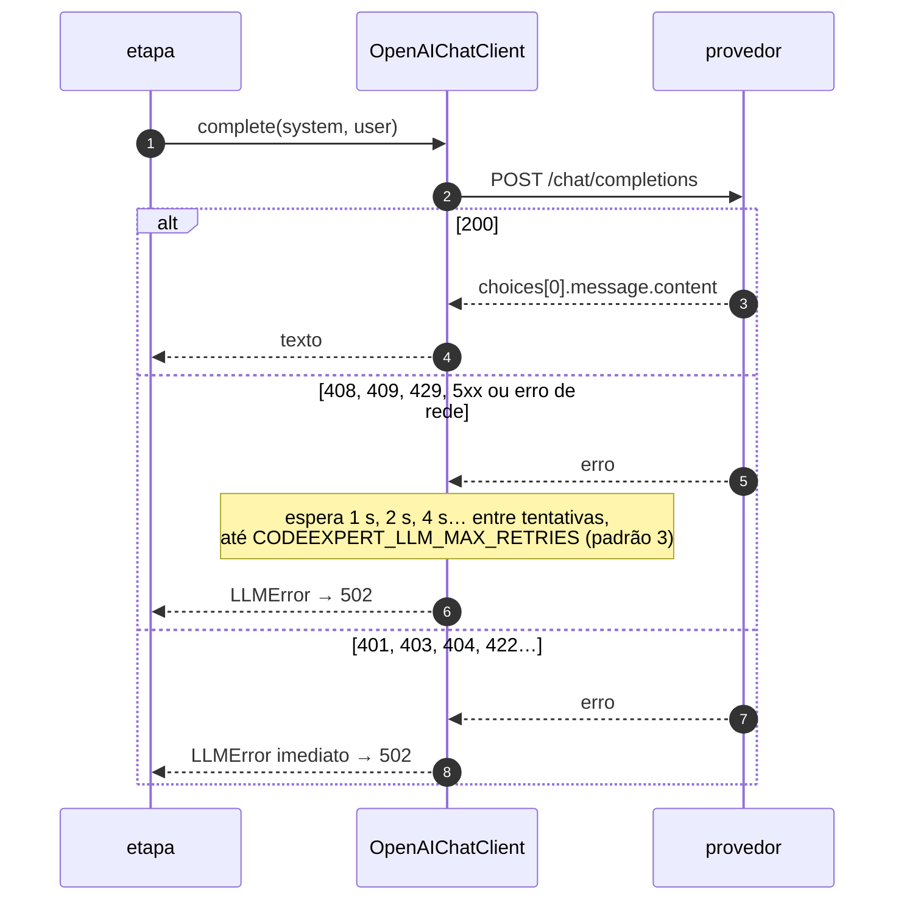

# Pipeline de geração

<p class="lead">Cinco etapas: três chamam o modelo, uma compila e executa, uma monta o XML. Esta página descreve o que cada etapa pede, como interpreta a resposta e onde pode falhar em silêncio.</p>

<span class="ce-badge ce-status--done">Implementado</span> Tudo nesta página. Mudanças previstas — verificação de escopo entre as etapas 2 e 3, entradas categorizadas, exportador sem arquivo compartilhado — estão no [Roadmap](../product/roadmap.md#verificacao-de-escopo).



| # | Endpoint | Módulo | Depende de | Produz |
| --- | --- | --- | --- | --- |
| 1 | `POST /gen_statement` | `generation/statement.py` | Modelo | `statement.json` |
| 2 | `POST /gen_code` | `generation/codegen.py` | Modelo | `solution.c` |
| 3 | `POST /gen_inputs` | `generation/inputs.py` | Modelo | `inputs.json` |
| 4 | `POST /gen_testcases` | `generation/testcases.py` | `gcc` | `solution`, `testcases.json` |
| 5 | `POST /export_moodle_xml_question` | `export/moodle.py` | — | o XML |

`POST /create_question` roda as cinco em ordem (`generation/pipeline.py`).

## 1 · Enunciado

Cria a execução (a resposta traz o `run_id`) e gera o enunciado. As restrições viram linhas de requisito no prompt, em `describe_constraints()`:

| Campo | Linha no prompt |
| --- | --- |
| `can_has_if: false` | `NÃO deve usar estruturas condicionais (if)` |
| `can_has_if: true`, `can_has_else: false` | `DEVE usar if mas NÃO deve usar else` |
| `can_has_if: true`, `can_has_else: true` | `DEVE usar estruturas condicionais completas (if e else)` |
| `can_has_repetition` | `DEVE` / `NÃO deve usar estruturas de repetição` |
| `can_has_function` | `DEVE` / `NÃO deve usar funções` |
| `can_has_matrix` | `DEVE` / `NÃO deve usar vetores ou matrizes` |
| `difficulty` | `A questão deve ser de nivel …` (conjunto fechado; valor fora dele é `422`) |

Note que `true` **exige** a estrutura, não só permite.

O prompt pede blocos `[Título]`, `[Descrição]`, `[Entradas]`, `[Saídas]`, sem exemplos, sem markdown e sem acentos (o texto acaba em arquivos lidos por código C). `parse_statement` abre um bloco a cada linha `[…]`; o título é a primeira linha não vazia.

!!! warning "Falha silenciosa"
    Se o modelo ignorar os blocos, o texto inteiro vira corpo e a primeira linha vira título. Resposta `200`, questão com aparência estranha. Por isso `parse_statement` tem testes.

## 2 · Solução

Recebe o enunciado e pede C puro, que lê de `stdin` sem imprimir mensagens. `strip_code_fences` remove uma cerca ` ```c ` se o modelo a incluir apesar da instrução — era a causa mais comum de falha de compilação.

!!! danger "Nada verifica as restrições"
    O código pode usar `for` numa questão pedida sem repetição, e o XML sai mesmo assim. <span class="ce-badge ce-status--planned">Planejado</span> no G2-2: uma etapa nova entre 2 e 3 com `tree-sitter-c` — ver [Roadmap](../product/roadmap.md#verificacao-de-escopo).

## 3 · Entradas

Recebe o enunciado **e** a solução (para acertar o formato dos `scanf`) e pede `qty` entradas como array JSON de strings. `parse_inputs` tenta, em ordem:

1. JSON válido que seja uma lista;
2. uma linha entre colchetes que não é JSON válido;
3. uma entrada por linha, ignorando cercas de markdown.

A lista é cortada em `qty`, mas o modelo pode devolver menos. Lista vazia é válida: o programa não lê nada. O prompt pede "casos-limite e casos normais", mas a categoria não é guardada.

## 4 · Casos de teste {#4-casos-de-teste}

**A única etapa que não fala com o modelo.** Compila e executa.



| Limite | Padrão | Variável |
| --- | --- | --- |
| Tempo de compilação | 20 s | `CODEEXPERT_COMPILE_TIMEOUT_SECONDS` |
| Tempo de cada execução | 5 s | `CODEEXPERT_RUN_TIMEOUT_SECONDS` |
| Saída capturada por execução | 64 KiB (excedente é truncado) | `CODEEXPERT_RUN_MAX_OUTPUT_BYTES` |

Cada execução roda no próprio grupo de processos; ao estourar o tempo, o grupo inteiro recebe `SIGKILL` e a etapa responde `422` dizendo qual entrada não terminou.

!!! danger "Limitado não é isolado"
    Não há limite de memória, de número de processos, de rede nem de sistema de arquivos. O binário roda com as permissões de quem iniciou o servidor. `CodeRunner` é um protocolo justamente para que um sandbox entre no lugar de `LocalGccRunner` sem mudar o pipeline ([ADR-0004](../adr/0004-execution-behind-a-runner-protocol.md)).

## 5 · Exportação Moodle XML {#5-exportacao-moodle-xml}

Três templates em `src/codeexpert/export/templates/`, lidos via `importlib.resources`:

| Template | Papel |
| --- | --- |
| `questionnaire.xml` | O envelope `<quiz>` |
| `question.xml` | Uma questão `type="coderunner"` |
| `case.xml` | Um `<testcase>` |

| Marcador | Substituído por |
| --- | --- |
| `Macro_QuestionNumber` | Número de questões já no arquivo + 1 |
| `Macro_QuestionName` | Título, escapado |
| `Macro_QuestionTextinHTML` | Enunciado escapado, `\n` → `<br>`, dentro de CDATA |
| `Macro_Answer` | Código C dentro de CDATA; um `]]>` literal é neutralizado |
| `Macro_CoderunnerType` | `c_program` |
| `Macro_Hidden` | `0` |
| `Macro_TestCases` | Os `<testcase>` concatenados |
| `Macro_Tags` | `Gerado por IA`, a dificuldade, e `Revisado` ou `Nao revisado` conforme `meta.json` |
| `Macro_StdIn`, `Macro_OutputExpected` | Entrada e saída, com `strip()` e escape XML |
| `Macro_UseAsExample` | `"1"` nos três primeiros casos, `"0"` nos demais |
| `Macro_Display` | vazio |

**Acumulação.** A primeira exportação cria o arquivo; as seguintes inserem a questão antes de `</quiz>`. A resposta traz `question_count`, a posição da questão no arquivo.



!!! warning "Leitura-modificação-escrita num arquivo único"
    Duas exportações simultâneas leem o mesmo estado e uma sobrescreve a outra. Hoje isso não acontece porque as rotas serializam os pedidos no processo. Com mais de um worker ou instância, uma questão some sem erro. <span class="ce-badge ce-status--planned">Planejado</span> no G1-8 (exportador puro).

Limitações atuais: só C (`c_program` fixo), sem categoria de banco de questões, `generalfeedback` vazio, exemplos escolhidos por posição.

## Cliente do modelo

`llm/client.py` é o único lugar que fala com um provedor:

```python
class LLMClient(Protocol):
    def complete(self, *, system: str, user: str, temperature: float = 0.7) -> str: ...
```

`OpenAIChatClient` faz `POST {CODEEXPERT_LLM_BASE_URL}/chat/completions` com `model`, uma mensagem `system`, uma `user` e `temperature`. A resposta é reduzida a `choices[0].message.content.strip()`; outro formato vira `LLMError` (`502`).



Com os padrões (3 tentativas, 60 s de timeout), uma etapa pode levar cerca de três minutos no pior caso. Uma questão completa faz **três** chamadas ao modelo. Não há cache, contagem de tokens nem teto de gasto.

**Trocar de provedor:** qualquer serviço com `/chat/completions` no formato OpenAI funciona só com `.env`. Um modelo local é a forma barata de exercitar o formato das respostas ao mexer em prompts:

```bash title=".env — Ollama local"
CODEEXPERT_LLM_BASE_URL=http://127.0.0.1:11434/v1
CODEEXPERT_LLM_MODEL=qwen2.5-coder
CODEEXPERT_LLM_API_KEY=nao-usada-mas-obrigatoria
```

Para um provedor com outra API, escreve-se uma classe que satisfaça `LLMClient` e ela é escolhida em `get_llm_client()`.

## Prompts

Todos em `generation/prompts.py`. O enunciado é pedido em português; código e entradas, em inglês.

| Prompt pede | Parser que depende disso |
| --- | --- |
| Layout em `[blocos]` | `statement.py::parse_statement` |
| Array JSON de strings | `inputs.py::parse_inputs` |
| C puro, sem markdown | `codegen.py::strip_code_fences` |

Mudar a forma do que o prompt pede exige mudar o parser correspondente — os dois falham em silêncio. Todo prompt alterado exige incrementar a entrada em `PROMPT_VERSIONS` no mesmo commit (a versão vai para o `meta.json`) e revisão humana. Regras completas em [`.agents/rules/prompts.md`](https://github.com/TUTOR-IA-Makers/tutor-ia/blob/main/.agents/rules/prompts.md).
