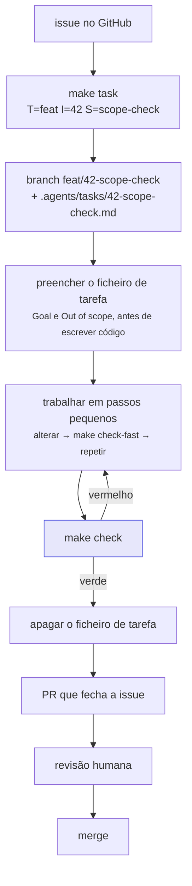

# O harness

<p class="lead">O <em>harness</em> é o conjunto de ficheiros que faz com que seis pessoas e três marcas de agente produzam trabalho revisável da mesma maneira. Vive em <code>.agents/</code>, com <code>AGENTS.md</code> à entrada, e cabe numa leitura de dez minutos.</p>

!!! info "Um ficheiro de instruções, não um por ferramenta"
    [`AGENTS.md`](https://github.com/HugoRosa29/coderunner_v2/blob/main/AGENTS.md) é a fonte única, para pessoas e para agentes. `CLAUDE.md` e `.github/copilot-instructions.md` são apenas ponteiros para ele. Altera-se um ficheiro e todos os agentes mudam de comportamento ao mesmo tempo — o porquê está em [ADR-0005](../adr/0005-single-instruction-file-for-agents.md).

## Porque existe

Antes havia um `progress.md` partilhado e um ficheiro de instruções por agente. Funciona para uma pessoa numa branch; falha para seis pessoas em seis branches com três agentes diferentes.

| Problema | O que o harness faz |
| --- | --- |
| Um ficheiro de estado partilhado conflitua em cada *merge* | O estado vive nas *issues*; o contexto de cada branch vive num ficheiro só dessa branch |
| Cada agente lê um ficheiro de instruções diferente | Um `AGENTS.md`; os restantes são ponteiros |
| Revisões do género "na minha máquina passa" | Um portão, `./scripts/check.sh`, corrido igual por pessoas, agentes e CI |
| Decisões perdidas em conversas de chat | `docs/adr/` — numeradas, imutáveis, uma por decisão |
| Trabalho de agente que ninguém consegue auditar | *Trailers* de commit que nomeiam o agente que assistiu |

## O mapa

```text
AGENTS.md              o acordo de trabalho — leia isto primeiro
.agents/
  rules/               o que é verdade independentemente da tarefa
    code.md            Python
    prompts.md         qualquer coisa em prompts.py
    docs.md            este site
    security.md        execution/, configuração, chaves
    git.md             branches, commits, PRs
  workflows/           procedimentos passo a passo
    start-task.md      começar
    finish-task.md     fechar
    review.md          rever o PR de outra pessoa
    add-adr.md         registar uma decisão
  tasks/               um ficheiro por branch ativa
    TEMPLATE.md
    42-scope-check.md
```

**Nada em `.agents/` repete o `AGENTS.md`** — é o detalhe para onde ele aponta. Duas cópias divergem; uma não.

## O ciclo



### 1. A issue primeiro

O trabalho começa sempre numa *issue*. Sem issue, o trabalho não foi combinado com ninguém — e uma equipa de seis pessoas não absorve *diffs* surpresa. Se a issue não existe, abra-a. Se está vaga, afine-a antes de escrever código: uma issue vaga produz um *diff* que a revisão não consegue julgar.

### 2. `make task` cria a branch e o ficheiro juntos

```bash
make task T=feat I=42 S=scope-check
```

| Argumento | Aceita | Resultado |
| --- | --- | --- |
| `T` | `feat` `fix` `docs` `refactor` `chore` `test` | O prefixo da branch |
| `I` | um número | O número da issue — branch e ficheiro ficam com o mesmo |
| `S` | minúsculas-com-hífens | O *slug* descritivo |

Produz a branch `feat/42-scope-check` a partir de uma `main` atualizada, e o ficheiro `.agents/tasks/42-scope-check.md` a partir do modelo. Se o `gh` estiver instalado, o título da issue já vem preenchido.

!!! tip "Os dez minutos de maior retorno do ciclo"
    Preencher **Goal** e **Out of scope** antes de escrever código. É o que impede um agente de "ajudar" a refatorar três módulos não relacionados, e o que permite a outra pessoa retomar a branch amanhã.

### 3. O ficheiro de tarefa

Um ficheiro por branch, com o nome da branch. É onde a branch guarda o seu contexto — e a razão de ser um por branch é simples: [ADR-0006](../adr/0006-issues-plus-task-file-per-branch.md) substituiu o `progress.md` único precisamente porque este conflituava em cada *merge*. A branch A só toca em `42-....md`, a branch B só no seu.

| Secção | O que lá vai |
| --- | --- |
| **Goal** | Um parágrafo: o que passa a ser verdade depois deste *merge* |
| **Out of scope** | O que um leitor poderia esperar e não está incluído. É a linha que um agente não atravessa |
| **Constraints** | O que estreita a solução: uma regra do `AGENTS.md`, uma ADR, uma interface que não pode mudar |
| **Plan** | Passos, com caixas. Incluindo o teste e a documentação |
| **Decisions taken along the way** | Acrescentado à medida que acontece. Uma decisão que sobrevive à branch pertence a uma ADR |
| **Verification** | O que correu, e o que disse |

!!! warning "É andaime, não histórico"
    O ficheiro de tarefa é apagado no PR que fecha a issue. O que sobrevive à branch vive em três sítios: a **issue** (o quê e porquê), as **ADRs** (decisões), os **commits** (como).

    Um ficheiro de tarefa na `main` significa uma de duas coisas: trabalho em curso, ou uma branch que alguém abandonou. Ambas valem a pena reparar.

### 4. O portão

```bash
make check        # tudo
make check-fast   # sem a construção do site — para o ciclo curto
```

Seis passos, na ordem em que falham mais depressa. É o mesmo ficheiro que o CI corre, e é por isso que não há "no CI é diferente" — [ADR-0008](../adr/0008-one-gate-for-people-agents-and-ci.md).

| # | Passo | O que recusa |
| --- | --- | --- |
| 1 | Artefactos e segredos versionados | Qualquer coisa em `var/`, `cache/`, `Questions/`, um `.env` no índice do Git |
| 2 | Credenciais na árvore de trabalho | Algo com a forma de uma chave: `sk-…`, `AIza…`, uma chave privada PEM |
| 3 | Formatação | `ruff format --check src tests main.py` |
| 4 | Lint | `ruff check`, com as regras de segurança (`S`) ativas |
| 5 | Testes | `pytest -q` — sem rede, sem chave |
| 6 | Documentação | `mkdocs build --strict`: ligação partida, âncora inexistente ou página fora da navegação é erro |

!!! danger "Uma falha que parece não ter nada a ver é na mesma uma falha"
    Descubra porquê. O CI vai falhar exatamente igual, e a próxima pessoa herda o problema. Não existe atalho específico para agentes, nem variante "rápida" aceitável para abrir um PR.

    O passo 6 é ignorado se o `mkdocs` não estiver instalado — `make setup` instala-o, por isso isto só acontece num ambiente incompleto.

### 5. Fechar

Correr o portão, ler o *diff* com os próprios olhos, apagar o ficheiro de tarefa, abrir o PR. O detalhe está em [Rever e fechar](review.md).

## As regras

Leia a que corresponde ao que está a tocar — não as cinco.

<div class="grid cards" markdown>

-   :material-language-python: **[`rules/code.md`](https://github.com/HugoRosa29/coderunner_v2/blob/main/.agents/rules/code.md)**

    ---

    Python: fronteiras, injeção de dependências, exceções, *logging*, tipos.

    A versão explicada está em [Convenções](../development/conventions.md).

-   :material-text-box-edit-outline: **[`rules/prompts.md`](https://github.com/HugoRosa29/coderunner_v2/blob/main/.agents/rules/prompts.md)**

    ---

    Prompts são o produto. Alterar um obriga a incrementar `PROMPT_VERSIONS` no mesmo commit e a confirmar o analisador correspondente.

-   :material-book-open-page-variant-outline: **[`rules/docs.md`](https://github.com/HugoRosa29/coderunner_v2/blob/main/.agents/rules/docs.md)**

    ---

    Este site: português, o que é planeado e o que está feito, e nunca afirmar o que o código não faz.

    Ver [Trabalhar na documentação](documentation.md).

-   :material-shield-lock-outline: **[`rules/security.md`](https://github.com/HugoRosa29/coderunner_v2/blob/main/.agents/rules/security.md)**

    ---

    Chaves, `subprocess`, caminhos construídos a partir de entrada do cliente. Tudo o que toca em `execution/`.

-   :material-source-branch: **[`rules/git.md`](https://github.com/HugoRosa29/coderunner_v2/blob/main/.agents/rules/git.md)**

    ---

    `type/<issue>-<slug>`, Conventional Commits, o corpo a explicar porquê, o *trailer* de atribuição.

-   :material-clipboard-list-outline: **[`workflows/`](https://github.com/HugoRosa29/coderunner_v2/tree/main/.agents/workflows)**

    ---

    Começar, fechar, rever, registar uma decisão. Lê-se quando se está a fazer essa coisa.

</div>

## Usar um agente de código

Encorajado, e igual para todos. A instrução é sempre esta, e só esta:

```text
Read AGENTS.md and .agents/tasks/42-scope-check.md, then implement the plan.
```

Os dois ficheiros estão no repositório, pelo que a instrução é idêntica para o Claude Code, o Codex ou o Antigravity. **Se um agente precisa de mais do que isto, a falta pertence ao ficheiro de tarefa ou ao `AGENTS.md`** — não a uma mensagem de chat que mais ninguém vê.

### O que um agente pode e não pode

| Pode | Não pode |
| --- | --- |
| Escrever código, testes e documentação | Aprovar ou fundir um PR |
| Abrir um PR | Alterar `AGENTS.md`, `.github/workflows/` ou o `CODEOWNERS` |
| Rascunhar uma ADR | Aceitar uma ADR — isso é de uma pessoa |
| Propor alterar um prompt | Fazê-lo sem revisão humana |
| Sugerir uma dependência nova | Acrescentá-la ao `pyproject.toml` sozinho |

Continua a ser o autor do que envia. Corra `make check`, leia o *diff*, e ponha o *trailer*:

```text
feat: verificar as restricoes declaradas contra a solucao gerada

Closes #42

Assisted-by: claude-opus-5
Co-Authored-By: Claude Opus 5 <noreply@anthropic.com>
```

!!! info "Porque é que a atribuição não é cerimónia"
    Com três marcas de agente em uso, precisamos de conseguir perguntar *"que ferramenta produziu as alterações que revertemos depois?"* e obter resposta do `git log`. Use `Assisted-by: codex`, `Assisted-by: antigravity`, conforme o caso.

### Ao rever código escrito por um agente

Os modos de falha são diferentes dos de uma pessoa — a lista está em [Rever e fechar](review.md#codigo-escrito-por-um-agente).

## O que um agente não decide sozinho {#o-que-um-agente-nao-decide-sozinho}

O `CODEOWNERS` exige revisor humano nestas áreas. Pergunte antes, em vez de abrir um PR que fica bloqueado.

| Área | Porquê |
| --- | --- |
| `generation/prompts.py` | Os prompts são o produto. Uma alteração muda o resultado de formas que os testes não apanham |
| `export/templates/` | Um macro partido só se descobre quando uma importação no Moodle falha |
| `docs/adr/` | As decisões são de pessoas; os agentes rascunham, os humanos aceitam |
| `.github/workflows/`, `AGENTS.md`, `CODEOWNERS` | Um agente não pode alargar as suas próprias permissões |
| Dependências no `pyproject.toml` | Cadeia de fornecimento |

## Quando as instruções estão erradas

Se o `AGENTS.md` contradiz o código, **o código ganha e o ficheiro é o bug**. Abra um PR contra ele. Um agente que contorne em silêncio uma regra desatualizada deixa o próximo agente a bater na mesma parede.
