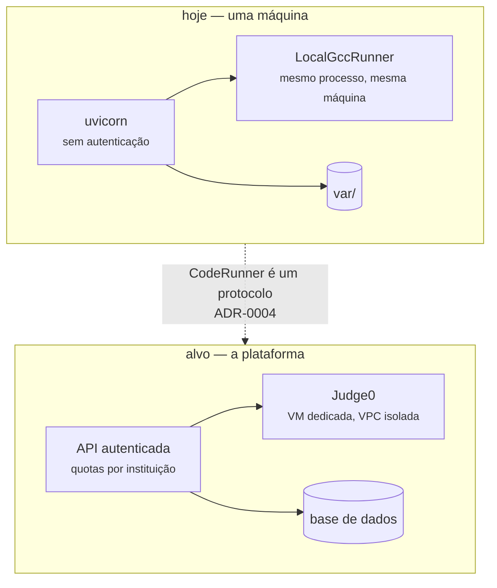

# Deploy

<p class="lead">Este serviço não está pronto para ser implantado em lado nenhum que não seja a máquina de quem o usa. Esta página diz porquê, item a item, e o que teria de mudar.</p>

!!! danger "A conclusão, primeiro"
    Não há autenticação, e o serviço **compila e executa código** na máquina onde corre. Qualquer pessoa que alcance a porta consome a chave de API e provoca execução local de código gerado por um modelo.

    Corra-o em `127.0.0.1`, na sua máquina. Tudo o resto nesta página é o caminho para deixar de ser verdade.

## Como corre hoje

```bash
make run
```

Um processo, sem estado partilhado entre execuções, a escrever em `var/`. É tudo.

| Aspeto | Estado |
| --- | --- |
| Processo | Um `uvicorn`, síncrono |
| Estado | Sistema de ficheiros local, um diretório por execução |
| Concorrência | Suportada — execuções não colidem |
| Configuração | Variáveis de ambiente, injetáveis |
| Autenticação | **Nenhuma** |
| Isolamento da execução | **Nenhum** — limites de tempo e saída, mas sem sandbox |
| Persistência | `var/` cresce sem política de retenção |
| Observabilidade | Logs para `stdout` |

## O que falta antes de expor o serviço {#o-que-falta-antes-de-expor-o-servico}

### 1 · Não há autenticação

!!! warning "Um serviço exposto é uma chave de API partilhada com a internet"
    Todos os endpoints são públicos. Não há utilizadores, não há *tokens*, não há quotas por cliente.

O mínimo seria uma chave de API própria verificada numa dependência do FastAPI. Não existe, e adicioná-la sem o ponto 2 resolvido ainda deixa o problema maior por resolver.

### 2 · Execução de código não confiável {#execucao-de-codigo-nao-confiavel}

`LocalGccRunner` compila e executa na mesma máquina que o serviço. Limita:

- tempo de compilação e de execução;
- tamanho da saída capturada;
- e mata o grupo de processos inteiro ao esgotar o tempo, para que um programa que faça `fork` não sobreviva ao pedido.

Não limita **nada** do resto: sistema de ficheiros, rede, memória, chamadas de sistema.

O código executado é gerado por um modelo a partir de um prompt de um professor — não é submissão de aluno — pelo que a exposição é mais estreita do que a da plataforma. Estreita não é inexistente.

A arquitetura alvo é inequívoca: código não confiável corre em Judge0, numa VM dedicada, em VPC isolada, e o host é tratado como já comprometido. `CodeRunner` é um protocolo precisamente para que essa troca seja uma classe nova — ver [ADR-0004](../adr/0004-execution-behind-a-runner-protocol.md) e [Arquitetura alvo](../product/target-architecture.md#adr-002-terceirizar-a-execucao-judge0-autogerido).

### 3 · Sem limites de utilização

!!! warning "Custo e carga sem teto"
    Nada impede um cliente de disparar cem gerações em paralelo, e cada uma são três chamadas ao modelo, uma compilação e até cem execuções.

### 4 · O estado é local e cresce

!!! warning "`var/runs/` cresce sem limite"
    Acumula um diretório por geração e nada o limpa. Num contentor efémero, perde-se tudo a cada reinício; num servidor persistente, enche o disco. Falta uma política de retenção — é uma das [lacunas que aceitam contribuição](../contributing/index.md#lacunas-que-aceitam-contribuicao).

### 5 · Sem observabilidade

!!! info "Não há como responder a \"quantas gerações falharam esta semana, e em que etapa\""
    Logs em `stdout`, sem métricas nem *tracing*. A [arquitetura alvo](../product/target-architecture.md) especifica métricas por etapa e *tracing* por submissão; aqui não existe nada disso.

## Se precisar de implantar mesmo assim

Para uma máquina interna, atrás de VPN, com utilizadores em quem confia:

```dockerfile
FROM python:3.13-slim

# gcc é necessário em tempo de execução, não apenas de construção:
# a etapa de casos de teste invoca-o a cada pedido.
RUN apt-get update && apt-get install -y --no-install-recommends gcc libc6-dev \
    && rm -rf /var/lib/apt/lists/*

WORKDIR /app
COPY pyproject.toml README.md LICENSE ./
COPY src ./src
RUN pip install --no-cache-dir .

# Um utilizador sem privilégios. Não é isolamento, mas reduz o que um escape alcança.
RUN useradd --create-home app && mkdir -p /app/var && chown -R app /app/var
USER app

ENV CODEEXPERT_WORKSPACE_ROOT=/app/var/runs \
    CODEEXPERT_QUESTIONS_DIR=/app/var/questions

EXPOSE 8000
CMD ["uvicorn", "codeexpert.api.app:app", "--host", "0.0.0.0", "--port", "8000"]
```

A configuração vem toda do ambiente, pelo que não há ficheiros a montar:

```bash
docker run --rm -p 127.0.0.1:8000:8000 \
  -e CODEEXPERT_LLM_API_KEY="$CODEEXPERT_LLM_API_KEY" \
  -e CODEEXPERT_LLM_MODEL=gpt-4o-mini \
  -v codeexpert-var:/app/var \
  codeexpert
```

!!! warning "Um contentor não é um sandbox para este efeito"
    Correr num contentor reduz o alcance de um escape, mas o processo continua a poder ler a rede e o sistema de ficheiros do contentor — incluindo a variável de ambiente com a chave. Não confunda isto com a solução do ponto 2.

!!! danger "Publique sempre em `127.0.0.1:8000:8000`"
    Nunca em `0.0.0.0`. O `-p 8000:8000` do Docker expõe a porta a toda a rede — e com ela a chave e o compilador.

## CI/CD {#ci-cd}

| Workflow | Quando | O que faz |
| --- | --- | --- |
| `.github/workflows/ci.yml` | *push* em `main`, todos os PR | Corre `./scripts/check.sh` — o mesmo portão que se corre localmente — e verifica as convenções do PR |
| `.github/workflows/docs.yml` | *push* em `main` ou `docs` | Constrói o site em modo estrito e publica no GitHub Pages |

Não há *workflow* de publicação da aplicação, porque não há para onde a publicar.

### Ativar o GitHub Pages

**Settings → Pages → Build and deployment → Source: GitHub Actions.** O resultado fica em <https://hugorosa29.github.io/coderunner_v2/>.

## Hoje e o alvo



## Ambientes

Um: a máquina de quem está a gerar questões. Não há *staging* nem produção, e enquanto o serviço não tiver autenticação nem isolamento, não deve haver.

## Se este código for absorvido pela plataforma

O pipeline de geração passa a correr dentro da plataforma, com a identidade, as cotas e o sandbox que ela já tem. Nada desta página sobrevive — e é esse o ponto. As três peças que se transferem são os prompts, a ideia de obter saídas por execução real, e o registo de rastreabilidade em `meta.json`.

Ver [Roadmap](../product/roadmap.md#o-que-acontece-a-este-codigo).
