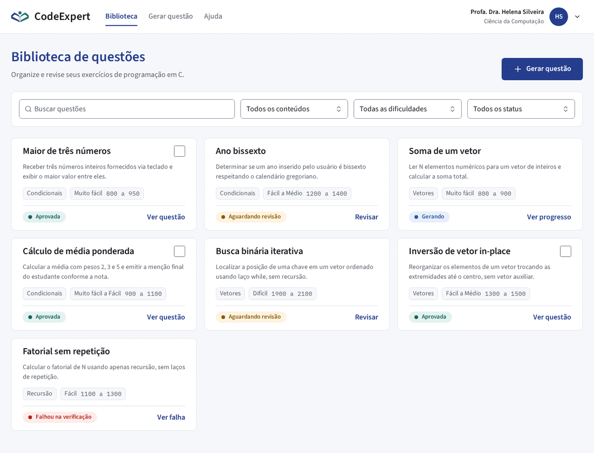
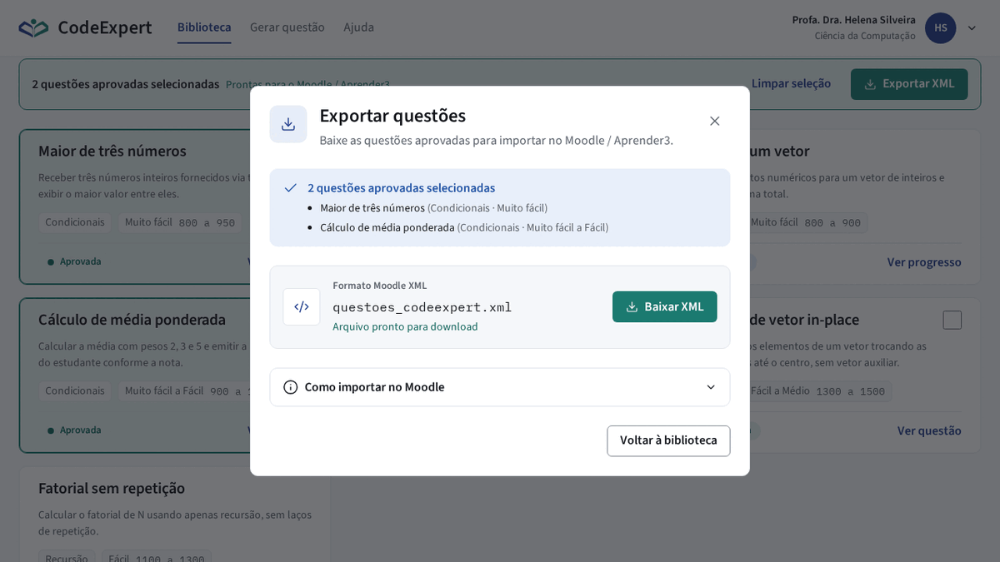
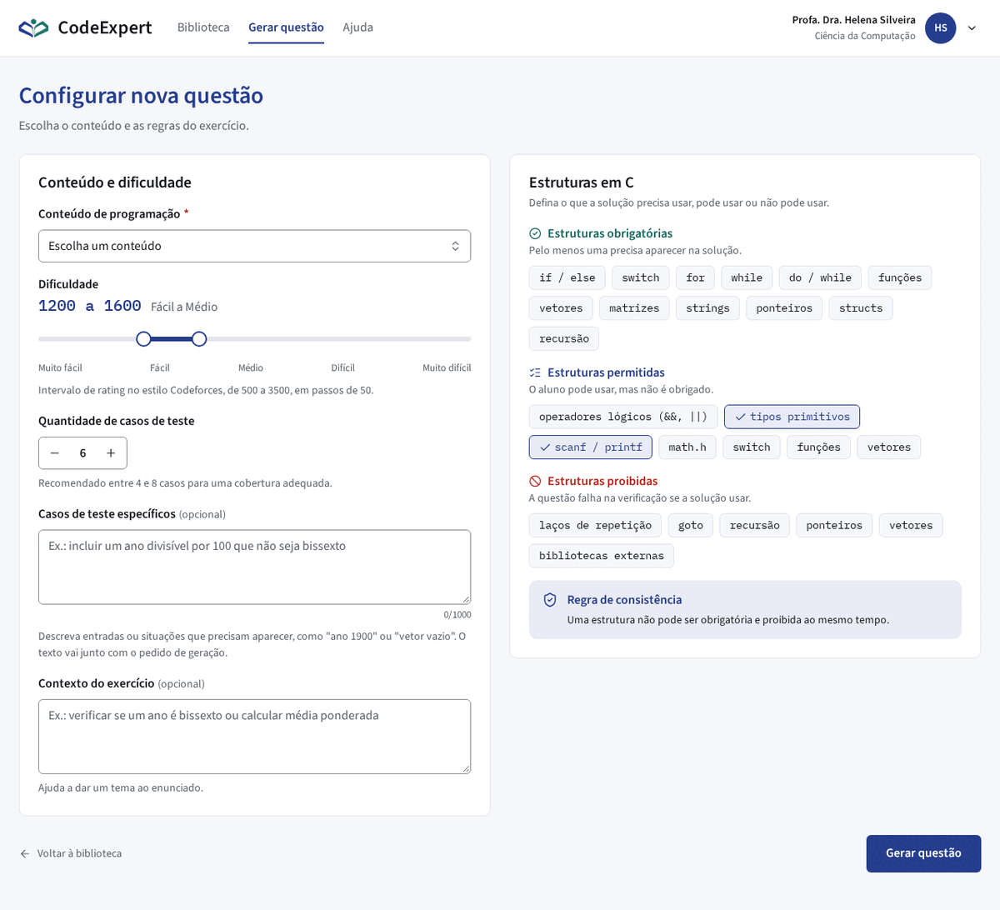
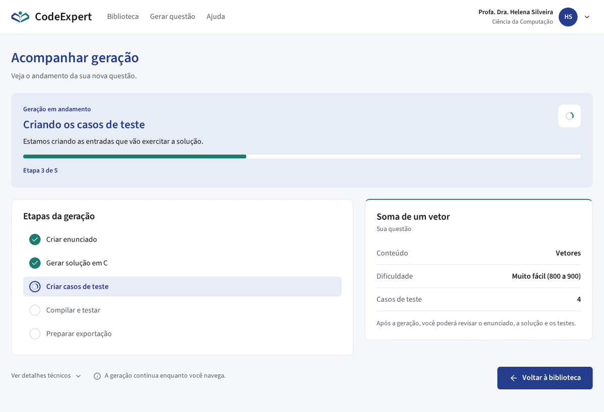
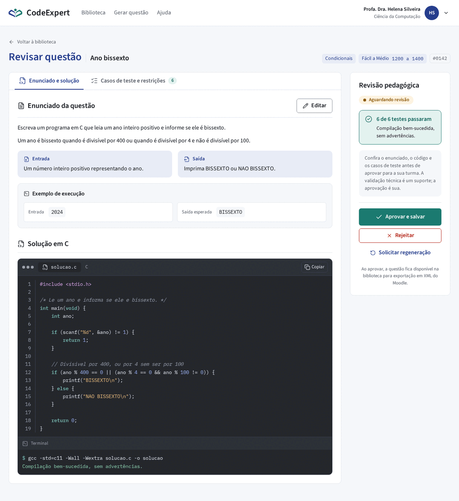
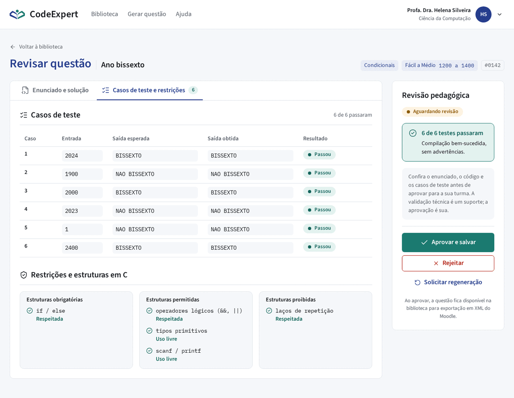

# Identidade visual e princípios de UX

Como o CodeExpert se apresenta para o professor: nome, logo, cores, tipografia, espaçamento, movimento e os princípios de experiência que guiam as telas. Os valores oficiais vivem em <code>frontend/src/styles/tokens.css</code>; esta página mostra e justifica esses valores. Se as duas divergirem, o arquivo de tokens vale e esta página é corrigida no mesmo PR.

Implementado Tokens, fontes, logo vetorizada e as telas da seção 12, com dados simulados. A integração com a API real está Planejada ([Roadmap](../product/roadmap.md)).

CodeExpert

Proporção aproximada de uso: azul domina a navegação, verde-azulado marca o que foi concluído, o resto é base neutra.

## 1. Propósito e público

**O produto em uma frase:** o CodeExpert gera exercícios de programação em C com enunciado, solução e casos de teste verificados por execução real, prontos para importar no Aprender3 (Moodle).

**Público principal:** professores de Algoritmos e Programação de Computadores que já usam o Aprender3 todo semestre e não querem abrir terminal.

-   **O que a identidade comunica**

    ---

    - **Confiança:** a questão foi verificada, não apenas gerada.
    - **Familiaridade:** o professor reconhece o ambiente acadêmico que já usa.
    - **Clareza:** cada tela mostra em que ponto a questão está e o que fazer a seguir.

-   **O que a identidade evita**

    ---

    - Produto genérico "feito por IA": gradientes decorativos, vidro fosco, brilhos, ícone de faíscas para gerar, cards idênticos com sombra difusa.
    - Cópia do visual do Aprender3 ou da marca da UnB. As cores são da mesma família, nunca idênticas.
    - Ferramenta de desenvolvedor intimidante: terminal e jargão técnico na interface principal.

## 2. Nome

| Item | Valor |
|---|---|
| Nome oficial | **CodeExpert** |
| Grafia correta | uma palavra, C e E maiúsculos |
| Grafias proibidas | Code Expert, Codeexpert, codeexpert, CODEEXPERT, Code-Expert |
| Onde aparece | README, este site, `<title>` das páginas, logo, landing, slides de sprint |

**Por que este nome:** já era o nome adotado na documentação e no repositório antes da S0. Trocar agora geraria retrabalho sem ganho para o professor.

!!! warning "Colisão de nome"
    Existe uma plataforma educacional chamada "Code Expert" (ETH Zurich), também voltada a exercícios de programação. Como o CodeExpert é de uso interno, por convite e sem fins comerciais, o risco é baixo. Se o projeto for divulgado fora da UnB, a equipe deve rever o nome.

## 3. Logo

**Conceito:** um livro aberto visto de frente. A página esquerda é azul, a direita é verde-azulada, e um círculo acima forma uma pessoa lendo.

- **Livro aberto:** ensino, material didático, exercício.
- **Pessoa com braços abertos:** o professor, e por extensão o aluno, no centro do produto.
- **Duas cores:** o azul representa estrutura e rigor acadêmico; o verde-azulado representa a verificação e a aprovação. As mesmas duas cores conduzem toda a interface (seção 4).

| Principal | Monocromática | Símbolo |
|:---:|:---:|:---:|
| { width="200" style="background:#FFFFFF;padding:16px;border-radius:10px;border:1px solid #E3E5EA" } | { width="200" style="background:#243C8C;padding:16px;border-radius:10px" } | { width="72" } |
| cabeçalho, sobre fundo branco | impressão e fundos azul ou escuro | aba do navegador e espaços abaixo de 32px |

| Versão | Arquivo de origem |
|---|---|
| Principal (cor) | `frontend/src/assets/brand/logo.svg` |
| Monocromática | `frontend/src/assets/brand/logo-mono.svg` |
| Símbolo | `frontend/public/favicon.svg`: logo dentro de um círculo branco, com o miolo das páginas recortado para mostrar a cor da aba |
| Referência raster | `docs/design/marca/logo-original.png`: a imagem original vetorizada; fica fora de `frontend/public/` para não ir ao build |

A logo foi vetorizada a partir da imagem de referência, com as cores exatas da seção 4.1. As imagens desta página são cópias em `docs/design/marca/`; ao mudar a logo, atualize as duas.

### Regras de uso

| Regra | Valor |
|---|---|
| Composição no cabeçalho | símbolo à esquerda + "CodeExpert" em Source Sans 3, peso 600, cor `--color-text` |
| Área de respiro | no mínimo a altura do círculo em volta do símbolo |
| Tamanho mínimo | 24px de altura na tela; 16px apenas para o favicon |
| Fundos permitidos | branco, `--color-page` e, na versão monocromática branca, `--color-primary` ou `--color-footer` |

!!! danger "Usos incorretos"
    Esticar, inclinar ou distorcer. Trocar as cores das páginas ou inverter azul e verde. Aplicar sombra, contorno, gradiente ou brilho. Colocar a versão em cor sobre foto ou fundo colorido. Separar o círculo do livro.

## 4. Cores

A paleta nasce da logo. O azul e o verde-azulado são da mesma família das cores da UnB e do Aprender3, mas deslocados de propósito: o azul é mais violeta que o institucional e o verde é mais frio que o da UnB. Tema único, claro.

### 4.1 Marca

Gerar questão

Azul primário<code>--color-primary</code>#243C8CNavegar e iniciar: navegação ativa, títulos de página, botão principal

Aprovar e salvar

Verde-azulado<code>--color-accent</code>#1B7A70Concluir e aprovar: "Aprovar e salvar", "Exportar XML", etapa concluída, card selecionado

Azul, hover<code>--color-primary-hover</code>#1B2F6EHover e pressionado do botão principal

Azul, fundo<code>--color-primary-tint</code>#E8ECF7Painel "Geração em andamento", etapa atual

Verde, hover<code>--color-accent-hover</code>#12635AHover e pressionado do botão de conclusão

Verde, fundo<code>--color-accent-tint</code>#E3F2EFCard selecionado, estrutura obrigatória marcada

Verde, texto<code>--color-accent-text</code>#12635ATexto sobre o fundo verde

<strong>Azul = navegar e iniciar</strong>Biblioteca, Gerar questão, Voltar à biblioteca, abas e links.

<strong>Verde-azulado = concluir e aprovar</strong>Aprovar e salvar, Exportar XML, etapa concluída, card selecionado.

Um professor que aprende essa regra numa tela reconhece em todas as outras.

### 4.2 Base

Página<code>--color-page</code>#F5F7FAFundo atrás dos painéis

Superfície<code>--color-surface</code>#FFFFFFPainéis, cards e campos

Texto<code>--color-text</code>#14161ATexto principal

Texto secundário<code>--color-text-muted</code>#5B616BDescrições e metadados

Borda<code>--color-border</code>#E3E5EADivisórias e borda de painéis

Borda de controle<code>--color-border-control</code>#8A8F98Campos, selects e checkboxes

Rodapé<code>--color-footer</code>#1E3557Reservado para o rodapé

Sobre cor<code>--color-on-fill</code>#FFFFFFTexto e ícones sobre azul ou verde

### 4.3 Erro

Erro<code>--color-danger</code>#B42318Botão "Rejeitar", mensagem de erro no campo, estrutura proibida

Erro, fundo<code>--color-danger-tint</code>#FDECEAFundo de chip proibido e de alerta de erro

### 4.4 Estados da questão

O estado aparece sempre como texto dentro do badge, com um ponto colorido à esquerda. A cor nunca é a única informação.

GerandoAguardando revisãoAprovadaFalhou na verificaçãoRejeitada

| Estado no sistema | Rótulo na interface | Tokens | Texto | Fundo |
|---|---|---|---|---|
| `GERANDO` | Gerando | `--status-info-text` `--status-info-bg` | #2456A6 | #E8EFFA |
| `GERADA` | Aguardando revisão | `--status-warning-text` `--status-warning-bg` | #8A5A00 | #FDF3E1 |
| `APROVADA` | Aprovada | `--status-success-text` `--status-success-bg` | #12635A | #E3F2EF |
| `FALHOU_VERIFICACAO` | Falhou na verificação | `--status-danger-text` `--status-danger-bg` | #B42318 | #FDECEA |
| `REJEITADA` | Rejeitada | `--status-neutral-text` `--status-neutral-bg` | #5B616B | #EEF0F3 |

`APROVADA` usa o mesmo verde-azulado da ação "Aprovar": a palavra e a cor da ação se repetem no resultado.

### 4.5 Bloco de código

O editor da solução em C é a única área escura da interface. A convenção de editores ajuda o professor a reconhecer o trecho na hora e separa o código do texto do enunciado. Comentários têm cor própria, em itálico.

solucao.c · C
<pre class="ce-id-code__body">1#include &lt;stdio.h&gt;
2
3int main(void) {
4    int ano;
5    scanf("%d", &amp;ano);
6    // Divisivel por 400, ou por 4 sem ser por 100
7    if (ano % 400 == 0 || (ano % 4 == 0 &amp;&amp; ano % 100 != 0)) {
8        printf("BISSEXTO\n");
9    }
10    return 0;
11}</pre>
Terminal
<pre class="ce-id-code__body">$ gcc -std=c11 -Wall -Wextra solucao.c -o solucao
Compilação bem-sucedida, sem advertências.</pre>

Fundo<code>--code-bg</code>#23262EFundo do editor

Barra<code>--code-bg-raised</code>#2C3039Barra de abas e do terminal

Borda<code>--code-border</code>#3A3F4BDivisórias do editor

Texto<code>--code-text</code>#E6E8ECTexto padrão

Comentário<code>--code-comment</code>#9AA1ADComentários e números de linha

Palavra reservada<code>--code-keyword</code>#7FC8BCint, if, return

Texto entre aspas<code>--code-string</code>#F2C27BStrings e caracteres

Número<code>--code-number</code>#9DB4F5Literais numéricos

Diretiva<code>--code-preprocessor</code>#E3A8E8#include

Terminal, sucesso<code>--code-success</code>#8FD6A8Compilação sem erro

Terminal, falha<code>--code-error</code>#F5A3A3Erro de compilação

Entradas e saídas dos casos de teste continuam em fundo claro, com fonte mono.

### 4.6 Contraste verificado (WCAG 2.2)

Cada amostra abaixo é o texto real sobre o fundo real. O `make check` recalcula 32 pares a partir de `tokens.css` com `npm run contrast` e falha abaixo de 4.5 para texto ou 3 para elementos que não são texto.

| Amostra | Par | Razão | Mínimo | Resultado |
|---|---|---|---|---|
| Aa 123 | Texto / superfície #14161A / #FFFFFF | 18.11 | 4.5 | AA |
| Aa 123 | Texto / página #14161A / #F5F7FA | 16.88 | 4.5 | AA |
| Aa 123 | Secundário / superfície #5B616B / #FFFFFF | 6.24 | 4.5 | AA |
| Aa 123 | Secundário / página #5B616B / #F5F7FA | 5.81 | 4.5 | AA |
| Aa 123 | Azul / superfície #243C8C / #FFFFFF | 10.00 | 4.5 | AA |
| Aa 123 | Branco / botão azul #FFFFFF / #243C8C | 10.00 | 4.5 | AA |
| Aa 123 | Branco / botão azul, hover #FFFFFF / #1B2F6E | 12.51 | 4.5 | AA |
| Aa 123 | Azul / fundo azul #243C8C / #E8ECF7 | 8.46 | 4.5 | AA |
| Aa 123 | Verde / superfície #1B7A70 / #FFFFFF | 5.17 | 4.5 | AA |
| Aa 123 | Branco / botão verde #FFFFFF / #1B7A70 | 5.17 | 4.5 | AA |
| Aa 123 | Branco / botão verde, hover #FFFFFF / #12635A | 7.10 | 4.5 | AA |
| Aa 123 | Verde texto / fundo verde #12635A / #E3F2EF | 6.16 | 4.5 | AA |
| Aa 123 | Erro / superfície #B42318 / #FFFFFF | 6.57 | 4.5 | AA |
| Aa 123 | Erro / fundo de erro #B42318 / #FDECEA | 5.75 | 4.5 | AA |
| Aa 123 | Branco / rodapé #FFFFFF / #1E3557 | 12.34 | 4.5 | AA |
| Aa 123 | Gerando #2456A6 / #E8EFFA | 6.14 | 4.5 | AA |
| Aa 123 | Aguardando revisão #8A5A00 / #FDF3E1 | 5.39 | 4.5 | AA |
| Aa 123 | Aprovada #12635A / #E3F2EF | 6.16 | 4.5 | AA |
| Aa 123 | Falhou na verificação #B42318 / #FDECEA | 5.75 | 4.5 | AA |
| Aa 123 | Rejeitada #5B616B / #EEF0F3 | 5.46 | 4.5 | AA |
| Aa 123 | Código: texto #E6E8EC / #23262E | 12.33 | 4.5 | AA |
| Aa 123 | Código: comentário #9AA1AD / #23262E | 5.82 | 4.5 | AA |
| Aa 123 | Código: palavra reservada #7FC8BC / #23262E | 7.85 | 4.5 | AA |
| Aa 123 | Código: texto entre aspas #F2C27B / #23262E | 9.21 | 4.5 | AA |
| Aa 123 | Código: número #9DB4F5 / #23262E | 7.41 | 4.5 | AA |
| Aa 123 | Código: diretiva #E3A8E8 / #23262E | 7.95 | 4.5 | AA |
| Aa 123 | Borda de controle / superfície (não texto) #8A8F98 / #FFFFFF | 3.25 | 3 | AA |
| Aa 123 | Verde sobre fundo verde (proibido) #1B7A70 / #E3F2EF | 4.48 | 4.5 | Reprovado |

O último par é proibido de propósito: texto `#1B7A70` sobre `#E3F2EF` fica abaixo do mínimo. Por isso existe `--color-accent-text`.

## 5. Tipografia

Duas famílias, com papéis que não se misturam. As amostras abaixo usam os mesmos arquivos woff2 do front-end.

Aa Çç Ãã

Source Sans 3 · 400 e 600

Toda a interface: títulos, texto, botões, rótulos.

0O 1l {}

IBM Plex Mono · 400 e 500

Código C, entradas, saídas, identificadores (#0142) e estruturas (if / else, for).

--text-2xl 30px · 600

Biblioteca de questões

--text-xl 24px · 600

Verificando a solução

--text-lg 20px · 600

Etapas da geração

--text-md 16px · 400

Estamos compilando o código e executando os casos de teste.

--text-sm 14px · 400

Recomendado entre 4 e 8 casos para uma cobertura adequada.

--text-xs 13px · 600

Aguardando revisão

| Regra | Valor |
|---|---|
| Entrelinha do texto | 1.5 |
| Entrelinha de títulos | 1.2 |
| Largura máxima de linha | cerca de 75 caracteres (`--width-prose`, 47rem) |
| Caixa | frase normal; sem rótulos em caixa alta |
| Carregamento | 4 arquivos woff2, subset latin, servidos pelo próprio projeto, `font-display: swap` |

**Por que estas fontes:** Source Sans 3 é legível em tamanhos pequenos, tem acentuação completa do português e aparência sóbria. IBM Plex Mono diferencia caracteres que confundem em código (`0` e `O`, `1` e `l`), o que importa quando o professor confere entradas e saídas. As duas são livres (SIL Open Font License; licenças em `docs/assets/fonts/`).

## 6. Espaçamento e grid

Escala de 4px. Todo espaçamento da interface usa um destes tokens.

<code>--space-1</code>4px

<code>--space-2</code>8px

<code>--space-3</code>12px

<code>--space-4</code>16px

<code>--space-6</code>24px

<code>--space-8</code>32px

<code>--space-12</code>48px

6px controles

10px painéis e cards

999px badges

| Item | Valor |
|---|---|
| Largura máxima do conteúdo | 1280px, centralizado |
| Breakpoints | 640px e 1024px |
| Biblioteca | 3 colunas acima de 1024px, 2 entre 640 e 1024px, 1 abaixo de 640px |
| Gerar questão | 2 colunas (conteúdo e dificuldade à esquerda, estruturas em C à direita); empilha abaixo de 1024px |
| Revisão | conteúdo em abas + barra lateral de 280px com a revisão pedagógica; a barra desce para baixo do conteúdo abaixo de 1024px |
| Sombra | nenhuma; apenas 1px de borda |
| Foco | anel `--color-primary` de 2px com afastamento de 2px em todo controle |

## 7. Iconografia

| Item | Valor |
|---|---|
| Família | Lucide |
| Traço | 1.75px |
| Tamanhos | 16px junto a texto, 20px em botões grandes, abas e títulos de seção |
| Cor | herda a cor do texto ao lado |

- Ícone sozinho só quando o significado é universal: fechar, buscar, expandir.
- Nos demais casos, ícone + texto ("Exportar XML", "Copiar").
- Sem ícone de faíscas ou estrelas para "gerar". O botão "Gerar questão" usa `plus` na biblioteca e nenhum ícone no formulário.
- Sem emoji na interface.

## 8. Movimento

| Token | Valor | Uso |
|---|---|---|
| `--dur-fast` | 120ms | hover, foco, troca de chip |
| `--dur-base` | 200ms | abrir e fechar seções, troca de cor do badge |
| `--dur-slow` | 320ms | avanço da barra de progresso |
| `--ease-enter` | `cubic-bezier(.2, 0, 0, 1)` | elementos entrando |
| `--ease-exit` | `cubic-bezier(.4, 0, 1, 1)` | elementos saindo |

- Animar só quando responde a uma ação do professor ou mostra progresso.
- Animar apenas posição, opacidade e cor, nunca tamanho de layout.
- Com "reduzir movimento" ativo no sistema, todas as durações viram zero. Um teste de ponta a ponta confere isso.

| Momento | Animação |
|---|---|
| Progresso da geração | a barra avança a cada etapa; a etapa concluída troca o marcador por um check |
| Etapa atual | indicador giratório discreto ao lado do título, sem pulsar a tela |
| Selecionar card na biblioteca | borda e fundo mudam para o verde-azulado; a barra de exportação desliza de cima |
| Aprovar questão | o badge muda de "Aguardando revisão" para "Aprovada" e um aviso confirma |
| Landing (G5-2) | Planejado vídeo controlado pelo scroll |

## 9. Princípios de UX

### 9.1 Referência de usabilidade: Aprender3

O CodeExpert reaproveita a **posição dos elementos e a forma de navegar** do Aprender3, não o visual. Objetivo: curva de aprendizado próxima de zero.

| Padrão do Aprender3 | Equivalente no CodeExpert |
|---|---|
| Navegação no topo: Página inicial, Painel, Meus cursos | Biblioteca, Gerar questão, Ajuda |
| Avatar e nome no canto direito do topo | nome, departamento e avatar do professor, com menu da conta |
| "Meus cursos": busca, filtros e ordenação acima de uma grade de cartões | Biblioteca: busca, conteúdo, dificuldade e status acima da grade de questões |
| Barra de progresso no cartão do curso | badge de estado e ação ("Ver progresso", "Revisar") no card da questão |
| Seções do curso | abas da revisão: "Enunciado e solução" e "Casos de teste e restrições" |
| "Marcar como feito" | "Aprovar e salvar" |
| Breadcrumb | "Voltar à biblioteca" + código `#0142` como metadado |
| Barra secundária azul com as seções do curso | Planejado barra secundária na revisão |

Muda em relação ao Aprender3: cores, tipografia, ícones, estilo dos cartões e animações.

### 9.2 As 10 heurísticas de Nielsen

| # | Heurística | Como aplicamos | Onde |
|---|---|---|---|
| 1 | Visibilidade do status do sistema | painel "Geração em andamento" com etapa atual, barra e "Etapa 4 de 5"; badge de estado em todo card | Progresso, Biblioteca |
| 2 | Correspondência com o mundo real | "Conteúdo", "Dificuldade", "Casos de teste", "Aguardando revisão"; o sistema não mostra `GERADA` nem `run_id` fora dos detalhes técnicos | todo o produto |
| 3 | Controle e liberdade do usuário | "Voltar à biblioteca" sempre visível; a geração continua enquanto o professor navega; "Solicitar regeneração" e "Cancelar" na revisão | Progresso, Revisão |
| 4 | Consistência e padrões | azul inicia, verde-azulado conclui; mesma ação com o mesmo nome em todas as telas | todo o produto |
| 5 | Prevenção de erros | estrutura em conflito fica desabilitada antes do erro; exportar só aparece com aprovadas selecionadas; rejeitar pede confirmação | Gerar, Biblioteca, Revisão |
| 6 | Reconhecer em vez de lembrar | estruturas em C como chips clicáveis; dificuldade como intervalo com o nome da faixa ao lado; filtros visíveis | Gerar, Biblioteca |
| 7 | Flexibilidade e eficiência | seleção múltipla e exportação em lote; filtros e aba da revisão guardados no endereço da página | Biblioteca, Revisão |
| 8 | Estética e design minimalista | uma ação principal por área; detalhes técnicos recolhidos em "Ver detalhes técnicos" | Progresso, todas |
| 9 | Reconhecer, diagnosticar e recuperar erros | a falha diz a causa em linguagem simples e oferece "Gerar de novo"; erros da API viram título e ação | Revisão, todas |
| 10 | Ajuda e documentação | dicas junto ao campo ("Recomendado entre 4 e 8 casos"); página de Ajuda; passo a passo de importação junto ao download do XML | Gerar, Exportar, Ajuda |

### 9.3 Outros princípios adotados

| Princípio | Resumo | Aplicação |
|---|---|---|
| Lei de Jakob | usuários preferem sistemas que funcionam como os que já conhecem | navegação e organização inspiradas no Aprender3 |
| Lei de Hick | quanto mais opções, mais lenta a decisão | formulário em dois blocos; campos opcionais marcados; estruturas em três grupos |
| Lei de Fitts | alvos grandes e próximos são mais rápidos | botões principais grandes, no fim da leitura |
| Divulgação progressiva | mostrar o essencial primeiro | detalhes técnicos recolhidos; revisão em duas abas |
| Proximidade (Gestalt) | itens próximos parecem relacionados | resumo "Sua questão" ao lado das etapas; ações agrupadas na barra "Revisão pedagógica" |
| Limiar de Doherty | resposta em menos de 400ms mantém o fluxo | o clique em "Gerar questão" leva na hora à tela de progresso |
| Estados vazios orientam | tela vazia convida à ação | biblioteca vazia mostra "Gerar primeira questão" |
| Mesma palavra, mesma ação | botão e mensagem usam o mesmo verbo | "Aprovar" gera "Questão aprovada"; "Exportar XML" gera "XML exportado" |
| Reconhecimento de seleção | itens escolhidos ficam marcados | card selecionado com borda e fundo verde-azulado e contagem na barra de exportação |

## 10. Voz e escrita

| Regra | Exemplo bom | Exemplo ruim |
|---|---|---|
| Verbo primeiro nos botões | "Gerar questão", "Exportar XML" | "Enviar", "OK" |
| Explicar o que está acontecendo | "Estamos compilando o código e executando os casos de teste." | "Processando..." |
| Erro diz o que houve e o que fazer | "A solução usou repetição, mas o pedido era sem repetição. Gere de novo." | "Erro 422" |
| Sem exclamação no sistema | "Questão aprovada" | "Sucesso!" |
| Frase em caixa normal | "Sua questão" | "SUA QUESTÃO" |
| Tratar o professor por "você" | "Após a geração, você poderá revisar o enunciado." | "O usuário poderá revisar" |

### Glossário

| Termo na interface | Significado | Não usar |
|---|---|---|
| Questão | exercício completo pronto para o Aprender3 | item, prompt, run |
| Conteúdo | assunto de programação (condicionais, vetores...) | eixo, E1 |
| Dificuldade | intervalo de rating de 500 a 3500, lido como Muito fácil a Muito difícil | nível N1, N2 |
| Caso de teste | entrada e saída esperada usadas na correção | test case |
| Estruturas em C | construções da linguagem obrigatórias, permitidas ou proibidas | flags |
| Aguardando revisão | gerada e verificada, falta o professor decidir | gerada, pendente |
| Aprovar | professor aceita a questão para uso | publicar, validar |
| Exportar XML | baixar o arquivo para importar no Aprender3 | download, gerar XML |

Os códigos internos (`#0142`, o rating `1200 a 1400`) aparecem como metadado discreto em fonte mono, nunca como única identificação.

## 11. Acessibilidade

**Meta:** paridade com o Aprender3, que adota a WCAG nível AA. Referência: [Guia rápido WCAG 2.2 (W3C)](https://www.w3.org/WAI/WCAG22/quickref/).

| Item | Critério WCAG | Como é verificado |
|---|---|---|
| Contraste de texto e controles | 1.4.3, 1.4.11 | `npm run contrast` no `make check` (seção 4.6) |
| Navegação por teclado | 2.1.1 | testes de componente e de ponta a ponta por teclado |
| Pular para o conteúdo | 2.4.1 | link no primeiro Tab, testado |
| Foco visível | 2.4.7 | anel `--color-primary` de 2px com afastamento de 2px |
| Idioma da página | 3.1.1 | `<html lang="pt-BR">` |
| Rótulo em todo campo | 3.3.2 | rótulo visível; erro junto ao campo |
| Estado não depende só de cor | 1.4.1 | badges sempre com texto |
| Mensagens de status | 4.1.3 | troca de etapa e avisos anunciados por região `aria-live` |
| Reflow | 1.4.10 | todas as telas testadas em 320px, sem rolagem horizontal |
| Regras automáticas | | axe-core em todas as rotas e no modal de exportação, sem violação séria ou crítica |

Teste com leitor de tela e com professor de fora da equipe continuam Planejados para a S4 (G4-10).

## 12. Aplicações

Implementado Capturas das telas como estão hoje no front-end, com dados simulados, em 1280px. Os protótipos do Stitch serviram de guia de layout; os ajustes da seção 12.6 prevalecem sobre eles.

### 12.1 Biblioteca de questões

<figure class="ce-id-screen" markdown>

<figcaption>Busca e filtros no topo, guardados no endereço. Grade de cards com título, descrição, conteúdo, dificuldade e estado. Só questões aprovadas têm caixa de seleção.</figcaption>
</figure>

<figure class="ce-id-screen" markdown>

<figcaption>Seleção de aprovadas abre a barra "Exportar XML" e o modal de exportação, com o passo a passo de importação no Moodle.</figcaption>
</figure>

### 12.2 Configurar nova questão

<figure class="ce-id-screen" markdown>

<figcaption>Conteúdo, dificuldade em intervalo, quantidade de casos, casos de teste específicos e contexto à esquerda. Estruturas em C à direita, em três grupos, com a regra de consistência visível.</figcaption>
</figure>

### 12.3 Acompanhar geração

<figure class="ce-id-screen" markdown>

<figcaption>Painel de destaque com a etapa atual, lista das cinco etapas e resumo da questão. O professor pode voltar à biblioteca sem interromper a geração.</figcaption>
</figure>

### 12.4 Revisão: enunciado e solução

<figure class="ce-id-screen" markdown>

<figcaption>Enunciado com entrada, saída e exemplo; logo abaixo, a solução no editor escuro com terminal. À direita, a revisão pedagógica com "Aprovar e salvar", "Rejeitar" e "Solicitar regeneração".</figcaption>
</figure>

### 12.5 Revisão: casos de teste e restrições

<figure class="ce-id-screen" markdown>

<figcaption>Comparação entrada, saída esperada e saída obtida, seguida da verificação de cada estrutura obrigatória, permitida e proibida.</figcaption>
</figure>

### 12.6 Ajustes em relação aos protótipos

| Protótipo mostra | Implementado assim | Motivo |
|---|---|---|
| Rótulos em caixa alta ("GERAÇÃO EM ANDAMENTO") | frase normal, peso 600, `--text-sm` | seções 5 e 10 |
| Ícone de faíscas no botão "Gerar questão" | `plus` na biblioteca, nenhum ícone no formulário | seção 7 |
| Barra de progresso em azul-ciano | `--color-accent` | paleta fechada |
| Dificuldade em cinco botões | intervalo de rating de 500 a 3500, passo 50, com o nome da faixa ao lado | decisão D6 |
| Só quantidade de casos de teste | campo opcional "Casos de teste específicos" abaixo da quantidade | professor pede situações que precisam aparecer |
| Revisão em quatro abas (Enunciado, Solução, Casos, Restrições) | duas abas: enunciado com solução abaixo; casos com restrições | decisão D7 |
| Badges "E1", "N2" em destaque | metadado discreto em mono; "Condicionais", "Médio" em destaque | glossário, seção 10 |
| "Parâmetros UnB / CIC" e "Tempo estimado" | omitidos até existir dado real no backend | não mostrar informação inventada |
| Nome de professor fixo | vem do serviço de sessão; hoje um nome fictício nos dados simulados | protótipo |

## 13. Registro de decisões

??? note "D1: Manter o nome CodeExpert"
    | Campo | Valor |
    |---|---|
    | Contexto | o critério de G5-1 exige um nome usado em todo lugar; o repositório chama `tutor-ia` e a documentação já usa CodeExpert |
    | Alternativas | Tutor IA; novo nome |
    | Decisão | CodeExpert |
    | Consequências | nenhum retrabalho de documentação; risco baixo de colisão com "Code Expert" (ETH Zurich), a rever se o produto sair da UnB |

??? note "D2: Paleta derivada da logo, próxima da UnB e do Aprender3"
    | Campo | Valor |
    |---|---|
    | Contexto | o professor usa o Aprender3 diariamente; a identidade precisa parecer do mesmo ambiente sem copiar a marca institucional |
    | Alternativas | cinco paletas avaliadas (Sinal, Cobalto, Floresta, Âmbar, Petróleo) |
    | Decisão | azul `#243C8C` e verde-azulado `#1B7A70`, extraídos da logo |
    | Consequências | as duas cores ganham papéis fixos (iniciar e concluir); o verde-azulado não vira "sucesso" genérico porque "Aprovar" e "Aprovada" usam a mesma cor |

??? note "D3: Layout baseado na usabilidade do Aprender3"
    | Campo | Valor |
    |---|---|
    | Contexto | o público já domina o Moodle; o prazo não permite testes extensos de navegação |
    | Alternativas | layout próprio de painel com menu lateral fixo |
    | Decisão | navegação no topo, filtros acima da grade, volta à biblioteca sempre visível |
    | Consequências | curva de aprendizado mínima; o visual precisa ser claramente distinto para não parecer uma página do Moodle |

??? note "D4: Source Sans 3 e IBM Plex Mono"
    | Campo | Valor |
    |---|---|
    | Contexto | no máximo duas fontes; a interface mistura texto em português e código C |
    | Alternativas | IBM Plex Sans; Inter |
    | Decisão | Source Sans 3 para a interface, IBM Plex Mono para código e dados |
    | Consequências | boa leitura de acentos e de código; Inter descartada por ser a fonte padrão de produtos genéricos |

??? note "D5: Bloco de código escuro em interface clara"
    | Campo | Valor |
    |---|---|
    | Contexto | a solução em C precisa ser lida rapidamente e separada do enunciado |
    | Alternativas | código em fundo claro, igual ao restante |
    | Decisão | fundo escuro só no editor de código, com cores de sintaxe verificadas e comentários em cor própria |
    | Consequências | reconhecimento imediato; é a única exceção ao tema claro e não deve ser usada em outros componentes |

??? note "D6: Dificuldade como intervalo de rating"
    | Campo | Valor |
    |---|---|
    | Contexto | cinco níveis fixos não deixam o professor pedir uma faixa estreita nem comparar com bancos de questões conhecidos |
    | Alternativas | botões segmentados de Muito fácil a Muito difícil |
    | Decisão | intervalo de rating no estilo Codeforces, de 500 a 3500 em passos de 50, com o nome da faixa ao lado (Muito fácil até 950, Fácil até 1350, Médio até 1850, Difícil até 2350, Muito difícil acima) |
    | Consequências | pedido mais preciso; o professor continua lendo a dificuldade em palavras; os cortes entre faixas podem ser ajustados em `frontend/src/domain/difficulty.ts` |

??? note "D7: Revisão em duas abas"
    | Campo | Valor |
    |---|---|
    | Contexto | quatro subtelas separavam o que o professor confere junto: o enunciado e a solução; os casos e as restrições |
    | Alternativas | quatro abas; índice lateral com seções numeradas |
    | Decisão | "Enunciado e solução" (solução logo abaixo, no editor) e "Casos de teste e restrições" |
    | Consequências | menos troca de contexto; a aba fica no endereço (`?aba=testes`) |

## 14. Como mudar a identidade

1. Abrir issue explicando o motivo da mudança.
2. Alterar `frontend/src/styles/tokens.css` e esta página (`docs/design/identidade.md`) no mesmo PR.
3. Rodar `make check`, que inclui a verificação de contraste.
4. Registrar a decisão na seção 13.
5. Se a mudança for visível, atualizar as capturas da seção 12 com `SCREENSHOTS=1 npx playwright test tests/e2e/screens.spec.ts` em `frontend/`, e as cópias da logo em `docs/design/marca/`.
