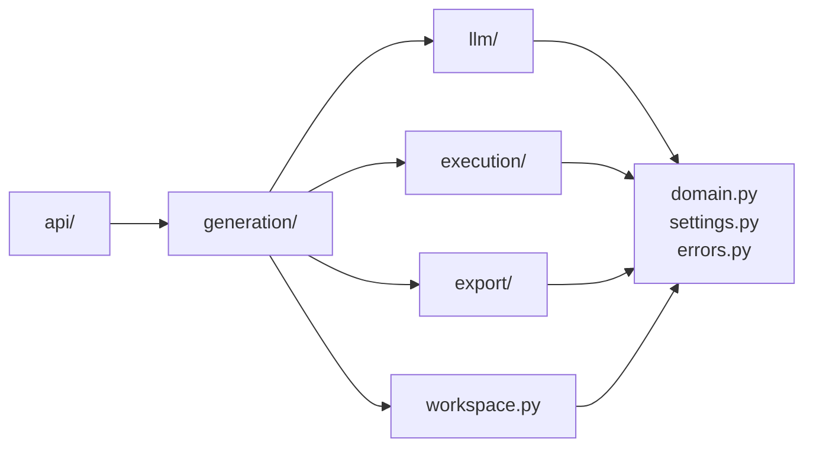

# Estrutura do projeto

<p class="lead">Um pacote Python instalável, com fronteiras internas desenhadas segundo os domínios do SAD. As dependências correm num só sentido, e é essa regra que dá sentido ao resto.</p>

## A árvore

```text
src/codeexpert/
├── __init__.py          versão do pacote
├── __main__.py          ponto de entrada: python -m codeexpert
├── settings.py          configuração, só a partir do ambiente
├── errors.py            as exceções que os serviços levantam
├── domain.py            Constraints, Statement, TestCase, RunMetadata
├── workspace.py         um diretório por execução — a unidade de isolamento
├── llm/
│   └── client.py        o único módulo que fala com um fornecedor de modelos
├── execution/
│   ├── runner.py        o protocolo CodeRunner
│   └── local.py         implementação com gcc, com limites
├── generation/
│   ├── prompts.py       todos os prompts do projeto
│   ├── statement.py     etapa 1
│   ├── codegen.py       etapa 2
│   ├── inputs.py        etapa 3
│   ├── testcases.py     etapa 4 — a única que produz verdade
│   ├── pipeline.py      as cinco etapas encadeadas
│   └── _trace.py        o registo de modelo e versão de prompt
├── export/
│   ├── moodle.py        etapa 5
│   └── templates/       os três templates XML
└── api/
    ├── app.py           fábrica da aplicação
    ├── deps.py          dependências injetáveis
    ├── errors.py        exceção de domínio → código HTTP, numa só tabela
    ├── schemas.py       contratos de entrada e saída
    └── routes/
        ├── health.py    /health e /config
        └── questions.py os seis endpoints de geração
```

Fora do pacote:

```text
tests/unit/           funções puras — sem rede, sem compilador
tests/integration/    vários módulos juntos — continua sem rede
scripts/              check.sh é o portão; o CI corre o mesmo ficheiro
.agents/              o harness da equipa
docs/                 este site; docs/adr/ regista as decisões
main.py               atalho de compatibilidade para python main.py
```

## A direção das dependências



Três invariantes, e violar qualquer uma é um erro de desenho e não de estilo:

| Invariante | Porquê |
| --- | --- |
| Nada abaixo de `api/` importa FastAPI | Cada função de serviço tem de continuar chamável a partir de um *script*, de um teste ou de um futuro *worker* |
| Nada fora de `llm/` chama um modelo | É o que permite à suite inteira correr sem rede e sem chave |
| Nada fora de `execution/` chama `subprocess` | É a costura onde o sandbox real entra — ver [ADR-0004](../adr/0004-execution-behind-a-runner-protocol.md) |

!!! warning "Nenhuma das três é verificada automaticamente"
    Não há teste nem regra de *lint* que as imponha: são responsabilidade de quem revê. Estão na lista de [o que rever com atenção](../contributing/review.md#rever-o-pr-de-outra-pessoa) precisamente por isso.

## Onde acrescentar código

| Quer acrescentar | Onde |
| --- | --- |
| Uma etapa nova no pipeline | Um módulo em `generation/`, com uma função pública, chamada a partir de `pipeline.py` |
| Um endpoint | `api/routes/`, sem `try/except` — a tradução de erros já existe |
| Um tipo de erro novo | `errors.py`, e uma linha em `api/errors.py::STATUS_BY_ERROR` |
| Suporte a outro fornecedor de modelos | Uma classe que satisfaça `LLMClient`, escolhida em `get_llm_client()` |
| Execução isolada (Judge0) | Uma classe que satisfaça `CodeRunner`, escolhida em `get_code_runner()` |
| Uma definição configurável | Um campo em `Settings`, e a linha correspondente em `.env.example` |
| Uma área nova do SAD | Um pacote irmão dentro de `src/codeexpert/` — ver [ADR-0002](../adr/0002-modular-monolith-src-layout.md) |

## O estado vive em ficheiros

Cada etapa lê o diretório da execução, trabalha e volta a escrever nele. Não há objetos partilhados entre etapas, nem sessão, nem base de dados.

!!! tip "É o que torna o pipeline retomável e inspecionável"
    Pode correr só a etapa 3 e voltar a exportar; e o resultado de cada etapa é um ficheiro que se pode ler e editar à mão antes de correr a seguinte.

Ver [Workspace de execução](../architecture/cache-and-state.md).

## Acrescentar outra linguagem

Suportar Python ou Java toca em quatro pontos, todos hoje com valores fixos:

| Ponto | Ficheiro | Valor atual |
| --- | --- | --- |
| Prompt de geração de código | `generation/prompts.py` | `CODE_SYSTEM` e `build_code_prompt` |
| Comando de compilação | `execution/local.py` | `gcc -std=c11 -Wall -Wextra -O1` |
| Comando de execução | `execution/local.py` | o binário produzido |
| Tipo de questão CodeRunner | `export/moodle.py` | `c_program` |

O caminho incremental: acrescentar `language` a `Constraints`, com `Literal["c"]` como único valor aceite; extrair os quatro pontos para uma tabela indexada por linguagem; propagar `language` através de `meta.json`, que já viaja entre etapas.

!!! warning "O terceiro ponto é o que exige cuidado"
    As etapas seguintes só conhecem o que está gravado no *workspace*. Uma linguagem que não viaje no `meta.json` desaparece entre a etapa 2 e a etapa 4, e o pipeline compila C sem se queixar.
