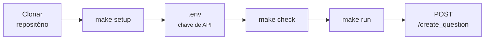

# Primeiros passos

<p class="lead">Do repositório clonado ao primeiro XML gerado. Um comando prepara o ambiente, um ficheiro guarda a chave, e o portão confirma que está tudo de pé antes de gastar uma chamada ao modelo.</p>

## O caminho mais curto



Em comandos:

```bash
git clone https://github.com/HugoRosa29/coderunner_v2.git
cd coderunner_v2
make setup
$EDITOR .env
make check
make run
```

## Pré-requisitos

| Requisito | Versão | Porque é necessário |
| --- | --- | --- |
| **Python** | 3.12 ou superior | Runtime da aplicação |
| **`gcc`** | qualquer | `codeexpert/execution/local.py` compila a solução gerada para obter as saídas reais |
| **Chave de API** | — | Três das cinco etapas chamam `/v1/chat/completions` num fornecedor compatível com OpenAI |
| **`bash` e `make`** | — | Os *scripts* do projeto. No Windows, use WSL |

!!! danger "`gcc` não é opcional"
    Sem `gcc` no `PATH`, `POST /gen_testcases` devolve `422` e o pipeline aborta na quarta etapa — a única que produz verdade em vez de texto gerado. Confirme com:

    ```bash
    gcc --version
    ```

    Os testes que precisam de compilador ignoram-se automaticamente quando ele falta, pelo que `make check` passa na mesma. A aplicação não.

!!! info "Não precisa de instalar dependências à mão"
    `make setup` cria `.venv`, instala o pacote em modo editável com os extras de desenvolvimento e documentação, e copia `.env.example` para `.env`. É idempotente: pode voltar a correr sempre que quiser.

## Ordem recomendada

<div class="grid cards" markdown>

-   :material-numeric-1-circle-outline: **[Instalação](installation.md)**

    ---

    Clonar, `make setup` e o que fazer quando não pode usar o `make`.

-   :material-numeric-2-circle-outline: **[Configuração](configuration.md)**

    ---

    As variáveis `CODEEXPERT_*`, o ficheiro `.env`, e o que `GET /config` responde quando falta alguma coisa.

-   :material-numeric-3-circle-outline: **[Executar o servidor](running.md)**

    ---

    Arrancar com recarga automática, as rotas de entrada e os diretórios criados em tempo de execução.

</div>
