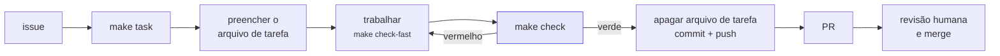

# Da issue ao PR

<p class="lead">O fluxo completo de uma tarefa: pegar a issue, criar a branch, preparar o arquivo de tarefa, trabalhar (com ou sem agente), passar no gate, commitar e abrir o PR. Pressupõe o ambiente pronto — ver Primeiro dia.</p>



O acordo de trabalho completo é o [`AGENTS.md`](https://github.com/TUTOR-IA-Makers/tutor-ia/blob/main/AGENTS.md). Esta página é o caminho prático por ele; o mapa de todos os arquivos está em [Harness](../reference/harness.md).

## 1. Pegue uma issue

Todo trabalho começa numa [issue](https://github.com/TUTOR-IA-Makers/tutor-ia/issues). As histórias do plano já estão lá, com título `[S0][G0-1] …` e labels `epic:`, `dupla:`, `sprint:` e `priority:`.

- Pegue itens da sua dupla, por prioridade. Pode pegar de outra dupla, desde que **avise no canal** antes.
- No máximo **duas histórias em andamento por dupla**.
- Se a issue não existe, abra uma com o template (Feature, Bug ou Chore). Se está vaga, esclareça antes de escrever código.
- Se a tarefa se revelar duas, pare e abra a segunda issue.

## 2. Crie a branch e o arquivo de tarefa

```bash
make task T=feat I=42 S=scope-check
```

| Argumento | Valores | Efeito |
| --- | --- | --- |
| `T` | `feat` `fix` `docs` `refactor` `chore` `test` | Prefixo da branch |
| `I` | número da issue | Branch e arquivo levam o mesmo número |
| `S` | `minusculas-com-hifens` | Nome curto |

O comando atualiza `main` (`git pull --ff-only`), cria a branch `feat/42-scope-check` e escreve `.agents/tasks/42-scope-check.md` a partir do [modelo](https://github.com/TUTOR-IA-Makers/tutor-ia/blob/main/.agents/tasks/TEMPLATE.md). Com o `gh` instalado e autenticado, o título da issue já vem preenchido.

## 3. Preencha o arquivo de tarefa antes de escrever código

O arquivo de tarefa guarda o contexto da branch. É o que permite a outra pessoa — ou a outro agente, numa sessão nova — continuar o trabalho amanhã. Um arquivo por branch, então nunca há conflito de merge nele.

| Seção | O que escrever |
| --- | --- |
| **Goal** | Um parágrafo: o que passa a ser verdade depois do merge |
| **Out of scope** | O que alguém poderia esperar e não entra. É o limite que o agente não cruza |
| **Constraints** | Regra do `AGENTS.md`, ADR ou interface que restringe a solução |
| **Plan** | Passos com caixas, incluindo teste e documentação |
| **Decisions taken along the way** | Preenchido durante o trabalho, o mais recente por último |
| **Verification** | O que você rodou e o resultado |

**Goal** e **Out of scope** são os mais importantes: impedem que um agente "ajude" refatorando três módulos que não têm nada a ver com a tarefa.

## 4. Leia a regra do que você vai tocar

| Vai tocar | Leia antes |
| --- | --- |
| Python | [`.agents/rules/code.md`](https://github.com/TUTOR-IA-Makers/tutor-ia/blob/main/.agents/rules/code.md) |
| `generation/prompts.py` | [`.agents/rules/prompts.md`](https://github.com/TUTOR-IA-Makers/tutor-ia/blob/main/.agents/rules/prompts.md) — e fale com um humano antes |
| `docs/` | [`.agents/rules/docs.md`](https://github.com/TUTOR-IA-Makers/tutor-ia/blob/main/.agents/rules/docs.md) e [Documentação](../reference/docs.md) |
| `execution/`, configuração, chaves | [`.agents/rules/security.md`](https://github.com/TUTOR-IA-Makers/tutor-ia/blob/main/.agents/rules/security.md) |
| Branches, commits, PR | [`.agents/rules/git.md`](https://github.com/TUTOR-IA-Makers/tutor-ia/blob/main/.agents/rules/git.md) |

Algumas áreas exigem um humano antes de mudar: prompts, templates XML, ADRs, workflows, `AGENTS.md`, `CODEOWNERS` e dependências. Lista e motivo em [Harness](../reference/harness.md#o-que-um-agente-nao-decide-sozinho).

## 5. Trabalhe em passos pequenos

Com um agente de código, a instrução é sempre a mesma, seja Claude Code, Codex ou Antigravity:

```text
Read AGENTS.md and .agents/tasks/42-scope-check.md, then implement the plan.
```

Se o agente precisar de mais contexto, o que falta vai para o arquivo de tarefa ou para o `AGENTS.md` — não para uma mensagem de chat que ninguém mais vê.

O ciclo:

```bash
make check-fast   # gate sem o build da documentação — rápido
make fix          # aplica formatação e correções automáticas de lint
```

Registre as decisões no arquivo de tarefa à medida que acontecem. Uma decisão que vale além desta branch vira ADR (ver [Harness](../reference/harness.md#adrs)).

## 6. Feche a tarefa

```bash
make check                                  # o gate completo, igual ao CI
git status --short && git diff              # leia o próprio diff
git rm .agents/tasks/42-scope-check.md      # o arquivo de tarefa sai no PR que fecha a issue
```

No diff, procure:

- qualquer coisa fora da tarefa — remova ou leve para outra branch;
- algo em `var/` ou um `.env` — não deveria ser possível; se aconteceu, corrija a causa;
- `print` de depuração, código comentado, `TODO` sem número de issue;
- prompt alterado sem incrementar `PROMPT_VERSIONS`;
- comportamento documentado que mudou sem a página correspondente mudar junto.

## 7. Commit

[Conventional Commits](https://www.conventionalcommits.org/). Assunto no imperativo, minúsculo, sem ponto final. O corpo explica **por quê**. Commit feito com ajuda de agente leva o trailer `Assisted-by:`.

```text
feat: verify declared constraints against the generated solution

Without this, a question generated as "no loops" can ship with a for loop
and a teacher only finds out in class.

Closes #42

Assisted-by: claude-opus-5
```

Um commit, uma mudança. Formatação vai num commit separado.

## 8. Push e PR

```bash
git push -u origin feat/42-scope-check
gh pr create --fill
```

O [template do PR](https://github.com/TUTOR-IA-Makers/tutor-ia/blob/main/.github/PULL_REQUEST_TEMPLATE.md) pede: o quê e por quê (com `Closes #42`), como foi verificado, checklist, e o que merece atenção do revisor. **"How this was verified"** é a seção mais útil para quem revisa.

O CI roda dois jobs no PR:

| Job | Falha quando |
| --- | --- |
| `gate` | `./scripts/check.sh` falha — o mesmo que `make check` |
| `conventions` | O **título** do PR não segue Conventional Commits (`feat`, `fix`, `docs`, `refactor`, `chore`, `test`, `perf`, `build`, `ci`), ou o **corpo** não referencia a issue (`Closes #42`, `Fixes #42`, `Resolves #42`, `Refs #42`) |

## 9. Revisão e merge

- Responda a todos os comentários, mesmo que seja para discordar.
- Para atualizar com `main`, use rebase: `git fetch origin && git rebase origin/main`.
- Um agente pode enviar correções. **Um humano aprova e faz o merge.** Agente nunca aprova.
- Em prompts, templates, ADRs, `.agents/`, `.github/`, `scripts/` e `pyproject.toml`, o `CODEOWNERS` exige revisor específico.

## Definition of Done

Diga no PR que tudo isto é verdade:

- [ ] `make check` passa.
- [ ] Comportamento novo tem teste; correção de bug tem teste que falhava antes.
- [ ] A documentação corresponde ao código, ou a mudança não toca comportamento documentado.
- [ ] Decisão arquitetural registrada como ADR.
- [ ] Arquivo de tarefa apagado; o PR fecha a issue.
- [ ] Nada no diff está fora da tarefa.

O plano de 30/11 acrescenta dois itens: **demonstrado na review da sprint pela URL de produção** (<span class="ce-badge ce-status--wip">Em desenvolvimento</span> — depende do deploy do G0-2) e, **se mudou prompt, o lote de regressão do G7-2 rodado** com o relatório no PR (<span class="ce-badge ce-status--planned">Planejado</span> — `make lote` ainda não existe).

## Quando você é o revisor

Revise nesta ordem e pare no primeiro nível que falhar:

1. **É a mudança certa?** Corresponde à issue? Há algo fora da tarefa?
2. **Está correta?** Leia o teste, depois o código. Um teste que passaria contra o código antigo não testa nada.
3. **É segura?** Segredos, `subprocess` fora de `execution/`, caminho montado a partir de entrada do cliente, dependência nova.
4. **A fronteira está intacta?** Algo abaixo de `api/` importa FastAPI? Algo fora de `llm/` chama um modelo?
5. **É honesta?** A documentação afirma algo que o diff não entrega?
6. **Só então, estilo.** Formatação o `ruff` já resolveu.

Em código escrito por agente, procure também: abstração plausível sem uso, teste que repete a implementação em vez de testar comportamento, arquivo não relacionado "arrumado" no caminho, comentário confiante e errado, fato inventado na documentação, e ausência do trailer `Assisted-by:`.

Aprove quando você aceitaria ser acionado de madrugada por causa desse código.
