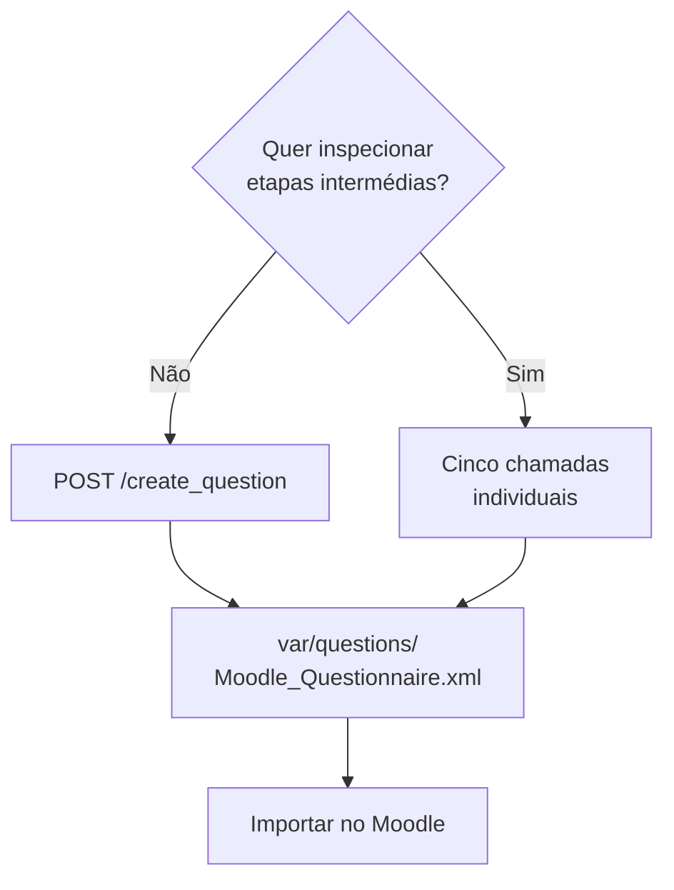

# Guias

Percursos práticos, do primeiro pedido até ao ficheiro importado no Moodle. Cada guia usa apenas endpoints e comandos que existem no repositório.

-   :material-flash: **[Gerar uma questão completa](generate-a-question.md)**

    ---

    Um único pedido a `POST /create_question` percorre as cinco etapas. O guia mostra o corpo do pedido, a resposta de cada etapa e o efeito no sistema de ficheiros.

-   :material-format-list-numbered: **[Pipeline passo a passo](step-by-step-pipeline.md)**

    ---

    As mesmas cinco etapas invocadas individualmente. Útil para inspecionar um enunciado antes de gerar código, ou para repetir apenas a geração de entradas.

-   :material-school-outline: **[Importar no Moodle](import-into-moodle.md)**

    ---

    O que o XML gerado contém, como o importar num banco de perguntas CodeRunner e o que verificar antes de o usar com alunos.

## Escolher o percurso

Os dois percursos executam exatamente o mesmo código: `create_question` chama as mesmas funções de etapa, por ordem. A diferença está no controlo, não no resultado.

!!! info "Nenhum dos percursos reutiliza sobras de outra execução"
    Cada geração tem o seu próprio diretório, identificado por um `run_id`. No percurso manual, esse identificador vem na resposta da primeira etapa e acompanha todas as seguintes.

    É o que permite interromper, editar um ficheiro intermédio e retomar — e o que impede duas gerações em paralelo de se misturarem. Ver [Workspace de execução](../architecture/cache-and-state.md#concorrencia).
