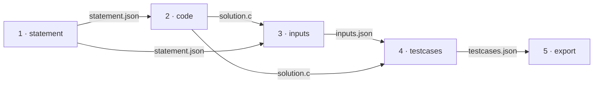

# Pipeline passo a passo

<p class="lead">Os cinco endpoints individuais permitem correr uma etapa de cada vez, editar o resultado intermédio à mão e continuar a partir daí. É o percurso que dá controlo real sobre a questão gerada.</p>

## Porquê o percurso manual

| Quer | `create_question` | Passo a passo |
| --- | --- | --- |
| Uma questão rápida | :material-check: | |
| Corrigir o enunciado antes de gerar a solução | | :material-check: |
| Substituir a solução pela sua | | :material-check: |
| Acrescentar entradas à mão | | :material-check: |
| Repetir só a etapa que falhou | | :material-check: |
| Perceber o que cada etapa faz | | :material-check: |

## As dependências entre etapas



Chamar uma etapa antes daquela que produz a sua entrada devolve `409` a nomear exatamente o que falta.

## 1. Enunciado

```bash
RUN=$(curl -sX POST http://127.0.0.1:8000/gen_statement \
  -H "Content-Type: application/json" \
  -d '{"difficulty": "facil", "can_has_repetition": true}' | jq -r .run_id)

echo "run_id = $RUN"
```

O primeiro pedido **cria a execução**. Guarde o `run_id` — todas as etapas seguintes o exigem.

```bash
# Ajustar o texto ou o título antes de gerar a solução
$EDITOR var/runs/$RUN/statement.json
```

!!! tip "O ponto de maior alavancagem do percurso"
    Tudo o que vem a seguir — solução, entradas, casos de teste e o XML — é gerado a partir deste texto. Cinco minutos a corrigir o enunciado aqui poupam três regerações à frente.

## 2. Solução em C

```bash
curl -X POST http://127.0.0.1:8000/gen_code \
  -H "Content-Type: application/json" -d "{\"run_id\": \"$RUN\"}"
```

```bash
# Substituir pela sua própria solução, se preferir
$EDITOR var/runs/$RUN/solution.c
```

!!! info "A solução não tem de vir do modelo"
    Se escrever a sua, as etapas seguintes usam-na — e as saídas esperadas passam a refletir o seu código. É a forma de usar o protótipo apenas como gerador de casos de teste para um exercício que já tem.

## 3. Entradas de teste

```bash
curl -X POST http://127.0.0.1:8000/gen_inputs \
  -H "Content-Type: application/json" -d "{\"run_id\": \"$RUN\", \"qty\": 8}"
```

```bash
# Acrescentar casos-limite que o modelo não pensou
$EDITOR var/runs/$RUN/inputs.json
```

É aqui que se acrescentam os casos que interessam pedagogicamente: o zero, o negativo, o vazio, o máximo.

!!! warning "O formato tem de corresponder ao que o programa lê"
    Uma entrada com os números separados por espaços quando o programa espera um por linha produz uma saída vazia — e nenhum erro. Confirme os `scanf` em `solution.c`.

## 4. Casos de teste

```bash
curl -X POST http://127.0.0.1:8000/gen_testcases \
  -H "Content-Type: application/json" -d "{\"run_id\": \"$RUN\"}"
```

A etapa que compila e executa — a única que produz factos em vez de texto.

!!! tip "Se não compilar, repita só esta etapa"
    O `detail` traz o `stderr` do `gcc`. Corrija `solution.c` e volte a chamar `/gen_testcases`: as três chamadas ao modelo já pagas não se repetem.

```bash
cat var/runs/$RUN/testcases.json
```

## 5. Exportação para XML

```bash
curl -X POST http://127.0.0.1:8000/export_moodle_xml_question \
  -H "Content-Type: application/json" -d "{\"run_id\": \"$RUN\"}"
```

```json
{ "run_id": "...", "file_path": "var/questions/Moodle_Questionnaire.xml", "question_count": 1 }
```

!!! warning "Exportar duas vezes duplica a questão"
    A exportação **acumula**, não substitui. Chamar esta etapa duas vezes na mesma execução deixa a mesma questão duas vezes no ficheiro — ver [Templates Moodle XML](../architecture/moodle-xml.md#acumulacao).

## Retomar a meio {#retomar-a-meio}

Um `create_question` que falhou na etapa 4 deixou as etapas 1 a 3 no disco. Não repita tudo:

```bash
ls var/runs/                                   # encontrar o run_id
RUN=20260918T221305Z-1a2b3c4d
ls var/runs/$RUN/                              # ver até onde chegou

$EDITOR var/runs/$RUN/solution.c               # corrigir o que falhou
curl -X POST http://127.0.0.1:8000/gen_testcases \
  -H "Content-Type: application/json" -d "{\"run_id\": \"$RUN\"}"
```

!!! success "Retomar poupa o que já foi pago"
    As etapas 1 a 3 são as que custam chamadas ao modelo. Uma falha na 4 ou na 5 não as desperdiça — o diretório da execução continua lá, com tudo o que foi produzido até ao ponto da falha.

!!! info "A verificação é de existência, não de coerência"
    Se editar `solution.c` e voltar a correr a etapa 4, os casos de teste passam a refletir o código novo — mas o enunciado continua a descrever o problema antigo. O serviço não o deteta. Ver [Workspace de execução](../architecture/cache-and-state.md#verificacao-de-existencia-nao-de-coerencia).

## Passo seguinte

Com o XML pronto, siga para [Importar no Moodle](import-into-moodle.md).
