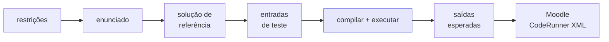

---
hide:
  - toc
---

# Onboarding

<p class="lead">Leia isto uma vez, no primeiro dia. Explica o que estamos a construir, o que este repositório contém de facto, e a regra que dá sentido à maior parte do código. Vinte minutos — os detalhes estão todos ligados, e não precisam de ser lidos agora.</p>

!!! info "Depois desta página, leia `AGENTS.md`"
    Esta página explica **o quê** e **porquê**. O acordo de trabalho — branches, ficheiros de tarefa, o portão, revisão, agentes — está em [`AGENTS.md`](https://github.com/HugoRosa29/coderunner_v2/blob/main/AGENTS.md), resumido em [Contribuir](../contributing/index.md) e detalhado em [O harness](../contributing/harness.md).

## 1. O produto

Estamos a construir uma **plataforma de avaliação formativa de programação** para disciplinas introdutórias de C — não um *online judge*.

A diferença é o ponto todo. Um juiz tradicional responde a uma só pergunta: *o programa produziu a saída esperada?* Isso falha o que uma disciplina introdutória ensina. Não consegue verificar "resolva isto sem usar ciclos", diz a um aluno em dificuldade `Wrong Answer` e mais nada, e entrega ao docente uma folha de cálculo de passa/não-passa quando o que ele precisa é de saber o que ensinar amanhã.

Desde 2025 mede também a coisa errada: com modelos de linguagem à distância de um separador, "o código passa nos testes" deixou de ser prova de que o aluno aprendeu alguma coisa.

Por isso a plataforma avalia o que é verificável, explica em linguagem sobre a qual um principiante consegue agir, e dá ao docente a forma do mal-entendido da turma em vez de uma coluna de notas.

### Três pilares, pela ordem em que são construídos

| Pilar | O que faz | Onda |
| --- | --- | --- |
| **Pilar 2** — Correção e *feedback* | Avalia uma submissão em três camadas e devolve *feedback* formativo | 1 — **o MVP** |
| **Pilar 3** — Analítica pedagógica | Transforma submissões num diagnóstico por conceito, para o docente | 2 |
| **Pilar 1** — Geração de questões | Gera exercícios no estilo pedagógico da instituição | 3 |

A ordem é deliberada: o Pilar 2 produz os dados que os outros dois consomem, e o Pilar 1 é o mais tolerante ao erro, porque um humano aprova o que ele produz.

### As três camadas de avaliação

| Camada | O que é | Conta para a nota |
| --- | --- | --- |
| **C1 — Funcional** | Compilar, executar contra casos de teste | Sim |
| **C2 — Estrutural** | Analisar a AST: estruturas usadas, violações de escopo, métricas | Sim, consoante o modo da atividade |
| **C3 — Pedagógica** | Um modelo escreve uma explicação, ancorada no que C1 e C2 já apuraram | **Nunca** |

## 2. A regra que explica o código {#a-regra-que-explica-o-codigo}

!!! quote "A regra"
    **Nenhuma saída de modelo de linguagem entra no cálculo de uma nota, em proporção nenhuma.**

O raciocínio é curto. A avaliação por modelo é não-determinística e não-auditável. Dois programas equivalentes receberem notas diferentes destrói permanentemente a confiança de um docente, e os alunos envolvidos são menores cujas notas são passíveis de recurso. Por isso o modelo escreve texto, e só texto, ancorado em prova que código determinístico produziu.

**Neste repositório a mesma regra aparece assim: o que pode ser verificado por execução nunca é previsto.** O modelo escreve o enunciado e uma solução candidata — depois compilamos essa solução com `gcc`, corremo-la contra cada entrada, e o `stdout` real torna-se a saída esperada na questão exportada. Nunca perguntamos ao modelo o que o programa imprimiria.

Essa frase explica `execution/`, o protocolo `CodeRunner`, os *timeouts*, e porque é que a suite de testes se importa tanto com uma etapa que parece canalização.

## 3. O que este repositório é

**O CodeExpert é um protótipo do EPIC-017 — geração de questões com IA.** É o Pilar 1, onda 3: o *último* épico da *última* onda, explicitamente fora do MVP.

Faz uma coisa, de ponta a ponta. Um pedido HTTP descreve as restrições pedagógicas de um exercício — pode usar `if`? `else`? ciclos? funções? vetores? que dificuldade? — e o serviço devolve uma questão completa, exportada como Moodle CodeRunner XML, pronta a importar.



!!! warning "O que não é"
    Sem autenticação, sem base de dados, sem *multi-tenancy*, sem *sandbox*, sem cálculo de notas, sem análise estrutural. Isso pertence a épicos anteriores que ainda não existem. **Não acrescente nada disso aqui por parecer estar em falta — está em falta de propósito.** Ver [Roadmap e enquadramento](../product/roadmap.md).

**Porque existe mesmo assim**, estando fora do caminho crítico:

<div class="grid cards" markdown>

-   :material-flask-outline: **Testa uma hipótese real, barato**

    ---

    Consegue um modelo reproduzir o estilo pedagógico de um docente? Essa pergunta precisa de uma tarde, não de uma plataforma.

-   :material-gift-outline: **Entrega valor hoje**

    ---

    A um docente que já usa o Moodle CodeRunner, sem depender de nada das ondas 0 a 2.

-   :material-check-decagram-outline: **Prova a ideia central em miniatura**

    ---

    A execução-em-vez-de-previsão é a mesma ideia em que assenta a camada C1 da plataforma.

</div>

## 4. O que se segue

A equipa avança agora para o que o SAD descreve — submissão, execução em *sandbox*, avaliação determinística, análise estrutural, *feedback* formativo. O backlog está a ser reformulado, por isso trate o [documento atual](../product/mvp-backlog.md) como direção e não como contrato.

Duas decisões já estão tomadas e vale a pena conhecê-las antes de ler código:

- **Isto continua a ser um repositório com um pacote**, não um monorepo. Áreas novas tornam-se pacotes irmãos dentro de `src/codeexpert/`, com uma regra de dependências num só sentido. Um pacote só se torna implantável por si quando algo mensurável o obrigar — [ADR-0002](../adr/0002-modular-monolith-src-layout.md).
- **Código não confiável nunca corre no processo da aplicação.** O executor local com `gcc` está hoje atrás de um protocolo precisamente para que o *sandbox* Judge0 da plataforma o possa substituir sem tocar no pipeline — [ADR-0004](../adr/0004-execution-behind-a-runner-protocol.md).

## 5. O código em cinco minutos

```text
src/codeexpert/
  settings.py    configuração, só a partir do ambiente
  errors.py      as exceções que os serviços levantam — a API mapeia-as para códigos de estado
  domain.py      Constraints, Statement, TestCase, RunMetadata
  workspace.py   um diretório por execução: a unidade de isolamento
  llm/           o único módulo que fala com um fornecedor de modelos
  execution/     compilar e executar C — a costura que um sandbox real substitui
  generation/    as cinco etapas do pipeline, e prompts.py
  export/        Moodle CodeRunner XML e os seus templates
  api/           FastAPI: rotas, esquemas, dependências, mapeamento de erros
```

As dependências correm num só sentido, e é essa regra que dá sentido à arrumação:

```text
api → generation → {llm, execution, export, workspace} → {domain, settings, errors}
```

Nada abaixo de `api/` importa FastAPI. Nada fora de `llm/` chama um modelo. Nada fora de `execution/` chama `subprocess`.

!!! tip "Duas ideias explicam quase todo o resto"
    **O estado vive em ficheiros, não em memória.** Cada etapa lê o diretório da execução, trabalha e volta a escrever — é isso que torna o pipeline retomável e inspecionável etapa a etapa.

    **Exatamente uma etapa produz verdade**: a geração de casos de teste, ao correr o programa. Todo o resto é geração assistida que um humano tem de rever.

Detalhe em [Estrutura do projeto](../development/project-structure.md) e [Pipeline de geração](../architecture/pipeline.md).

## 6. Pôr a funcionar

```bash
git clone https://github.com/HugoRosa29/coderunner_v2.git
cd coderunner_v2
make setup                 # .venv, dependências, .env
$EDITOR .env               # a sua chave em CODEEXPERT_LLM_API_KEY
make check                 # o portão — deve ficar verde num clone acabado de fazer
make run                   # http://127.0.0.1:8000 → Swagger UI
```

Precisa de Python 3.12+, `gcc` no `PATH` e uma chave de um fornecedor compatível com OpenAI. No Windows, use WSL — os *scripts* são bash. O detalhe está em [Instalação](../getting-started/installation.md) e [Configuração](../getting-started/configuration.md).

Gere a primeira questão:

```bash
curl -X POST http://127.0.0.1:8000/create_question \
  -H "Content-Type: application/json" \
  -d '{"statement_request": {"difficulty": "facil", "can_has_repetition": true}, "qty": 5}'
```

O resultado fica em `var/questions/Moodle_Questionnaire.xml`, e os artefactos da execução — enunciado, solução, entradas, casos de teste e o `meta.json` que regista que modelo e que versão de prompt os produziram — ficam em `var/runs/<run_id>/` para inspeção.

!!! danger "Reveja antes de usar com alunos"
    O protótipo ainda não verifica se a solução gerada respeitou as restrições pedidas. Leia a [análise de lacunas](../product/gap-analysis.md) antes de pôr qualquer questão gerada à frente de uma turma.

## 7. Como trabalhamos

[`AGENTS.md`](https://github.com/HugoRosa29/coderunner_v2/blob/main/AGENTS.md) é o acordo de trabalho — igual para pessoas e para agentes. A versão curta:

- O trabalho começa numa *issue* do GitHub. `make task T=feat I=42 S=scope-check` cria a branch e o seu ficheiro de tarefa de uma vez.
- O ficheiro de tarefa em `.agents/tasks/` carrega o contexto da branch. Um por branch, pelo que os *merges* nunca conflituam nele. É apagado no PR que fecha a issue.
- `make check` é o portão. É o que o CI corre. Verde antes de enviar.
- Conventional Commits; commits assistidos por agente levam um *trailer* `Assisted-by:`.
- Decisões caras de reverter ficam numa [ADR](../adr/index.md).

Seja qual for o agente — Claude Code, Codex, Antigravity — a instrução é a mesma: *lê o `AGENTS.md` e o ficheiro de tarefa*. É o ponto todo de haver um só ficheiro de instruções.

[:octicons-arrow-right-24: O harness, em detalhe](../contributing/harness.md)

## 8. Vocabulário

| Termo | Significado |
| --- | --- |
| **SAD** | O documento de arquitetura da plataforma, v0.1, ainda em rascunho |
| **Onda 0–3** | As fases de entrega. O MVP fecha no fim da onda 1 |
| **EPIC-017** | Geração de questões com IA — o que este repositório prototipa |
| **C1 / C2 / C3** | As camadas de avaliação funcional, estrutural e pedagógica |
| **FORMATIVO / ESCOPO / ESTRITO** | O modo de avaliação da atividade: se as violações estruturais afetam a nota, e quais |
| **Violação de escopo** | Usar uma estrutura que o exercício proíbe. Objetivo e binário — justo penalizar |
| **Violação de qualidade** | Nomes pobres, duplicação, aninhamento profundo. Envolve juízo — contencioso penalizar |
| **Execução (*run*)** | Uma passagem pelo pipeline de geração, com o seu `run_id` e o seu diretório |
| **O portão** | `make check` |

## 9. Para onde ir a seguir

<div class="grid cards" markdown>

-   :material-handshake-outline: **[Contribuir](../contributing/index.md)**

    ---

    O ciclo de trabalho: issue, branch, ficheiro de tarefa, portão, PR.

-   :material-robot-outline: **[O harness](../contributing/harness.md)**

    ---

    O que há em `.agents/`, e como instruir um agente de código sem inventar contexto.

-   :material-rocket-launch-outline: **[Primeiros passos](../getting-started/index.md)**

    ---

    Pré-requisitos, instalação, configuração e arranque, com o detalhe todo.

-   :material-scale-balance: **[Decisões (ADR)](../adr/index.md)**

    ---

    Porque é que o código está assim, e o que faria mudar de ideias.

-   :material-compare: **[Análise de lacunas](../product/gap-analysis.md)**

    ---

    O que falta antes de isto ser confiável, item a item.

-   :material-map-outline: **[Roadmap](../product/roadmap.md)**

    ---

    Onde este repositório se situa no plano da plataforma.

</div>
