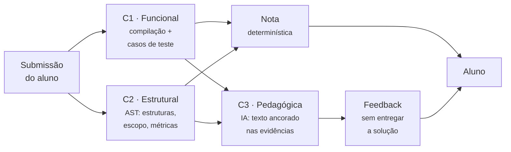
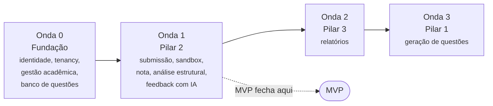

# Plataforma-alvo

A plataforma completa que os documentos de planejamento descrevem, e onde este repositório se encaixa nela. Nada desta página existe em código, exceto onde indicado.

!!! info "Fonte"
    Resumo de quatro documentos de planejamento externos ao repositório, todos v0.1 e com decisões em aberto:

    | Documento | Conteúdo |
    | --- | --- |
    | Etapa 1 — Visão do produto | Problema, proposta de valor, personas, riscos, hipóteses |
    | Etapa 2 — Mapa de épicos | 19 épicos, modelo de nota, permissões, ondas |
    | Etapa 3 — Definição do MVP | Recorte por épico, critérios de saída, sequenciamento |
    | SAD — Arquitetura do MVP | C4, ADRs, modelo de dados, resiliência, segurança — resumido em [Arquitetura-alvo](target-architecture.md) |

## O problema

Disciplinas introdutórias de programação têm reprovação alta, e a ferramenta usual — o juiz automático — só verifica se o programa imprime a saída esperada. Três consequências:

- **O aluno recebe um veredito, não um diagnóstico.** "Wrong Answer" não diz o que errou.
- **O professor vê o resultado, não o processo.** Uma planilha de acertos não diz o que ensinar na próxima aula.
- **O que importa pedagogicamente não é verificado.** "Resolva sem usar `if`" passa se a saída estiver certa.

E desde 2025, com modelos de linguagem a uma aba de distância, "o código passa nos testes" deixou de ser evidência de aprendizado. Por isso a plataforma se posiciona como **avaliação formativa e diagnóstica**, não como juiz automático melhorado.

## Três pilares

| Pilar | O que faz | Onda |
| --- | --- | --- |
| **Pilar 2** — Correção e feedback | Avalia a submissão em três camadas e devolve feedback formativo | 1 — o MVP |
| **Pilar 3** — Analítica pedagógica | Transforma submissões em diagnóstico por conceito para o professor | 2 |
| **Pilar 1** — Geração de questões | Gera exercícios no estilo pedagógico da instituição | 3 — **este repositório** |

O Pilar 2 produz os dados que os outros consomem; o Pilar 1 vem por último porque um humano aprova o que ele gera e porque depende de um acervo de referência.

### As três camadas de avaliação

!!! danger "RN-NOTA-01"
    **Nenhuma saída de modelo de linguagem entra no cálculo da nota, em nenhuma proporção.** A IA produz texto, ancorado no que C1 e C2 já apuraram. Avaliação por LLM não é determinística nem auditável, e duas notas diferentes para códigos equivalentes destroem a confiança do professor.

    Neste repositório, a mesma regra faz a etapa 4 compilar e executar em vez de perguntar ao modelo qual seria a saída.

A camada C2 também não pode ser feita por LLM: um comentário, uma string ou uma variável `whileCount` induzem erro. Estruturas permitidas e proibidas são verificadas por parser determinístico (`tree-sitter-c`) — a mesma decisão que o G2-2 aplica à **nossa** solução de referência.

## As quatro ondas

| Onda | Épicos | Resultado |
| --- | --- | --- |
| **0 — Fundação** | EPIC-001 a 007, 018, 019 | Uma turma real existe na plataforma, com questões publicadas |
| **1 — Pilar 2** | EPIC-008 a 013 | **MVP**: o aluno submete, recebe nota determinística e feedback |
| **2 — Pilar 3** | EPIC-014 a 016 | O professor decide a próxima aula com base em dados |
| **3 — Pilar 1** | EPIC-017 | O acervo cresce com apoio de IA |

O backlog das Ondas 0 e 1 está em [Backlog da plataforma](mvp-backlog.md).

## Onde este repositório se encaixa

No roadmap original, o EPIC-017 é o **último épico da última onda** e depende de EPIC-004 (banco de questões), 005 (curadoria), 006 (casos de teste e validação) e 013 (governança de IA).

O [Plano de entrega](plano-30-11.md) **reescopa isso de propósito**: até 30/11 a equipe entrega o gerador como produto, e constrói só as partes de 004, 005 e 013 de que a geração precisa. O motivo: ~80% do núcleo do gerador já existia e passava nos testes, enquanto a Onda 1 exige sandbox, identidade, análise de AST de código de aluno e cálculo de nota, tudo do zero.

| O EPIC-017 exige | Hoje | Até 30/11 |
| --- | --- | --- |
| Parametrização (conteúdo, nível, estruturas) | Implementado parcial: nível e cinco booleanos | Planejado eixo e listas de estruturas (G2-1, G6-1) |
| Gerar enunciado, solução e casos de teste | Implementado | — |
| Validação automática antes de mostrar ao professor | Implementado parcial: compila e executa | Planejado verificação de escopo (G2) |
| Rastreabilidade (modelo, prompt, custo) | Implementado parcial: modelo e versão de prompt | Planejado custo (G2-4) |
| Revisar → editar → aprovar | Não existe | Planejado (G3, G4) |
| Referências do acervo; habilitar só com ≥ 8 por combinação | Não existe | Planejado (G6) |
| Alerta de similaridade com o acervo | Não existe | Fora do recorte |
| Aprovador ≠ solicitante | Não existe | Fora do recorte |

## Personas

| Persona | Papel na plataforma | No recorte de 30/11 |
| --- | --- | --- |
| **Professor** | Cria questões, publica atividades | Gera, revisa, aprova e exporta |
| **Tutor** | Cria, edita e valida questões | — |
| **Monitor** | Lê submissões e relatórios da turma | Cataloga o acervo |
| **Aluno** | Submete código, lê feedback | Não toca o sistema |
| **Coordenador** | Consome relatórios agregados | — |
| **Administrador** | Tenant, usuários, cotas de IA | — (a equipe opera) |

O professor desconfia de avaliação feita por IA e abandona o sistema depois de discordar de duas ou três. Por isso a geração tem aprovação humana obrigatória.

## Ordem de sacrifício {#ordem-de-sacrificio}

Features que a Definição do MVP proíbe cortar, porque a falta delas aparece como injustiça, insegurança ou ilegalidade:

| Feature | Por quê | Neste repositório |
| --- | --- | --- |
| **FEAT-024** — validação automática da questão | Questão sem solução válida reprova aluno certo | Parcial; G2 completa |
| **FEAT-033** — isolamento da execução | Código não confiável sem sandbox | Fora do recorte; risco aceito (G8-3) |
| **FEAT-040** — verificação de escopo | Aluno perde ponto por estrutura que não usou | G2-2 |
| **FEAT-045** — ancoragem do feedback | Feedback inventado | Não se aplica |
| **FEAT-047** — filtro anti-solução | A IA entrega a resposta | Não se aplica |
| **FEAT-058** — degradação sem IA | Provedor fora derruba a nota | Não se aplica |
| **FEAT-061/062** — menores e minimização de dados | Ilegalidade | Nenhum dado de aluno no recorte |

A ordem de corte do próprio plano de 30/11 está em [Plano § 7](plano-30-11.md#7-ordem-de-sacrificio).

## Critérios de saída do MVP relevantes aqui

| # | Critério | Meta |
| --- | --- | --- |
| 2 | Precisão da verificação de escopo | Zero falsos positivos num conjunto adversarial |
| 7 | Segurança de execução | Bateria de código malicioso contida em 100% dos casos |
| 12 | Acervo | ≥ 8 questões aprovadas por eixo × nível nos eixos E1–E4 — é o limiar que habilita a geração por IA |

## Fora de escopo da plataforma

| Item | Motivo |
| --- | --- |
| Detecção de plágio ou de uso de IA pelo aluno | Impreciso, e falso positivo tem consequência disciplinar |
| Provas somativas com nota oficial | Exige integridade acadêmica e contestação formal |
| Integração com LMS (LTI, sincronização de notas) | Custo alto; validar valor primeiro |
| Casos de teste sem solução de referência | Teste errado reprova aluno certo |
| Gamificação e rankings | Sem evidência de valor |
| Mais de duas linguagens | Cada linguagem multiplica sandbox, parser, rubrica e prompts |

Exportar Moodle XML não contradiz o item de LMS: é como este gerador entrega valor hoje a quem já usa o CodeRunner, sem depender da plataforma.
