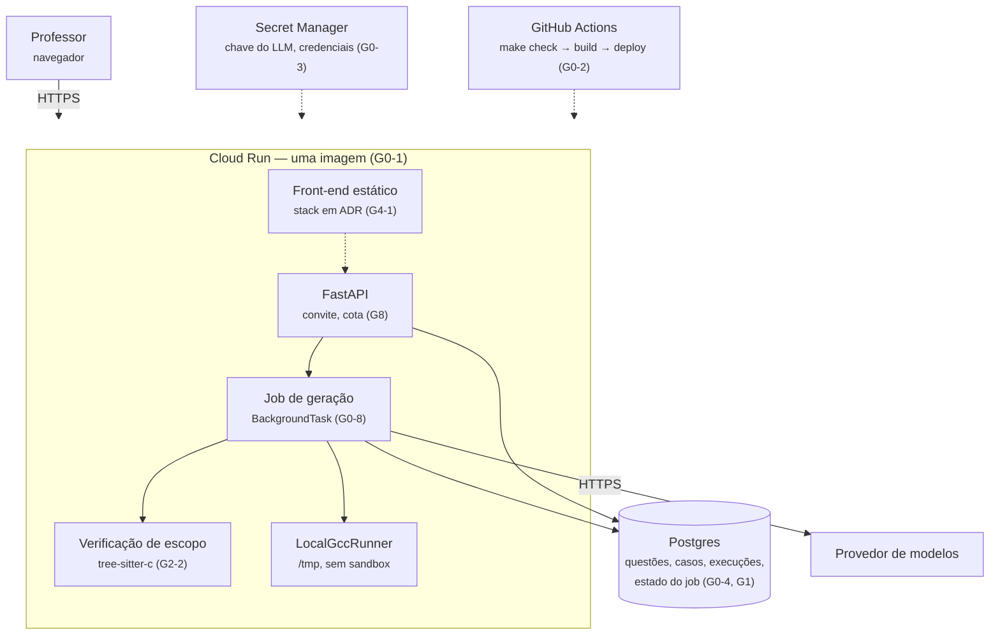

# Evolução até 30/11

O que muda na arquitetura e no produto até 30/11, área por área, no formato Hoje → Mudança planejada → Estado esperado. Resume o Plano de entrega; os critérios de aceite de cada história estão lá.

!!! warning "Plano, não descrição do sistema"
    Nada marcado como Planejado existe no código. Em desenvolvimento significa que há issue aberta na sprint atual, não que já funciona. O que existe hoje está em [Arquitetura](../architecture/index.md).

## Onde estamos

**30/09 — Sprint 0 (28/09 → 04/10), meta: `main` deploya sozinho para uma URL pública e as decisões que travam todo mundo estão tomadas.**

As seis histórias da S0 estão Em desenvolvimento:

| Issue | História | Dupla |
| --- | --- | --- |
| [#1](https://github.com/TUTOR-IA-Makers/tutor-ia/issues/1) | G0-1 Imagem única com a API e o `gcc` | A |
| [#2](https://github.com/TUTOR-IA-Makers/tutor-ia/issues/2) | G0-2 Deploy contínuo a partir de `main` | A |
| [#3](https://github.com/TUTOR-IA-Makers/tutor-ia/issues/3) | G4-1 Esqueleto do front-end no mesmo container | B |
| [#4](https://github.com/TUTOR-IA-Makers/tutor-ia/issues/4) | G5-1 Design system mínimo | B |
| [#5](https://github.com/TUTOR-IA-Makers/tutor-ia/issues/5) | G6-1 Taxonomia e vocabulário | C |
| [#6](https://github.com/TUTOR-IA-Makers/tutor-ia/issues/6) | G6-2 Catalogar E1 e E2 (continua na S1) | C |

| Sprint | Datas | Meta |
| --- | --- | --- |
| **S0** Chão firme | 28/09 → 04/10 | Deploy contínuo para URL pública; stack do front, design system e taxonomia decididos |
| **S1** Persistir e mostrar | 05/10 → 18/10 | A questão gerada fica no banco; formulário no ar; ≥ 16 questões de referência |
| **S2** O fluxo completo | 19/10 → 01/11 | Gerar, revisar, aprovar, listar, ponta a ponta. Ponto de decisão em 01/11 |
| **S3** Confiança | 02/11 → 15/11 | Nenhuma questão aprovada viola as restrições pedidas; teto de custo |
| **S4** Fechar | 16/11 → 29/11 | Edição com revalidação, exportação de seleção, acesso por convite. Congelamento em 23/11 |

Distribuição por dupla, estimativas e ordem de corte em [Plano de entrega](plano-30-11.md#6-as-cinco-sprints).

## Mudanças planejadas

### Infraestrutura e deploy {#infraestrutura-e-deploy}

| Hoje | Mudança planejada | Estado esperado |
| --- | --- | --- |
| Roda com `make run` na máquina de cada um. Sem Dockerfile, sem deploy | **G0-1** imagem Docker com API e `gcc` · **G0-2** GitHub Actions: `make check` → build → push → deploy no Cloud Run a cada merge em `main` | Uma imagem, a mesma local e em produção. URL pública no `README.md`, respondendo `GET /health` com a versão de `main` |
| Chave no `.env` local | **G0-3** chave no Secret Manager, lida pela conta de serviço (S1) | Nenhuma chave no repositório, nos logs ou no painel do Cloud Run |
| Logs em `stdout`, sem `run_id` | **G0-5** logs estruturados com `run_id`, etapa e duração (P1, sem sprint) | Uma geração inteira rastreável no Cloud Logging |

S0 e S1. G0-1 e G0-2 estão Em desenvolvimento; o resto, Planejado. Ambiente de staging (G0-7) fica fora do recorte.

### Estado da geração e banco de questões {#estado-da-geracao}

| Hoje | Mudança planejada | Estado esperado |
| --- | --- | --- |
| Estado em `var/runs/<run_id>/`. `RunWorkspace.open()` faz `root.is_dir()`; no Cloud Run cada instância tem seu disco, então a etapa 2 em outra instância responde `404` | **G0-4** protocolo `ArtifactStore`: `LocalFilesystemStore` em dev/testes, `PostgresStore` em produção, com ADR (S1) | Estado no Postgres a cada etapa. Disco só como rascunho de uma etapa (`/tmp/<run_id>` para o `.c` e o binário) |
| Nenhum banco | **G1-1** Postgres gerenciado com migrações Alembic aplicadas no deploy · **G1-2** tabelas de questão, caso de teste e execução (S1) | O que hoje está em `meta.json` (modelo, versão de prompt) vira coluna, junto com tokens e custo |
| Pedido HTTP síncrono, aberto por dezenas de segundos | **G0-8** `POST /questions` responde `202` com id; as etapas rodam numa `BackgroundTask`; `GET /questions/{id}` mostra progresso (S2) | Job interrompido fica `INTERROMPIDO`, com as etapas pagas preservadas. Não é fila distribuída |
| XML acumulado em um arquivo, lido e reescrito a cada exportação | **G1-8** `export_question` vira função pura: recebe questões, devolve XML (S2) · **G1-6** `POST /export` com ids selecionados (S4) | Exportação sem arquivo compartilhado; só questões aprovadas |
| Sem listagem | **G1-5** `GET /questions` com filtros por eixo, nível, estado e texto, paginado (S2) | Biblioteca do professor |
| Os 3 primeiros casos são exemplo, por ordem | **G1-4** categoria (típico, limite, borda, inválido) e visibilidade (público, privado) (S4, P1) | Casos privados ocultos no XML; ≥ 1 público e 1 privado para aprovar |

Todos Planejados. G0-4 é o risco técnico do plano: se estourar, corta-se outra coisa da S1, nunca ele.

### Verificação de escopo {#verificacao-de-escopo}

| Hoje | Mudança planejada | Estado esperado |
| --- | --- | --- |
| Cinco booleanos (`can_has_if`…). O prompt pede ao modelo que respeite; **nada verifica** | **G2-1** listas nomeadas `permitidas`, `proibidas`, `obrigatorias`, com vocabulário compartilhado com a taxonomia (S3) | Restrições expressivas e verificáveis por AST; os booleanos continuam aceitos ou a quebra é documentada |
| — | **G2-2** etapa nova entre `gen_code` e `gen_inputs`: `tree-sitter-c` detecta as estruturas usadas em `solution.c` (S3) | Veredito (detectado × pedido) persistido e exposto. Zero falsos positivos com `for` em comentário, string ou identificador |
| — | **G2-3** violação dispara nova geração, até N vezes (padrão 2) (S3) | Esgotadas as tentativas: estado `FALHOU_VERIFICACAO`, nunca `GERADA` |
| Entradas são strings; a categoria pedida no prompt é descartada | **G2-5** `gen_inputs` devolve `{entrada, categoria}` (S2, P1) | Categoria alimenta o G1-4 |
| Sem tokens nem custo | **G2-4** `usage` por etapa, custo em reais, `GET /metrics` (P1, sem sprint) | Custo médio por questão gerada e por aprovada |

Todos Planejados. Plano B do G2-3, se o G2-2 estourar: em vez de regerar, mostrar a violação na tela de revisão.

### Revisão e aprovação humana {#revisao-e-aprovacao}

| Hoje | Mudança planejada | Estado esperado |
| --- | --- | --- |
| `meta.json` tem `reviewed: false`; nada o altera; o XML sai com `Nao revisado` | **G3-1** estados `GERANDO`, `GERADA`, `FALHOU_VERIFICACAO`, `APROVADA`, `REJEITADA`; transição inválida é `409` (S2) · **G3-2** `POST /questions/{id}/approve` grava quem e quando (S2) | Todo XML exportado tem um humano responsável |
| Editar exige mexer nos arquivos em `var/runs/` | **G3-3** editar enunciado, solução ou casos; editar a solução reexecuta compilação, verificação e saídas esperadas (S4) | Saída esperada nunca é digitada nem herdada — sempre recalculada |
| Qualquer execução pode ser exportada | **G3-4** o exportador recusa o que não está `APROVADA` (S4) | Impossível levar para a turma algo que ninguém revisou |

Todos Planejados. Aprovador ≠ solicitante e trilha de auditoria ficam fora (exigem papéis).

### Interface do professor {#interface-do-professor}

| Hoje | Mudança planejada | Estado esperado |
| --- | --- | --- |
| Só o Swagger UI em `/docs` | **G4-1** stack decidida em ADR; build do front no `Dockerfile`, servido pelo FastAPI como estático (S0) | Front e API num deploy só, sem CORS nem segundo domínio |
| Sem identidade visual de produto | **G5-1** nome, logo, paleta e tipografia; tokens num arquivo consumido pelo front (S0) · **G5-2** landing pública (S1) | — |
| Pedido montado em JSON no `curl` | **G4-2** formulário · **G4-3** progresso da geração · **G4-4** estados de erro (S1) · **G4-5** tela de revisão · **G4-6** biblioteca · **G4-9** entrada por convite (S2) · **G4-7** edição inline · **G4-8** download com instruções (S3) · **G4-10** polimento e mobile (S4) | Um professor gera, revisa, aprova e baixa o XML sem terminal |

G4-1 e G5-1 Em desenvolvimento; o resto Planejado. A stack do front ainda não foi decidida.

### Acervo de referência {#acervo-de-referencia}

| Hoje | Mudança planejada | Estado esperado |
| --- | --- | --- |
| Geração a partir do nada: o prompt não inclui nenhuma questão de exemplo | **G6-1** taxonomia fechada: eixos E1–E4, níveis, vocabulário de estruturas (S0) · **G6-2/G6-4** catalogar ≥ 8 questões por eixo × nível, com situação de direitos (S0–S2) · **G6-3** `make import-acervo` (S1) | ≥ 32 questões de referência no banco, como `APROVADA` |
| — | **G6-5** o prompt de enunciado recebe exemplos reais da mesma combinação (S2) · **G6-6** geração ancorada só com ≥ 8 referências; a interface mostra quantas faltam (S3, P1) · **G6-7** avaliação cega com um professor (S3, P1) | Geração ancorada no estilo da instituição, com um número para a hipótese H7 |

G6-1 e G6-2 Em desenvolvimento; o resto Planejado. G6-5 é a mudança de prompt mais importante do projeto e exige o lote de regressão do G7.

### Harness de avaliação da IA {#harness-de-avaliacao-da-ia}

| Hoje | Mudança planejada | Estado esperado |
| --- | --- | --- |
| "O prompt melhorou" é impressão. `PROMPT_VERSIONS` identifica o prompt, mas não há medida | **G7-1** golden set de 20 pedidos e `make lote`, retomável (S1) · **G7-2** relatório por lote: taxa de compilação, conformidade de escopo, custo, tempo, regeração (S1) · **G7-3** rubrica humana (S3, P1) | Mudança de prompt aceita ou recusada por número; relatório obrigatório no PR que muda prompt |

Todos Planejados. Não confundir com o harness de desenvolvimento (`AGENTS.md`, `.agents/`), que já existe — ver [Harness](../reference/harness.md).

### Acesso e custo {#acesso-e-custo}

| Hoje | Mudança planejada | Estado esperado |
| --- | --- | --- |
| Todos os endpoints públicos, sem autenticação | **G8-1** acesso por código de convite, um banco de questões por convite; sem sessão é `401` (S4) | Geração só com sessão; `/health` e a landing continuam abertos |
| Sem limite de uso | **G8-2** cota diária e mensal por convite, `429` ao atingir (S3) · **G0-6** alerta de orçamento em 50% e 80% e limite diário global (S3) | A chave de API não fica exposta à internet |
| — | **G8-4** página de LGPD mínima (S4, P1) | O professor sabe o que é guardado |

Todos Planejados. G8-1, G8-2 e G0-6 estão na lista do que não se corta.

### Execução de código {#execucao-de-codigo}

| Hoje | Mudança planejada | Estado esperado |
| --- | --- | --- |
| `LocalGccRunner` no processo da API: limite de tempo e de saída, `SIGKILL` no grupo de processos. Sem limite de memória, processos, rede ou disco | **G8-3** revisão de segurança antes de expor: limites conferidos no container, `--concurrency` 4–8, CPU ≥ 2, sistema de arquivos read-only fora de `/tmp` (S4) | **Igual a hoje**, rodando no Cloud Run, com o risco aceito e documentado |

O sandbox Judge0 (FEAT-033) fica **fora do recorte**. É aceitável porque o código vem de um modelo, nenhum código de aluno roda aqui e o acesso é por convite; se qualquer uma dessas condições mudar, o sandbox passa a bloquear. Ver [Plano § 11](plano-30-11.md#11-o-que-fica-fora-e-porque).

### Documentação {#documentacao}

**G9-1** documentação alinhada com a realidade (S4) · **G9-2** guia do professor, de uma página, testado com alguém de fora (S3) · **G9-3** ensaio geral em 25/11 a partir de um clone limpo (S4). Todos Planejados.

## Arquitetura esperada em 30/11 {#arquitetura-esperada-em-3011}

Montada a partir das histórias acima. Nomes de endpoints e tabelas são os do plano e podem mudar na implementação.

| Aspecto | Hoje | 30/11 |
| --- | --- | --- |
| Interface | Swagger UI | Front-end do professor, servido pela mesma imagem |
| Entrada | Pedido síncrono, aberto até o fim | `202` + acompanhamento do job |
| Estado | Arquivos em `var/runs/` | Postgres, a cada etapa |
| Verificação | Compila e executa | Compila, executa **e** verifica escopo |
| Saída | XML acumulado num arquivo | XML gerado sob demanda a partir de questões aprovadas |
| Acesso | Aberto, local | Convite, cota, teto de custo, URL pública |
| Execução do C | Local, sem sandbox | A mesma, dentro do Cloud Run, risco documentado |

O que continua igual: a direção das dependências, `LLMClient` e `CodeRunner` como protocolos, a regra de que a saída esperada vem da execução, e o gate único.

## Lacunas conhecidas {#lacunas-conhecidas}

As lacunas do protótipo em relação ao EPIC-017, e onde o plano as trata. "Silenciosa" = o sistema responde `200` com um resultado de aparência correta.

| # | Lacuna hoje | Silenciosa | Tratada por |
| --- | --- | --- | --- |
| 1 | As restrições pedidas não são verificadas | Sim | G2-1, G2-2, G2-3 |
| 2 | Não há aprovação humana (o XML já diz `Nao revisado`) | Não | G3 |
| 3 | Geração sem acervo de referência | Não | G6 |
| 4 | Execução com limites, sem isolamento | Não | Aceita e documentada (G8-3); sandbox fora do recorte |
| 5 | Modelo e prompt registrados; tokens e custo não | Não | G2-4 (P1) |
| 6 | Sem cache, cota ou degradação | Não | G8-2, G0-6 (cota e teto); cache fora do recorte |
| 7 | Casos de teste sem categoria nem visibilidade real | Sim | G1-4, G2-5 |
| 8 | Sem usuários nem autenticação | Não | G8-1 (convite); papéis e multi-tenancy fora do recorte |

## Divergências conhecidas {#divergencias-conhecidas}

Encontradas ao revisar código, documentação e plano em 30/09. Ficam registradas aqui até serem corrigidas por uma issue própria.

| Divergência | Efeito | Correção sugerida |
| --- | --- | --- |
| Os scripts em `scripts/` estão versionados sem permissão de execução (`100644`) | `make setup`, `make check` e `make task` falham com `Permission denied` num clone novo; o job `gate` do CI falha pelo mesmo motivo | `git update-index --chmod=+x scripts/*.sh` |
| `scripts/check.sh` roda `mkdocs build --strict --quiet`; o `--quiet` suprime os avisos e o modo estrito não dispara | O gate local não pega link quebrado nem página fora do `nav`. O workflow de docs (sem `--quiet`) pega | Remover `--quiet`, ou filtrar a saída sem esconder avisos |
| GitHub Pages não está habilitado no repositório | O job `deploy` de `docs.yml` falha em `configure-pages` | Settings → Pages → Source: **GitHub Actions** ([Documentação](../reference/docs.md#publicacao)) |
| `POST /create_question` aceita `input_request`, mas ele herda `run_id` obrigatório de `RunRequest` | `{"input_request": {"qty": 5}}` responde `422`. Use `qty` no nível de cima | Tornar `run_id` opcional ali, ou remover o campo |
| Erros de `/create_question` nem sempre trazem o `run_id` | Para retomar, é preciso achar a execução em `var/runs/` | Incluir o `run_id` no `detail` |
| `.github/ISSUE_TEMPLATE/config.yml` e `CODEOWNERS` referem o repositório/pessoas de origem (`HugoRosa29/coderunner_v2`) | Links de "Working agreement" e "Onboarding" no formulário de issue abrem o repositório antigo | Apontar para `TUTOR-IA-Makers/tutor-ia` (exige revisão humana) |
| `docs.yml` também publica a partir de uma branch `docs`, que não existe mais | Nenhum; configuração morta | Remover `docs` do gatilho |
| O plano diz "Por que a S4 está a 65%", mas a tabela de capacidade mostra 72% | Número inconsistente no contrato de escopo | Corrigir o plano por PR |

A documentação anterior também afirmava coisas que o código já não faz (execução "sem timeout", Pydantic "com API v1", "sem registro de modelo ou versão de prompt", "a equipe avança para a Onda 1"). Esta versão foi reescrita a partir do código de `main`.

## Manter esta página

Quando uma issue fechar, troque o badge da história e, se ela mudou o que existe, atualize a página de [Arquitetura](../architecture/index.md) no mesmo PR. Se o plano mudar, mude primeiro o [Plano de entrega](plano-30-11.md) (é o contrato de escopo) e depois este resumo.
