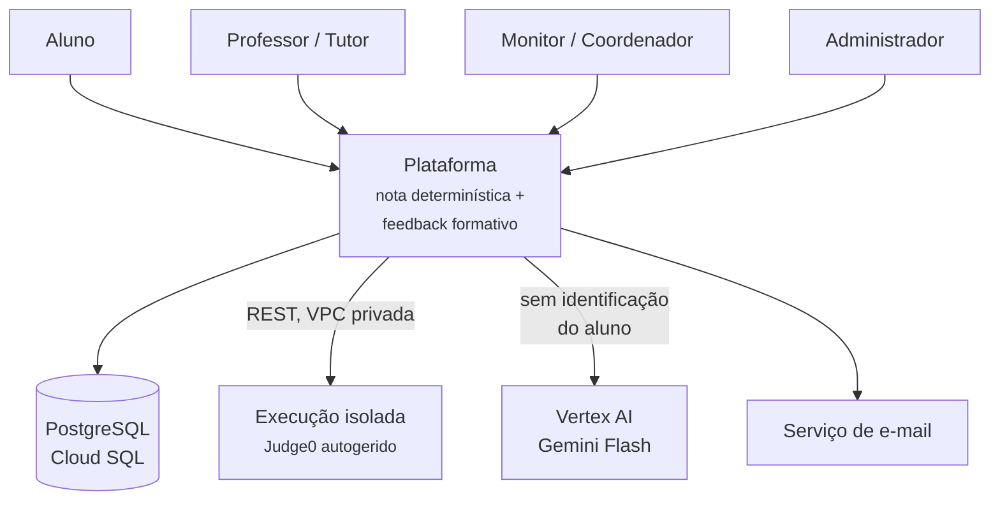

# Arquitetura-alvo (SAD)

Resumo do SAD v0.1, a arquitetura da plataforma completa. Serve para saber quais decisões já foram tomadas antes de escrever código novo. Nada aqui está implementado neste repositório, exceto onde indicado.

!!! warning "Rascunho"
    O SAD está em v0.1. Várias ADRs estão como *proposta*, e há provas de conceito pendentes. Trate como direção. A arquitetura prevista para 30/11 — bem menor — está em [Roadmap](roadmap.md#arquitetura-esperada-em-3011).

## Contexto — C4 nível 1

Um avaliador pedagógico de código: recebe submissões em C, produz nota reproduzível e texto formativo ancorado em evidências.

Duas fronteiras de confiança: **o código do aluno nunca roda no processo da aplicação** (sandbox em VPC própria, host tratado como comprometido) e **nenhum identificador direto do aluno chega ao provedor de IA** (RN-PRIV-01).

## Containers — C4 nível 2

| Container | Tecnologia | Responsabilidade | Onde roda |
| --- | --- | --- | --- |
| Frontend | SPA React/TS | Telas e painéis; nenhuma regra de avaliação | Cloud Storage + CDN |
| API | FastAPI + Pydantic | Autenticação, autorização, CRUD, enfileiramento. **Não executa código** | Cloud Run |
| Worker de avaliação | Python | Consome a fila, orquestra C1 e C2, persiste nota e evidências | Cloud Run separado |
| Analisador estrutural | tree-sitter-c + libclang | Estruturas, escopo, métricas | Biblioteca no worker |
| Worker de feedback | Python + Vertex AI | Monta o prompt, chama o modelo, filtra, persiste | Cloud Run separado |
| Serviço de execução | Judge0 CE | Compila e executa código não confiável | GCE MIG ou GKE, VPC isolada |
| Banco de dados | PostgreSQL 16 | Fonte de verdade, multi-tenant com RLS | Cloud SQL |
| Filas | Cloud Tasks + Pub/Sub | Durabilidade, retentativa, absorção de pico | Gerenciado |
| Cache | Memorystore/Redis | Cache de feedback, cotas | Gerenciado |

Avaliação e feedback ficam em workers separados para que a indisponibilidade da IA nunca derrube a nota.

### Relação com este repositório

| Decisão do SAD | Hoje | Até 30/11 |
| --- | --- | --- |
| FastAPI + Pydantic v2 | Implementado | — |
| Serviços sem dependência de HTTP | Implementado | — |
| Execução atrás de uma interface substituível | Implementado (`CodeRunner`) | — |
| PostgreSQL como fonte de verdade | Arquivos locais | Planejado (G0-4, G1) |
| tree-sitter-c para análise estrutural | Não existe | Planejado só para a solução de referência (G2-2) |
| Nenhuma CPU pesada no processo da API | Compilação e execução no processo do pedido | Continua no mesmo processo, fora do ciclo do pedido (G0-8) |
| Fila durável externa | Tudo síncrono | `BackgroundTask` com estado no banco (G0-8); fila externa fica para depois |
| Execução em Judge0 isolado | `LocalGccRunner` | Fora do recorte |

## Divergências registradas no SAD

!!! danger "D-1 — Judge0 não roda no Cloud Run"
    Judge0 depende do `isolate`, que exige `CAP_SYS_ADMIN`, container privilegiado e cgroup v1. O Cloud Run não oferece isso. **Decisão:** sandbox em GCE (MIG) ou GKE com nós dedicados, em VPC separada.

!!! danger "D-2 — pycparser é a escolha errada para código de aluno"
    Exige código pré-processado e aborta no primeiro erro de sintaxe — justamente o código em que o feedback mais importa. **Decisão:** tree-sitter-c como parser principal, tolerante a erro; libclang como complemento.

!!! danger "D-3 — A fila não pode viver no processo FastAPI"
    `BackgroundTasks` morre com a instância; o Cloud Run recicla e escala a zero. **Decisão:** fila durável externa com worker separado.

    O plano de 30/11 usa `BackgroundTask` mesmo assim (G0-8), com o estado do job no banco para que uma instância morta deixe o job `INTERROMPIDO` em vez de perdido. Trocar por Cloud Tasks depois muda só quem chama a função.

## ADRs do SAD

| ADR | Decisão | Status |
| --- | --- | --- |
| ADR-001 | FastAPI: a API é orquestração de I/O com contratos validados | Aceita |
| ADR-002 | Terceirizar a execução para Judge0 autogerido; o host é a fronteira de segurança | Aceita, com correção de plataforma (D-1) |
| ADR-003 | Separação estrita entre nota e IA; nenhuma chamada ao modelo no caminho da nota, verificável por teste | Aceita |
| ADR-004 | Multi-tenancy com Row Level Security; a aplicação nunca conecta com usuário `BYPASSRLS` | Proposta |
| ADR-005 | tree-sitter-c no lugar de pycparser (D-2) | Proposta |

As ADRs deste repositório ficam em [Decisões (ADR)](../adr/index.md) e citam as do SAD onde se cruzam.

## Modo de avaliação

Atributo `modo_avaliacao` da Atividade:

| Modo | C1 — casos de teste | C2 — escopo e qualidade |
| --- | --- | --- |
| `FORMATIVO` | Compõe a nota | Não afeta a nota; marca o feedback |
| `ESCOPO` | Compõe a nota | Só violação de escopo penaliza — **padrão recomendado** |
| `ESTRITO` | Compõe a nota | Escopo + critérios de qualidade determinísticos |

Escopo (usou `for` onde é proibido) é objetivo e justo de penalizar; qualidade (nomes, duplicação) envolve julgamento. Duas regras protegem o aluno: **RN-ARQ-01** — cada submissão guarda um snapshot da configuração, e a nota depende só dele; **RN-ARQ-02** — mudar o modo não recalcula notas passadas.

## Modelo de dados relevante para a geração

Multi-tenant, com `tenant_id` em toda tabela de domínio.

| Entidade | Campos |
| --- | --- |
| `QUESTAO_VERSAO` | `enunciado`, `nivel`, `estruturas_permitidas`, `estruturas_proibidas`, `estruturas_obrigatorias`, `solucao_referencia`, `status`, `situacao_direitos` |
| `CASO_TESTE` | `visibilidade` (público/privado), `categoria` (típico/limite/borda/inválido), `entrada`, `saida_esperada` |

`situacao_direitos` é preenchida na curadoria, nunca depois: questão de origem restrita não pode ser servida a outra instituição. O plano de 30/11 antecipa parte disso (G1-2, G1-4, G2-1, G6-2).

## Resiliência e governança de IA

Premissa de carga: ~10 turmas de 120 alunos; pico de 50 submissões/min sustentadas, 100 em rajada; C1+C2 em 30 s no p95. A API valida, persiste, enfileira e responde `202`. **RN-ARQ-03:** falha de infraestrutura nunca vira nota baixa — ausência de resultado é um estado, não zero.

Quatro barreiras antes de chamar o modelo: acionamento condicional, cache por `hash(código) + versão da questão + versão do prompt + modelo`, cota por instituição e turma (degrada, não bloqueia), deduplicação em janela.

| Falha | Comportamento |
| --- | --- |
| Provedor de IA indisponível | Circuit breaker; feedback determinístico a partir de C1 e C2 |
| Cota esgotada | Mesmo caminho; alerta ao admin |
| Sandbox indisponível | Submissão fica `ENFILEIRADA`; nunca vira zero |
| Analisador estrutural falha | C2 `INDISPONIVEL`; nota só com C1 |

## Segurança da execução

| Camada | Controle |
| --- | --- |
| Rede | VPC própria, sem saída para a internet; acesso só do worker |
| Host | VMs dedicadas, efêmeras, tratadas como comprometidas |
| Container | Versão fixada, CVEs monitoradas |
| Processo | Limites de tempo, CPU, memória, processos, arquivo e saída; FS efêmero; sem rede |
| Aplicação | Limite de tamanho de código, de submissões por minuto, timeout global |
| Dados | Código de aluno é dado pessoal: cifrado, acesso por papel e tenant, retenção definida |

Este repositório implementa só parte da camada "Processo" (tempo e saída) — ver [Pipeline § 4](../architecture/pipeline.md#4-casos-de-teste).

## Próximos passos definidos no SAD

1. Prova de conceito do Judge0 em GCE com 20 execuções concorrentes.
2. Protótipo do analisador C2 sobre 50 códigos reais de aluno, incluindo os que não compilam.
3. Fechar rubrica e tabela de penalidades com os professores.
4. Decidir as três posições do modo de avaliação.
5. Evoluir o SAD para v1.

Nenhum desses está no recorte de 30/11.
