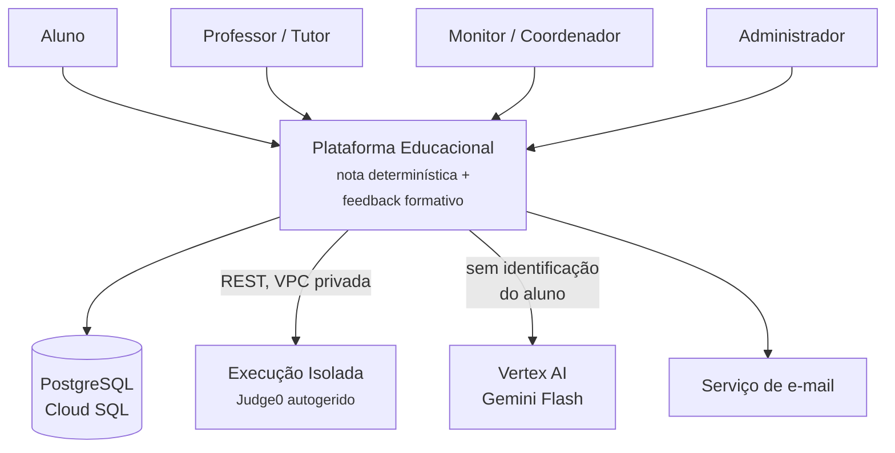

# Arquitetura alvo

Resumo do SAD v0.1 — a arquitetura que a plataforma pretende ter. Serve para saber que decisões já estão tomadas antes de escrever código novo neste repositório.

!!! warning "Documento em rascunho, com decisões em aberto"
    O SAD está marcado como **v0.1, rascunho para revisão**. Vários ADRs estão como *proposto*, não *aceite*, e a secção final lista provas de conceito por fazer. Trate isto como direção, não como especificação fechada.

## Contexto — C4 nível 1

O sistema é descrito como um **avaliador pedagógico de código**, não um juiz online. Recebe submissões em C, produz uma nota reproduzível e um texto formativo ancorado em evidências.

!!! info "Duas fronteiras de confiança"
    1. **O código do aluno nunca corre no processo da aplicação.** O sandbox está numa VPC própria, sem rota de saída para a internet, e o seu host é tratado como **já comprometido** no desenho de rede.
    2. **Nenhum identificador direto do aluno chega ao provedor de IA** — sem nome, matrícula ou e-mail (RN-PRIV-01).

    Nenhum dos dois sistemas externos participa do cálculo da nota: o sandbox fornece *factos de execução*, o modelo fornece *texto*.

## Contentores — C4 nível 2

| Contentor | Tecnologia | Responsabilidade | Onde corre |
| --- | --- | --- | --- |
| **Frontend** | SPA React/TS | Editor com realce, telas, painéis. Nenhuma regra de avaliação | Cloud Storage + CDN |
| **API** | FastAPI + Pydantic | Autenticação, autorização, CRUD, enfileiramento. **Não executa código** | Cloud Run |
| **Worker de Avaliação** | Python | Consome a fila; orquestra C1 e C2; persiste nota e evidências | Cloud Run, separado |
| **Analisador Estrutural** | tree-sitter-c + libclang | Deteta estruturas, verifica escopo, calcula métricas | Biblioteca no worker |
| **Worker de Feedback** | Python + Vertex AI | Monta o prompt, chama o modelo, filtra, persiste | Cloud Run, separado |
| **Serviço de Execução** | Judge0 CE | Compila e executa código não confiável, com limites | **GCE MIG ou GKE, VPC isolada** |
| **Base de dados** | PostgreSQL 16 | Fonte da verdade, multi-tenant com RLS | Cloud SQL |
| **Filas** | Cloud Tasks + Pub/Sub | Durabilidade, retentativa, desacoplamento de picos | Gerido |
| **Cache** | Memorystore/Redis | Cache de feedback por hash de código; cotas | Gerido |

!!! note "Porquê dois workers separados"
    A avaliação é rápida, determinística e obrigatória. O feedback é lento, caro, opcional e sujeito a falha externa. Uni-los faria a indisponibilidade da IA derrubar a nota — exatamente o que a regra de degradação graciosa proíbe.

### O que já é compatível com este repositório

| Decisão do SAD | Estado neste código |
| --- | --- |
| **FastAPI + Pydantic** para a API | :material-check-circle:{ style="color:#1a7f5a" } Já é a stack |
| **Pydantic v2** | :material-alert-circle:{ style="color:#c07000" } Instalado, mas usado com a API v1 (`@validator`, `.dict()`) |
| Serviços sem dependência de HTTP | :material-check-circle:{ style="color:#1a7f5a" } Convenção já cumprida |
| Nenhuma CPU pesada no processo da API | :material-close-circle:{ style="color:#b3261e" } Compilação e execução correm no processo do pedido |
| Fila durável externa | :material-close-circle:{ style="color:#b3261e" } Tudo é síncrono |
| PostgreSQL como fonte da verdade | :material-close-circle:{ style="color:#b3261e" } O estado vive em ficheiros |

A escolha de FastAPI e a separação serviços/HTTP são as duas decisões deste protótipo que sobrevivem intactas. Ver [Convenções](../development/conventions.md).

## Divergências registadas no SAD

Três itens do *briefing* técnico original não sobreviveram ao contacto com a realidade operacional. Valem para quem for implementar, e uma delas explica um risco deste protótipo.

!!! danger "D-1 — Judge0 não corre em Cloud Run"
    O Judge0 depende do `isolate`, que exige `CAP_SYS_ADMIN`, contentor privilegiado e **cgroup v1** — a documentação oficial manda alterar o GRUB do host. O Cloud Run não oferece equivalente ao modo privilegiado.

    **Decisão:** o sandbox corre em **GCE (MIG) ou GKE com nós dedicados**, em VPC separada. Só a API permanece *serverless*.

!!! danger "D-2 — pycparser é a escolha errada para código de aluno"
    O pycparser exige código pré-processado e **aborta ao primeiro erro de sintaxe**. Código de introdutória frequentemente não compila — e é precisamente nesse código que o feedback estrutural mais importa.

    **Decisão:** **tree-sitter-c** como parser primário, tolerante a erro por projeto; **libclang** como complemento para código que compila.

!!! danger "D-3 — A fila não pode viver dentro do processo FastAPI"
    `BackgroundTasks` e workers em memória morrem com a instância. O Cloud Run recicla instâncias e escala a zero; uma submissão em processamento nesse momento perde-se em silêncio.

    **Decisão:** fila durável externa (Cloud Tasks ou Pub/Sub) com serviço worker separado.

## Decisões de arquitetura

### ADR-001 — FastAPI

**Aceite.** A API é sobretudo orquestração de I/O com contratos de dados complexos que exigem validação estrita, e o processamento pesado é Python.

!!! warning "A regra de projeto que este protótipo viola"
    *"Nenhuma operação com CPU relevante corre no processo da API; tudo vai para worker."*

    O protótipo compila com `gcc` e executa `qty` processos **dentro do pedido HTTP**, sem timeout. É a divergência estrutural mais significativa entre este código e a arquitetura alvo.

### ADR-002 — Terceirizar a execução (Judge0 autogerido)

**Aceite, com correção de plataforma.** Executar C de aluno com ponteiros e alocação dinâmica exige conter *segfault*, ciclo infinito, esgotamento de memória e escrita em disco. Construir isso do zero é o maior risco técnico do projeto e não diferencia o produto.

Restrições que a decisão impõe: nós com cgroup v1; contentor privilegiado — **o host é a fronteira de segurança, não o contentor**; VPC isolada sem saída para a internet; instâncias efémeras e recicladas; **versão fixada e monitorizada**, dado o histórico de vulnerabilidades críticas de escape corrigidas em 2024.

### ADR-003 — Separação estrita entre nota e IA

**Aceite.** A nota é calculada exclusivamente por C1 e C2. A IA produz apenas texto ancorado em evidências. O professor controla, por atividade, se as violações de C2 penalizam.

Implicações obrigatórias:

- Nenhuma chamada ao modelo no caminho de escrita da nota — **verificável por teste automatizado**.
- O prompt recebe **evidências estruturadas**, não a tarefa de julgar. Toda afirmação do feedback deve ser rastreável a uma evidência; afirmação sem âncora é descartada.
- Reexecutar a mesma submissão com o mesmo snapshot produz nota idêntica.
- O feedback pode falhar sem que a nota falhe.

### ADR-004 — Multi-tenancy com Row Level Security

**Proposto.** Schema único, coluna `tenant_id` em toda a tabela de domínio, RLS do PostgreSQL com política baseada em variável de sessão definida pelo middleware.

O filtro apenas em código falha na primeira consulta esquecida; a RLS torna o isolamento invariante do banco, não disciplina do programador. Regra associada: **a aplicação nunca liga com utilizador `BYPASSRLS`**.

### ADR-005 — tree-sitter-c {#adr-005-tree-sitter-c}

**Proposto**, substituindo a indicação de `pycparser` do briefing. Ver D-2 acima.

## O toggle de modo de avaliação

Atributo `modo_avaliacao` na entidade **Atividade**, com três posições:

| Modo | C1 — casos de teste | C2 — escopo e qualidade |
| --- | --- | --- |
| `FORMATIVO` | Compõe a nota | Não afeta a nota; marca o feedback |
| `ESCOPO` | Compõe a nota | Só violação de escopo penaliza — **padrão recomendado** |
| `ESTRITO` | Compõe a nota | Escopo + critérios de qualidade 100% determinísticos |

!!! info "Porquê três posições e não duas"
    **Escopo** — usou `for` numa questão que proíbe `for` — é objetivo, binário e verificável; penalizar é justo. **Qualidade** — nomes, duplicação, aninhamento — envolve julgamento e limiares arbitrários; penalizar gera contestação legítima.

Duas regras protegem o aluno de mudanças retroativas:

- **RN-ARQ-01 — Snapshot de configuração.** Toda submissão persiste `modo_avaliacao`, pesos, versão da questão e versão da rubrica **no momento da submissão**. A nota é função exclusiva desse snapshot e do código.
- **RN-ARQ-02 — Mudar o toggle não recalcula.** Afeta apenas submissões futuras. Recalcular é ação explícita, auditada e comunicada.

## Modelo de dados

Multi-tenant, com `tenant_id` em toda a tabela de domínio. As entidades relevantes para um futuro EPIC-017:

| Entidade | Campos que este protótipo teria de preencher |
| --- | --- |
| `QUESTAO_VERSAO` | `enunciado`, `nivel`, `estruturas_permitidas`, `estruturas_proibidas`, `estruturas_obrigatorias`, `solucao_referencia`, `status`, `situacao_direitos` |
| `CASO_TESTE` | `visibilidade` (público/privado), `categoria` (típico/limite/borda/inválido), `entrada`, `saida_esperada` |

!!! note "Duas dimensões que o protótipo não modela"
    **Visibilidade e categoria dos casos de teste.** O protótipo marca os três primeiros casos como exemplo e os restantes como ocultos — uma aproximação grosseira de `visibilidade`, decidida por ordem de chegada e não por critério. A `categoria` — típico, limite, borda, inválido — não existe de todo, e é ela que permite ao professor atribuir pesos diferentes por tipo de caso.

    **`estruturas_*` como vocabulário controlado.** O protótipo tem cinco booleanos; o modelo alvo tem listas de estruturas nomeadas, verificáveis por AST. Ver [Análise de lacunas](gap-analysis.md#as-restricoes-nao-sao-verificadas).

Duas propriedades transversais que qualquer código futuro tem de respeitar:

- **`SUBMISSAO` é imutável.** Correções produzem nova `AVALIACAO`, nunca sobrescrevem.
- **`situacao_direitos` preenchido durante a curadoria**, nunca depois — reclassificar centenas de itens retroativamente é trabalho perdido, e questões de origem restrita não podem ser servidas a outras instituições.

## Resiliência e governança de IA

### Absorção de pico

Premissa de carga: 120 alunos por turma, ~10 turmas; pico de **50 submissões/min sustentadas, 100 em rajada**; alvo de C1+C2 em 30 s no p95.

**Regra central: a API nunca processa submissão.** Valida, persiste, enfileira e devolve `202 Accepted`.

!!! danger "RN-ARQ-03 — Falha de infraestrutura nunca vira nota baixa"
    Ausência de resultado é estado próprio, jamais zero. É a regra que separa um sistema em que se confia de um em que não se confia.

### Quatro barreiras antes de chamar o modelo

Relevantes para este repositório, que hoje não tem nenhuma:

1. **Acionamento condicional** — não chama a IA quando o erro é de compilação com diagnóstico claro, quando a submissão é idêntica a uma anterior, ou quando passou em 100% sem violações.
2. **Cache por chave composta** — `hash(código) + versão da questão + versão do prompt + modelo`. As três dimensões extra impedem servir feedback obsoleto.
3. **Cota por instituição e turma** — alerta aos 80%; ao atingir 100%, **degrada, não bloqueia**.
4. **Deduplicação em janela** — submissões idênticas partilham o texto base.

### Degradação graciosa

| Falha | Comportamento |
| --- | --- |
| Provedor de IA indisponível | *Circuit breaker* abre; feedback determinístico a partir de C1 e C2 |
| Cota esgotada | Mesmo caminho; alerta ao admin |
| Sandbox indisponível | Submissão fica `ENFILEIRADA`; retentativa; **nunca avaliada como zero** |
| Analisador estrutural falha | C2 marcado `INDISPONIVEL`; nota só com C1 |

!!! warning "O protótipo não degrada — aborta"
    Há três tentativas com recuo exponencial em falhas transitórias, mas não há *circuit breaker*, cache nem cota. Esgotadas as tentativas, o pipeline aborta com `502`. O que salva a situação é o estado ficar no diretório da execução, permitindo retomar manualmente. Ver [Retomar a meio](../guides/step-by-step-pipeline.md#retomar-a-meio).

## Segurança da execução — defesa em profundidade

| Camada | Controlo |
| --- | --- |
| Rede | VPC própria, sem saída para a internet; acesso só do worker, por porta única |
| Host | VMs dedicadas, efémeras, recicladas; **tratadas como comprometidas por omissão** |
| Contentor | Versão fixada, atualização de segurança monitorizada |
| Processo | Limites de tempo real e de CPU, memória, número de processos, tamanho de ficheiro e de saída; FS efémero; sem rede |
| Aplicação | Limite de tamanho do código; limite de submissões por minuto; timeout global |
| Dados | Código do aluno é dado pessoal: cifrado em repouso, acesso por papel e tenant, retenção definida |

!!! danger "Este protótipo não tem nenhuma destas camadas"
    Compila e executa código gerado por um LLM com os privilégios do processo do servidor, sem isolamento, timeout ou limite de memória.

    O risco é menor do que no caso do aluno — o código vem de um modelo instruído a resolver um exercício, não de um adversário — mas não é nulo, e a mitigação é a mesma. Ver [Deploy](../deployment/index.md#execucao-de-codigo-nao-confiavel).

## Próximos passos definidos no SAD

1. Prova de conceito do Judge0 em GCE com 20 execuções concorrentes — **item 1 do bloco 1, antes de qualquer tela**.
2. Protótipo do analisador C2 sobre 50 códigos reais de aluno, incluindo códigos que não compilam.
3. Fechar a rubrica reduzida e a tabela de penalidades com os professores.
4. Decidir as três posições do toggle.
5. Evoluir o SAD para v1 com o resultado das provas de conceito.

Nenhum destes depende deste repositório.
