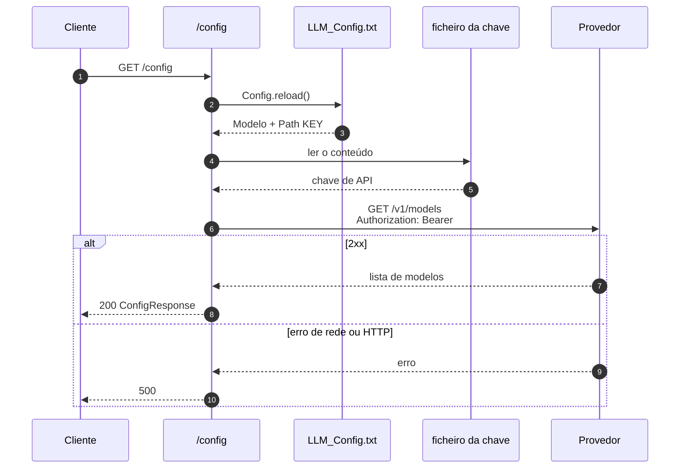

# `GET /config`

<p class="lead">Recarrega <code>config/LLM_Config.txt</code> a partir do disco e valida a chave contra o provedor com um pedido real. É o <em>health check</em> do serviço e a única forma de aplicar alterações à configuração sem reiniciar.</p>

## Pedido

<span class="ce-badge ce-badge--get">GET</span> `/config`

Sem parâmetros, sem corpo, sem cabeçalhos obrigatórios.

```bash
curl http://127.0.0.1:8000/config
```

## O que faz



Duas operações distintas, ambas com efeito:

1. **`Config.reload()`** — substitui o singleton por uma instância nova, lida do disco. Isto **muda o estado do processo**: as chamadas de geração seguintes usam o modelo e a chave recarregados.
2. **Validação da ligação** — `GET {api_base_url}/models` com a chave, com timeout de 10 segundos.

!!! warning "`GET` mas não é uma operação segura"
    Apesar do método, este endpoint tem efeitos colaterais: recarrega a configuração global e escreve `OPENAI_API_KEY` em `os.environ`. Um `POST` seria semanticamente mais correto.

    Na prática isto é útil — é o mecanismo de recarga a quente do serviço — mas convém saber que chamar `/config` durante um pipeline em curso pode trocar o modelo a meio.

## Resposta

<span class="ce-badge">200</span> `ConfigResponse`

```json
{
  "model": "gpt-4o-mini",
  "api_base_url": "https://api.openai.com/v1",
  "status": "Configuration loaded successfully and API connection verified"
}
```

| Campo | Tipo | Descrição |
| --- | --- | --- |
| `model` | `string` | Valor de `Modelo` no ficheiro de configuração |
| `api_base_url` | `string` | A constante `OPENAI_API_BASE_URL` de `config.py` |
| `status` | `string` | Mensagem fixa de confirmação |

!!! info "A chave nunca é devolvida"
    `ConfigResponse` expõe apenas modelo, URL base e estado. A chave de API não aparece na resposta nem nos registos — `Config._load()` regista apenas o nome do modelo.

## Erros

| Código | Causa | `detail` |
| --- | --- | --- |
| `404` | `config/LLM_Config.txt` não existe | `Config file 'config/LLM_Config.txt' not found.` |
| `500` | Chave `Modelo` ausente ou vazia | `'Modelo' not found in config file.` |
| `500` | Ficheiro apontado por `Path KEY` ilegível | `Failed to read API key from '...': ...` |
| `500` | Provedor inalcançável, chave rejeitada, timeout | `Failed to connect to OpenAI API: ...` |

!!! note "`Path KEY` ausente e ficheiro da chave ilegível dão erros diferentes"
    Se a linha `Path KEY` faltar por completo, `api_key` fica vazia e a verificação final levanta `ValueError("API key could not be loaded.")` — `500`. Se a linha existir mas apontar para um ficheiro inexistente, o `OSError` é convertido mais cedo, com a mensagem do caminho — também `500`, mas mais informativa.

Ver [Erros](errors.md) para o diagnóstico de cada caso.

## Quando chamar

<div class="grid cards" markdown>

-   :material-check-circle-outline: **Depois de arrancar o servidor**

    ---

    Confirma ficheiro, chave e conectividade em menos de um segundo, em vez de descobrir o problema a meio de um pipeline.

-   :material-reload: **Depois de editar `LLM_Config.txt`**

    ---

    É a única forma de aplicar a alteração sem reiniciar o processo. `Config.get_instance()` devolveria a instância em cache.

-   :material-bug-outline: **Ao diagnosticar falhas de geração**

    ---

    Separa problemas de configuração e conectividade de problemas de *prompting* ou compilação.

</div>

!!! info "Não é obrigatório antes de gerar"
    As etapas de geração usam `Config.get_instance()`, que carrega o ficheiro na primeira utilização. O serviço funciona sem que `/config` seja alguma vez chamado — a mensagem *"Call /config first"* em `services/llm.py` descreve uma restrição que o código não impõe.
