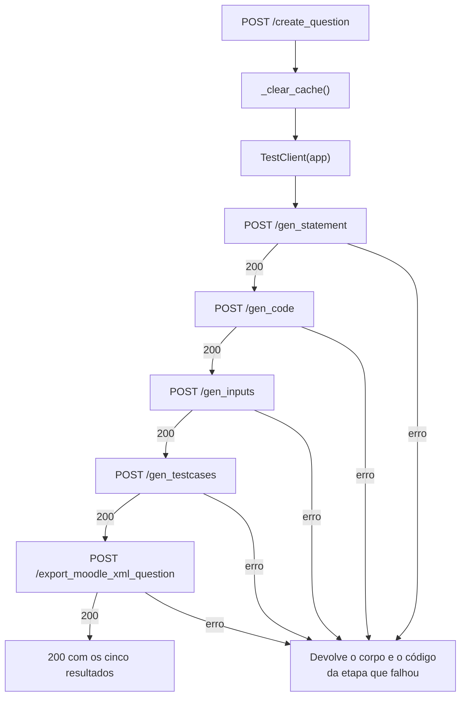

# `POST /create_question`

<p class="lead">Executa as cinco etapas em sequência e devolve o resultado de cada uma. Limpa <code>cache/</code> antes de começar e para na primeira falha.</p>

## Pedido

<span class="ce-badge ce-badge--post">POST</span> `/create_question`

O corpo tem dois objetos aninhados, porque o endpoint declara dois modelos Pydantic como parâmetros — o FastAPI usa os nomes dos parâmetros como chaves.

```bash
curl -X POST http://127.0.0.1:8000/create_question \
  -H "Content-Type: application/json" \
  -d '{
        "statement_request": {
          "can_has_if": true,
          "can_has_else": true,
          "can_has_repetition": true,
          "can_has_function": false,
          "can_has_matrix": false,
          "difficulty": "facil"
        },
        "input_request": { "qty": 10 }
      }'
```

| Campo | Obrigatório | Omissão |
| --- | --- | --- |
| `statement_request` | <span class="ce-badge ce-badge--req">Sim</span> | — devolve `422` |
| `input_request` | <span class="ce-badge ce-badge--opt">Não</span> | `InputRequest()`, ou seja `qty: 10` |

Os campos dentro de cada objeto seguem os modelos documentados em [Endpoints de geração](generation.md). Como `StatementRequest` tem valores por omissão para tudo, o corpo mínimo é:

```json
{ "statement_request": {} }
```

## Execução



Duas particularidades desta implementação:

1. **`cache/` é limpo antes da primeira etapa.** É o único endpoint que o faz. Os artefactos permanecem depois do pedido — a limpeza é de entrada, não de saída.
2. **A orquestração passa por HTTP.** Um `TestClient` sobre a própria aplicação faz cinco pedidos internos, em vez de chamar as funções de serviço diretamente. As razões e o custo desta escolha estão em [Arquitetura](../architecture/index.md#o-orquestrador-chama-a-sua-propria-api).

## Resposta

<span class="ce-badge">200</span>

Um objeto com o resultado de cada etapa sob a sua própria chave:

```json
{
  "statement": {
    "name": "Soma de Numeros Positivos",
    "statement": "Soma de Numeros Positivos\n\nEscreva um programa que...",
    "file_path": "cache/statement.json"
  },
  "code": {
    "code": "#include <stdio.h>\n\nint main() {\n    int n, soma = 0;\n...",
    "file_path": "cache/solution.c"
  },
  "inputs": {
    "inputs": ["3\n10\n20\n30\n-1\n", "2\n5\n7\n-1\n"],
    "file_path": "cache/inputs.json"
  },
  "testcases": {
    "testcases": [
      { "input": "3\n10\n20\n30\n-1\n", "output": "60\n" }
    ],
    "file_path": "cache/testcases.json"
  },
  "moodle_xml": {
    "status": "success",
    "file_path": "Questions/Moodle_Questionnaire.xml"
  }
}
```

| Chave | Modelo |
| --- | --- |
| `statement` | `StatementResponse` |
| `code` | `CodeResponse` |
| `inputs` | `InputResponse` |
| `testcases` | `TestCaseResponse` |
| `moodle_xml` | `{"status", "file_path"}` |

Cada valor é idêntico ao que o endpoint individual correspondente devolveria.

## Erros

O orquestrador **propaga o erro da etapa que falhou**, com o corpo e o código de estado dessa etapa. Não acrescenta contexto sobre qual das cinco falhou:

```json
{ "detail": "Compilation failed:\nsolution.c:14:9: error: expected ';' before '}' token" }
```

| Código | Etapa provável | Diagnóstico |
| --- | --- | --- |
| `422` | Validação de entrada | `statement_request` ausente, ou `qty` fora de `[1, 100]` |
| `404` | Nunca, em condições normais | Só ocorre se o disco falhar a meio — a cache é limpa e reconstruída pelo próprio pipeline |
| `500` | 1, 2 ou 3 | Provedor LLM: chave, rede ou *rate limit* |
| `500` | 4 | Erro de compilação, ou `gcc` ausente do `PATH` |
| `500` | 5 | Template ausente, ou `Questions/` não gravável |

O texto de `detail` identifica a origem: mensagens que começam por `Compilation failed:` vêm da etapa 4; `Error calling OpenAI API:` das etapas 1 a 3.

!!! info "As falhas não são revertidas — e isso é útil"
    Quando uma etapa falha, os ficheiros das etapas anteriores permanecem em `cache/`. Retome a partir do ponto de falha com os endpoints individuais, sem repetir chamadas ao modelo já pagas.

    Ver [Retomar a meio](../guides/step-by-step-pipeline.md#retomar-a-meio).

## Considerações de utilização

!!! danger "Um pedido de cada vez"
    O estado vive em caminhos globais de `cache/`. Dois pedidos concorrentes escrevem sobre os mesmos ficheiros, e o `_clear_cache()` do segundo apaga os artefactos que o primeiro está a usar. O resultado é uma questão com enunciado de um pedido e código do outro, sem qualquer erro.

    Não corra este endpoint com múltiplos clientes nem com vários *workers* uvicorn. Ver [Concorrência](../architecture/cache-and-state.md#concorrencia).

!!! warning "Sem timeout previsível"
    O pedido inclui três chamadas ao modelo, cada uma com até 60 segundos de timeout, mais `qty` execuções de um programa arbitrário **sem qualquer limite de tempo**. Um programa gerado com um ciclo infinito bloqueia o pedido para sempre.

    Do lado do cliente, defina um timeout explícito e generoso.

!!! tip "`qty: 3` durante a exploração"
    `qty` afeta os tokens de saída da etapa 3 e o número de execuções da etapa 4. Enquanto ajusta as restrições, um valor baixo encurta visivelmente o ciclo; suba para 10–20 quando a combinação já produzir o exercício pretendido.

## Exemplo: um questionário de dificuldade crescente

Como o XML acumula, um ciclo produz um questionário completo:

```bash
for d in "muito facil" "facil" "medio" "dificil"; do
  echo "A gerar: $d"
  curl -s -X POST http://127.0.0.1:8000/create_question \
    -H "Content-Type: application/json" \
    -d "{\"statement_request\": {\"difficulty\": \"$d\", \"can_has_repetition\": true},
         \"input_request\": {\"qty\": 5}}" \
    | python -c "import json,sys; print(' ', json.load(sys.stdin)['statement']['name'])"
done

grep -c "<question type=" Questions/Moodle_Questionnaire.xml
```

Apague `Questions/Moodle_Questionnaire.xml` primeiro se quiser um ficheiro novo.
