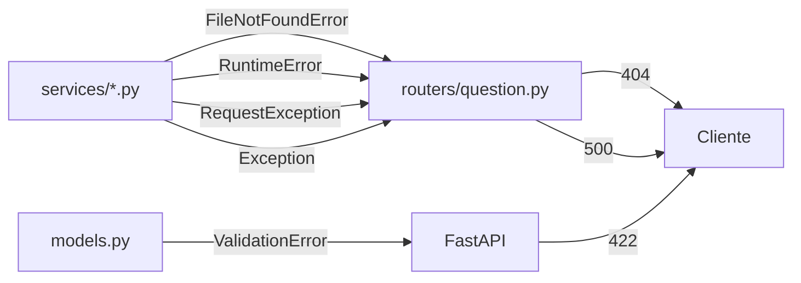

# Erros

<p class="lead">Todos os erros seguem o formato padrão do FastAPI. Este é o mapa de cada código de estado para a sua causa, e o passo de diagnóstico correspondente.</p>

## Formato

```json
{ "detail": "Statement file not found. Generate a statement first." }
```

Erros de validação Pydantic (`422`) usam a estrutura detalhada do FastAPI:

```json
{
  "detail": [
    {
      "type": "value_error",
      "loc": ["body", "qty"],
      "msg": "Value error, qty must not exceed 100",
      "input": 500
    }
  ]
}
```

## Como os erros são produzidos

Nenhum ficheiro em `services/` importa de `fastapi`. Os serviços levantam exceções Python; o router traduz cada tipo num `HTTPException`:



| Exceção | Código | Levantada por |
| --- | --- | --- |
| `FileNotFoundError` | `404` | Verificações de dependências em `codegen`, `inputs`, `testcases`; ficheiro de configuração ausente |
| `RuntimeError` | `500` | Falha de compilação; configuração não inicializada |
| `requests.exceptions.RequestException` | `500` | Qualquer falha de rede ou HTTP no provedor |
| `ValueError`, `OSError` | `500` | Carregamento da configuração |
| `Exception` | `500` | Cláusula final em cada endpoint |
| `ValidationError` | `422` | Pydantic, antes do código do endpoint correr |

!!! note "A cláusula genérica devolve a mensagem em bruto"
    Cada endpoint termina com um `except Exception` que passa `str(e)` para o campo `detail`. Erros não previstos chegam ao cliente como o texto da exceção Python — sem *stack trace*, mas também sem contexto sobre a etapa.

    Para diagnosticar, consulte a consola do servidor: `logging` está configurado a `INFO` e cada etapa regista o ficheiro que escreveu.

---

## `404` — dependência em falta

Uma etapa não encontrou um ficheiro que a etapa anterior devia ter escrito.

| `detail` | Endpoint | Resolução |
| --- | --- | --- |
| `Statement file not found. Generate a statement first.` | `/gen_code`, `/gen_inputs` | Chame `POST /gen_statement` |
| `Solution file not found. Generate a solution first.` | `/gen_inputs`, `/gen_testcases` | Chame `POST /gen_code` |
| `Inputs file not found. Generate inputs first.` | `/gen_testcases` | Chame `POST /gen_inputs` |
| `Config file ... not found.` | `/config` | Ver abaixo |

```bash
# Que ficheiros existem?
ls -la cache/
```

!!! tip "Servidor arrancado do diretório errado"
    Se `/config` devolver `404` e o ficheiro existir claramente, o processo está a correr noutro diretório. Todos os caminhos do projeto são relativos ao *current working directory*:

    ```bash
    cd /caminho/para/coderunner_v2
    python main.py
    ```

---

## `422` — validação

Produzido pelo Pydantic antes de o código do endpoint correr.

| Causa | Endpoint | `loc` |
| --- | --- | --- |
| `qty` menor que 1 | `/gen_inputs` | `["body", "qty"]` |
| `qty` maior que 100 | `/gen_inputs` | `["body", "qty"]` |
| Corpo ausente | `/gen_inputs` | `["body"]` |
| `statement_request` ausente | `/create_question` | `["body", "statement_request"]` |
| Tipo errado num campo booleano | Qualquer | O campo em causa |

!!! warning "`difficulty` inválido não produz `422`"
    `StatementRequest.difficulty` é um `str` sem restrições. `"impossivel"` ou `"MÉDIO"` são aceites; simplesmente não correspondem a nenhum ramo em `_build_prompt()` e nenhuma instrução de dificuldade chega ao modelo.

    Se um enunciado sair sistematicamente com a dificuldade errada, verifique a grafia primeiro: minúsculas, sem acentos, com o espaço — `muito facil`, `facil`, `medio`, `dificil`, `muito dificil`.

---

## `500` — falha do provedor LLM

| `detail` começa por | Causa provável |
| --- | --- |
| `Error calling OpenAI API: 401` | Chave inválida, expirada ou revogada |
| `Error calling OpenAI API: 429` | *Rate limit* ou quota esgotada |
| `Error calling OpenAI API: 404` | O modelo em `Modelo` não existe ou não está acessível à conta |
| `Error calling OpenAI API: ConnectionError` | Sem rede, DNS, *proxy* ou *firewall* |
| `Error calling OpenAI API: ReadTimeout` | O provedor excedeu os 60 segundos |
| `Failed to connect to OpenAI API:` | Igual, mas vindo de `GET /config` |

O primeiro passo de diagnóstico é sempre o mesmo:

```bash
curl -i http://127.0.0.1:8000/config
```

Isola configuração e conectividade do resto do pipeline.

!!! warning "Não há retentativas"
    `services/llm.py` chama `requests.post` uma vez. Um `429` transitório aborta o pipeline completo. Os artefactos das etapas anteriores ficam em `cache/`, pelo que pode retomar no ponto de falha em vez de recomeçar. Ver [Retomar a meio](../guides/step-by-step-pipeline.md#retomar-a-meio).

---

## `500` — compilação e execução

| `detail` começa por | Causa | Resolução |
| --- | --- | --- |
| `Compilation failed:` | O código gerado não compila | Edite `cache/solution.c` e repita `/gen_testcases` |
| `[WinError 2]`, ou `No such file or directory` a mencionar o compilador | `gcc` ausente do `PATH` | Instale um compilador e confirme com `gcc --version` |

A mensagem de compilação inclui o `stderr` completo do `gcc`, com ficheiro e linha:

```json
{ "detail": "Compilation failed:\ncache/solution.c:14:9: error: expected ';' before '}' token" }
```

!!! tip "Cercas de markdown são a causa mais comum"
    Se a primeira linha do erro apontar para a linha 1 com algo como `error: expected identifier`, abra `cache/solution.c` — o modelo provavelmente incluiu uma cerca de código na resposta. Apague-a e repita `/gen_testcases`; as etapas anteriores não precisam de ser refeitas.

---

## `500` — configuração

Todos provenientes de `Config._load()`, visíveis através de `GET /config`.

| `detail` | Causa | Resolução |
| --- | --- | --- |
| `'Modelo' not found in config file.` | Linha `Modelo:` ausente ou vazia | Acrescente `Modelo: gpt-4o-mini` |
| `API key could not be loaded.` | Linha `Path KEY:` ausente | Acrescente a linha com o caminho |
| `Failed to read API key from ...` | Ficheiro da chave inexistente ou sem permissões | Verifique o caminho e as permissões |

Ver [Configuração](../getting-started/configuration.md) para o formato do ficheiro.

---

## Casos que não produzem erro

Estes são os mais difíceis de diagnosticar, porque a API responde `200`:

| Sintoma | Causa | Onde ler mais |
| --- | --- | --- |
| Saídas vazias nos casos de teste | As entradas não correspondem aos `scanf` da solução | [Resolução de problemas](../development/troubleshooting.md#saidas-vazias-nos-casos-de-teste) |
| XML exportado sem conteúdo | `export` não valida dependências | [Templates](../architecture/moodle-xml.md) |
| Questão com enunciado e código incoerentes | Cache não limpa entre execuções manuais | [Cache e estado](../architecture/cache-and-state.md#verificacao-de-existencia-nao-de-coerencia) |
| Todas as submissões falham no Moodle | Solução não determinística | [Importar no Moodle](../guides/import-into-moodle.md#verificacoes-antes-de-usar-com-alunos) |
| Dificuldade ignorada | `difficulty` com grafia inválida | [Acima](#422-validacao) |
| Mais questões no XML do que o esperado | O ficheiro acumula entre execuções | [Acumulação](../architecture/moodle-xml.md#acumulacao) |
| Alteração à configuração sem efeito | O singleton está em cache | Chame `GET /config` |

O pedido bloqueado indefinidamente merece nota própria: não há timeout na execução dos binários, pelo que um programa gerado com um ciclo infinito prende o pedido. A única saída é reiniciar o servidor.
