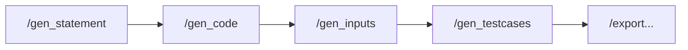

# API

<p class="lead">Seis endpoints: um de configuração, quatro de geração, um de exportação — mais um orquestrador que os encadeia. Todos aceitam e devolvem JSON.</p>

## Base URL

```text
http://127.0.0.1:8000
```

Definida por `main.py`, que liga a `0.0.0.0:8000`. Não é configurável por ficheiro; para alterar a porta, use `uvicorn` diretamente:

```bash
uvicorn main:app --port 9000
```

## Autenticação

**Nenhuma.** Todos os endpoints são públicos. Não há chaves de API, tokens, sessões nem cabeçalhos de autorização em lado nenhum da aplicação.

!!! danger "A chave do provedor fica exposta pelo uso"
    Quem alcançar esta porta pode gerar questões à custa da sua chave de API. Com o servidor ligado a `0.0.0.0`, isso inclui qualquer máquina da rede local.

    Ver [Deploy](../deployment/index.md#o-que-falta-antes-de-expor-o-servico).

## Cabeçalhos

| Cabeçalho | Quando | Valor |
| --- | --- | --- |
| `Content-Type` | Pedidos com corpo | `application/json` |
| `Accept` | Opcional | Todas as respostas são `application/json` |

## Os endpoints

| Método | Caminho | Descrição |
| --- | --- | --- |
| <span class="ce-badge ce-badge--get">GET</span> | [`/config`](config.md) | Recarrega a configuração e valida a ligação ao provedor |
| <span class="ce-badge ce-badge--post">POST</span> | [`/gen_statement`](generation.md#gen_statement) | Gera o enunciado sob restrições |
| <span class="ce-badge ce-badge--post">POST</span> | [`/gen_code`](generation.md#gen_code) | Gera a solução de referência em C |
| <span class="ce-badge ce-badge--post">POST</span> | [`/gen_inputs`](generation.md#gen_inputs) | Gera entradas de teste |
| <span class="ce-badge ce-badge--post">POST</span> | [`/gen_testcases`](generation.md#gen_testcases) | Compila, executa e captura as saídas |
| <span class="ce-badge ce-badge--post">POST</span> | [`/export_moodle_xml_question`](generation.md#export_moodle_xml_question) | Escreve a questão no XML |
| <span class="ce-badge ce-badge--post">POST</span> | [`/create_question`](create-question.md) | Executa as cinco etapas em sequência |

Rotas de documentação — `/`, `/docs`, `/redoc`, `/openapi.json` — estão descritas em [Executar o servidor](../getting-started/running.md#rotas-de-entrada).

## Estado partilhado

Os endpoints de geração **não são independentes**. Cada um lê ficheiros que o anterior escreveu em `cache/` e devolve `404` se as suas dependências faltarem.



!!! danger "Um pipeline de cada vez"
    O estado é global ao processo, não por pedido. Chamadas concorrentes escrevem sobre os mesmos ficheiros e produzem questões incoerentes sem qualquer erro. Ver [Cache e estado](../architecture/cache-and-state.md#concorrencia).

## Convenções de resposta

**Sucesso** — cada endpoint devolve o seu modelo Pydantic, com `file_path` a apontar para o artefacto escrito:

```json
{ "name": "...", "statement": "...", "file_path": "cache/statement.json" }
```

**Erro** — o formato padrão do FastAPI:

```json
{ "detail": "Statement file not found. Generate a statement first." }
```

| Código | Significado neste serviço |
| --- | --- |
| `200` | Sucesso |
| `404` | Um ficheiro de que a etapa depende não existe |
| `422` | O corpo do pedido não passou a validação Pydantic |
| `500` | Falha do provedor LLM, erro de compilação, ou erro não previsto |

A tabela completa por endpoint está em [Erros](errors.md).

## Tempos de resposta

Sem valores medidos no repositório, mas as ordens de grandeza decorrem do que cada etapa faz:

| Endpoint | Domina o tempo |
| --- | --- |
| `/config` | Um `GET /v1/models` ao provedor |
| `/gen_statement`, `/gen_code` | Uma chamada ao modelo (timeout de 60 s) |
| `/gen_inputs` | Uma chamada ao modelo, com o código completo no contexto |
| `/gen_testcases` | Uma compilação `gcc` mais `qty` execuções de processo |
| `/export_moodle_xml_question` | Leitura e escrita de ficheiros |
| `/create_question` | Soma de todas as anteriores — três chamadas ao modelo |

!!! warning "Não há timeout na execução dos binários"
    `/gen_testcases` e `/create_question` podem bloquear indefinidamente se o programa gerado não terminar. Configure timeouts generosos do lado do cliente e ver [Pipeline de geração](../architecture/pipeline.md#limites-desta-etapa).
