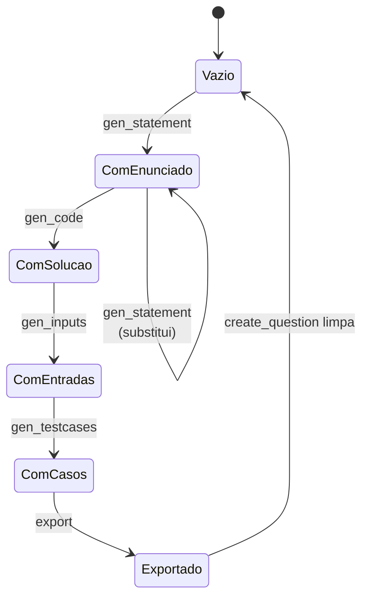

# Cache e estado

<p class="lead">Não há base de dados nem estado em memória entre pedidos. As cinco etapas comunicam exclusivamente através de ficheiros no diretório <code>cache/</code>, o que define — e limita — o comportamento do serviço.</p>

## O contrato de ficheiros

`cache/` é o barramento de dados do pipeline. Cada etapa lê ficheiros produzidos por etapas anteriores e escreve exatamente um ficheiro seu.

| Ficheiro | Escrito por | Lido por | Formato |
| --- | --- | --- | --- |
| `statement.json` | `gen_statement` | `gen_code`, `gen_inputs`, `export` | `{"name": str, "statement": str}` |
| `solution.c` | `gen_code` | `gen_inputs`, `gen_testcases`, `export` | Código C em texto |
| `solution` / `solution.exe` | `gen_testcases` | `gen_testcases` | Binário compilado |
| `inputs.json` | `gen_inputs` | `gen_testcases` | `{"inputs": [str, ...]}` |
| `testcases.json` | `gen_testcases` | `export` | `{"testcases": [{"input": str, "output": str}]}` |

Os caminhos são constantes de módulo derivadas de `CACHE_DIR`, definido em `config.py` como o caminho **relativo** `"cache"`.

!!! warning "Todos os caminhos são relativos ao diretório de trabalho"
    `CACHE_DIR = "cache"`, `QUESTIONS_DIR = "Questions"`, `TEMPLATES_DIR = "templates"` e `CONFIG_FILE = "config/LLM_Config.txt"` são relativos ao *current working directory* do processo, não à localização do código.

    Arrancar o servidor a partir de outro diretório faz o carregamento da configuração falhar com `FileNotFoundError`. Arranque sempre a partir da raiz do repositório.

## Estados válidos

O estado do pipeline é inteiramente inferível do conteúdo de `cache/`:



Nenhuma etapa regista o seu progresso: reconstruir o estado é listar os ficheiros presentes.

```bash
ls -la cache/
```

## Verificação de dependências

As etapas 2, 3 e 4 verificam a existência dos ficheiros de que dependem e levantam `FileNotFoundError` com uma mensagem acionável, traduzida pelo router em `404`:

```python title="services/inputs.py"
for path, label in [
    (CODE_FILE, "Solution file not found. Generate a solution first."),
    (STATEMENT_FILE, "Statement file not found. Generate a statement first."),
]:
    if not os.path.exists(path):
        raise FileNotFoundError(label)
```

!!! danger "A etapa 5 é a exceção"
    `export_moodle_xml` **não** verifica nada. `_load_json()` e `_load_text()` devolvem valores por omissão para ficheiros ausentes, pelo que uma exportação sobre uma cache vazia produz um XML sem conteúdo e responde `200` com `status: "success"`.

    Confirme o conteúdo de `cache/` antes de exportar manualmente.

### Verificação de existência, não de coerência

Os ficheiros são verificados isoladamente. Nada garante que se relacionem entre si.

Um cenário concreto: gerar um enunciado sobre matrizes, gerar código, depois chamar `gen_statement` outra vez para um enunciado sobre ciclos, e seguir para `gen_inputs`. Todos os ficheiros existem, todas as verificações passam — e as entradas são geradas a partir de um enunciado que não corresponde ao código.

## Limpeza

Apenas `POST /create_question` limpa a cache, através de `_clear_cache()`, e fá-lo **antes** da primeira etapa:

```python title="routers/question.py"
def _clear_cache() -> None:
    if not os.path.exists(CACHE_DIR):
        return
    for name in os.listdir(CACHE_DIR):
        path = os.path.join(CACHE_DIR, name)
        shutil.rmtree(path) if os.path.isdir(path) else os.remove(path)
```

Consequências:

- Os artefactos da última execução **permanecem no disco** após o pedido terminar — o que é deliberadamente útil para inspeção e depuração.
- Os endpoints individuais nunca limpam nada. Limpe à mão antes de um percurso manual: `rm -rf cache/*`.
- `Questions/` **nunca** é limpo, em nenhum caminho. Ver [acumulação](moodle-xml.md#acumulacao).

## Concorrência

!!! danger "O serviço suporta um pipeline de cada vez"
    Os caminhos em `cache/` são constantes globais, sem qualquer identificador por pedido ou sessão. Dois clientes que chamem `/create_question` em simultâneo escrevem sobre os mesmos ficheiros.

    O resultado provável é uma questão cujo enunciado vem de um pedido e cujo código vem do outro — sem erro, sem aviso. E `_clear_cache()` no arranque do segundo pedido apaga os artefactos que o primeiro ainda está a usar.

    Não corra este serviço com mais do que um utilizador ativo, nem com múltiplos *workers* uvicorn, até que o estado seja isolado por pedido.

O caminho para resolver isto é substituir os caminhos globais por um diretório por execução:

```python
# Esboço — não implementado no repositório
run_dir = os.path.join(CACHE_DIR, uuid4().hex)
```

Isto exige passar o identificador da execução por todas as assinaturas de serviço, e é a alteração estrutural mais significativa que o projeto tem em aberto.

## Ficheiros versionados que não deviam estar

!!! warning "Artefactos de execução no controlo de versões"
    O repositório rastreia `cache/statement.json`, `cache/solution.c`, `cache/inputs.json` e `cache/solution.exe` — resultados de uma execução anterior, incluindo um binário compilado.

    Servem como exemplo do formato de cada ficheiro, mas serão sobrescritos na primeira execução, poluindo o `git status`. Um binário no histórico é, além disso, um risco desnecessário.

    A correção é acrescentar ao `.gitignore`:

    ```gitignore
    cache/
    Questions/
    ```

    e remover os ficheiros do índice com `git rm --cached`, preservando exemplos em `docs/` se o formato for útil como referência.

## Diretório de saída

`Questions/` é criado por `os.makedirs(QUESTIONS_DIR, exist_ok=True)` no momento da exportação. Contém um único ficheiro, `Moodle_Questionnaire.xml`, que **acumula** questões — o comportamento está descrito em [Templates Moodle XML](moodle-xml.md#acumulacao).
