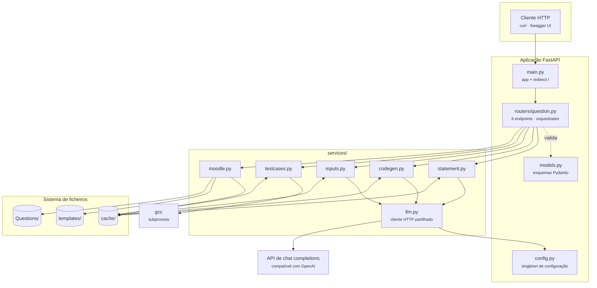
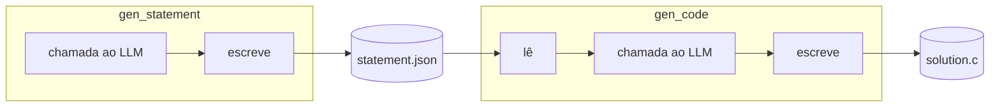

# Arquitetura

<p class="lead">O CodeExpert é um serviço FastAPI de processo único, sem base de dados. O estado entre etapas vive em ficheiros no diretório <code>cache/</code>, e o pipeline combina três chamadas a um LLM com uma execução real de código compilado.</p>

!!! info "Esta é a arquitetura do protótipo, não a da plataforma"
    O que se segue descreve o código deste repositório. A arquitetura alvo — sandbox Judge0, workers separados, PostgreSQL multi-tenant, filas duráveis — está em [Arquitetura alvo](../product/target-architecture.md), e a distância entre as duas em [Análise de lacunas](../product/gap-analysis.md).

    Duas decisões deste protótipo sobrevivem intactas no alvo: **FastAPI com Pydantic** e a **separação estrita entre serviços e HTTP**.

## Visão geral



## Camadas e responsabilidades

| Camada | Ficheiros | Responsabilidade | O que **não** faz |
| --- | --- | --- | --- |
| **Aplicação** | `main.py` | Instancia a app, regista o router, redireciona `/` para `/docs` | Nenhuma lógica de negócio |
| **Router** | `routers/question.py` | Rotas HTTP, tradução de exceções em `HTTPException`, orquestração | Não chama o LLM nem toca em ficheiros de conteúdo |
| **Modelos** | `models.py` | Esquemas de pedido/resposta e validação de `qty` | Sem lógica de domínio |
| **Serviços** | `services/*.py` | Uma etapa do pipeline cada, incluindo a persistência do seu resultado | Não conhecem HTTP nem `HTTPException` |
| **Cliente LLM** | `services/llm.py` | Único ponto de saída para o provedor | Não conhece prompts nem o pipeline |
| **Configuração** | `config.py` | Singleton com carregamento preguiçoso e recarga explícita | Não valida a chave contra o provedor |

O princípio que atravessa o código: **os serviços levantam exceções Python; o router traduz para HTTP**. Nenhum ficheiro em `services/` importa de `fastapi`.

## Comunicação entre etapas

Não há passagem de objetos entre etapas. Cada serviço:

1. lê do disco o que precisa;
2. faz o seu trabalho;
3. escreve o resultado num ficheiro em `cache/`;
4. devolve um modelo Pydantic que inclui o `file_path`.



Esta escolha tem consequências concretas — resiliência a falhas parciais, mas também ausência de isolamento entre pedidos concorrentes. Está analisada em [Cache e estado](cache-and-state.md).

## O orquestrador chama a sua própria API

`POST /create_question` não invoca as funções de serviço diretamente. Constrói um `TestClient` sobre a própria aplicação e faz cinco pedidos HTTP a si mesmo:

```python title="routers/question.py"
from main import app          # import local, para evitar ciclo de importação
client = TestClient(app)

steps = [
    ("/gen_statement", statement_request.dict()),
    ("/gen_code", None),
    ("/gen_inputs", input_request.dict()),
    ("/gen_testcases", None),
    ("/export_moodle_xml_question", None),
]
```

**A vantagem:** a orquestração passa exatamente pelo mesmo caminho de código que um cliente externo — validação, tratamento de erros e serialização incluídos. O comportamento do pipeline completo e o das chamadas individuais não podem divergir.

**O custo:** cada etapa paga serialização JSON e uma travessia da stack ASGI, o `import` de `main` dentro da função é necessário para quebrar o ciclo `main → router → main`, e o `TestClient` é uma ferramenta de teste a correr em produção.

!!! note "Alternativa direta"
    Chamar `generate_statement(request)` diretamente, com um bloco `try/except` por etapa, elimina a dependência circular e o overhead. Duplica o mapeamento de exceções que o router já faz — a menos que esse mapeamento seja extraído para uma função partilhada.

## Fluxos que dependem de sistemas externos

| Dependência | Onde | Falha se |
| --- | --- | --- |
| API de *chat completions* | `services/llm.py` | Rede indisponível, chave inválida, modelo desconhecido, *rate limit* |
| `gcc` | `services/testcases.py` | Binário ausente do `PATH`, ou código gerado não compila |
| Sistema de ficheiros | Todos os serviços | `cache/` ou `Questions/` sem permissões de escrita |

Não há base de dados, cache em memória, fila de tarefas nem serviço de autenticação.

## Autenticação e autorização

**Nenhuma das duas existe.** Os seis endpoints são públicos e não há noção de utilizador, sessão, token ou permissão em lado nenhum do código.

A única credencial no sistema é a chave de API do provedor LLM, que a aplicação usa para se autenticar **perante o provedor**. Não autentica clientes perante a aplicação.

As implicações práticas estão em [Deploy](../deployment/index.md#o-que-falta-antes-de-expor-o-servico).

## Nesta secção

<div class="grid cards" markdown>

-   :material-pipe: **[Pipeline de geração](pipeline.md)**

    ---

    As cinco etapas em detalhe: o que cada uma envia ao modelo, como interpreta a resposta e o que persiste.

-   :material-database-outline: **[Cache e estado](cache-and-state.md)**

    ---

    O contrato de ficheiros entre etapas, quando é limpo e porque é que dois pedidos em simultâneo colidem.

-   :material-robot-outline: **[Integração com o LLM](llm-integration.md)**

    ---

    O cliente HTTP partilhado, a estratégia de *prompting* de cada etapa e o que é preciso para trocar de provedor.

-   :material-file-xml-box: **[Templates Moodle XML](moodle-xml.md)**

    ---

    O sistema de marcadores `Macro_*`, a acumulação de questões e as limitações do exportador.

-   :material-compare: **[Arquitetura alvo](../product/target-architecture.md)**

    ---

    O que o SAD v0.1 define para a plataforma, e quais destas decisões já são compatíveis.

</div>
