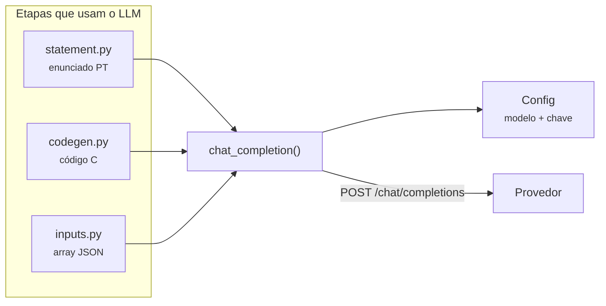

# Integração com o LLM

<p class="lead">Todas as chamadas ao provedor passam por uma única função de 30 linhas em <code>services/llm.py</code>. Três das cinco etapas a usam, cada uma com o seu <em>system prompt</em>.</p>

## O cliente

`chat_completion(prompt, system, temperature=0.7)` faz um `POST` a `{api_base_url}/chat/completions` e devolve o conteúdo da primeira escolha, já com `strip()` aplicado.

```python title="services/llm.py"
payload = {
    "model": config.model,
    "messages": [
        {"role": "system", "content": system},
        {"role": "user", "content": prompt},
    ],
    "temperature": temperature,
}
response = requests.post(
    f"{config.api_base_url}/chat/completions",
    headers=headers, json=payload, timeout=60,
)
response.raise_for_status()
return response.json()["choices"][0]["message"]["content"].strip()
```

| Aspeto | Comportamento |
| --- | --- |
| Autenticação | Header `Authorization: Bearer <chave>` |
| Modelo | `config.model`, do ficheiro de configuração |
| Temperatura | `0.7` — o valor por omissão, nunca alterado por nenhum chamador |
| Timeout | 60 segundos |
| Erros HTTP | `raise_for_status()` levanta `requests.exceptions.HTTPError` |
| Retentativas | **Nenhuma** |
| *Streaming* | Não usado |

Antes de qualquer pedido, verifica que a configuração está carregada:

```python
if not config.api_key or not config.model:
    raise RuntimeError("API configuration not initialised. Call /config first.")
```

!!! note "Esta guarda quase nunca dispara"
    `Config.get_instance()` carrega o ficheiro na primeira chamada e `_load()` já levanta `ValueError` se `Modelo` ou a chave estiverem em falta. Chegar a este `RuntimeError` implica um ficheiro que carregou com sucesso mas com valores vazios — a mensagem sugere um contrato mais rígido do que o que o código realmente impõe.

## Estratégia de prompting por etapa

Cada etapa define o seu `SYSTEM_PROMPT` como constante de módulo. Os três partilham a instrução de não usar markdown, porque as três respostas são escritas diretamente para ficheiros.

| Etapa | *System prompt* | Formato esperado |
| --- | --- | --- |
| `statement.py` | Gerador de enunciados; texto simples, sem markdown | Quatro blocos entre parênteses retos |
| `codegen.py` | Gerador de código C; sem markdown, sem cercas nem indicadores de linguagem | Código C em bruto |
| `inputs.py` | Gerador de entradas de teste baseado em análise de código | Array JSON de strings |



### Robustez das respostas

Nenhuma etapa usa saída estruturada, *function calling* ou `response_format: json_object`. A conformidade é pedida em linguagem natural e verificada — quando é verificada — por análise de texto:

| Etapa | Interpretação da resposta | Se o formato não for respeitado |
| --- | --- | --- |
| Enunciado | Análise de blocos `[...]` | Degrada: texto inteiro num só bloco, título = primeira linha |
| Código | **Nenhuma** — escreve o texto tal como veio | Cercas de markdown chegam ao `.c` e falham a compilação na etapa 4 |
| Entradas | Três níveis: JSON, divisão por vírgulas, divisão por linhas | Os níveis de recurso podem corromper entradas multilinha |

Ver [Pipeline de geração](pipeline.md) para o detalhe de cada análise.

!!! tip "A melhoria de maior retorno nesta camada"
    Para a etapa de entradas, `response_format: {"type": "json_object"}` — suportado pela API OpenAI — eliminaria os dois níveis de recurso e a classe de erros que produzem. Para a etapa de código, uma expressão regular que remova cercas antes de gravar transformaria uma falha na etapa 4 num não-problema.

## Custo e latência

Um `POST /create_question` faz **três** chamadas ao modelo, sequenciais, cada uma com até 60 segundos de timeout. A terceira envia o enunciado **e** o código completo como contexto, sendo tipicamente a mais cara.

A quarta etapa não custa tokens, mas o seu tempo cresce linearmente com `qty`: uma compilação mais `qty` execuções de processo.

!!! tip "Reduzir `qty` durante a exploração"
    `qty` afeta tanto os tokens de saída da etapa 3 como o número de execuções da etapa 4. Enquanto ajusta as restrições até chegar ao exercício certo, `qty: 3` encurta visivelmente o ciclo.

## Trocar de provedor

O código não é específico da OpenAI — usa o formato de *chat completions* que muitos servidores implementam. A única barreira é que a URL base é uma constante:

```python title="config.py"
OPENAI_API_BASE_URL = "https://api.openai.com/v1"
```

Para apontar a um endpoint compatível, altere essa constante:

=== "Ollama (local)"

    ```python
    OPENAI_API_BASE_URL = "http://localhost:11434/v1"
    ```

    O Ollama aceita qualquer valor no header de autorização, mas `Path KEY` continua a ter de apontar para um ficheiro legível e não vazio — caso contrário `_load()` levanta `ValueError`.

=== "vLLM / LM Studio"

    ```python
    OPENAI_API_BASE_URL = "http://localhost:8000/v1"
    ```

    Confirme que o servidor expõe `GET /v1/models`, ou `GET /config` falhará mesmo com a geração funcional.

=== "Azure OpenAI"

    Requer mais do que a URL: a Azure usa `api-key` em vez de `Authorization: Bearer` e o caminho inclui *deployment* e `api-version`. Adaptar exige alterar também a construção de headers em `services/llm.py`.

!!! info "Uma alteração mínima que remove esta fricção"
    Tornar a URL base configurável a partir de `LLM_Config.txt`, à imagem de `Modelo` e `Path KEY`, elimina a necessidade de editar código para trocar de provedor. O campo `Fornecedor`, hoje presente no ficheiro mas ignorado pelo parser, é o lugar natural para essa lógica.

## Tratamento de erros

`services/llm.py` não captura exceções — deixa-as propagar. O router traduz:

| Origem | Exceção | Resposta |
| --- | --- | --- |
| Rede indisponível, DNS, timeout | `requests.exceptions.RequestException` | `500` com `Error calling OpenAI API: ...` |
| `401`, `429`, `500` do provedor | `requests.exceptions.HTTPError` | `500` (subclasse de `RequestException`) |
| Configuração vazia | `RuntimeError` | `500` |
| Resposta sem `choices` | `KeyError` / `IndexError` | `500` genérico |

!!! warning "Um `429` do provedor chega ao cliente como `500`"
    Excesso de pedidos, chave inválida e falha de rede são indistinguíveis pelo código de estado. A distinção só está no texto de `detail`. Como não há retentativas, um *rate limit* transitório aborta o pipeline inteiro — mas os artefactos das etapas já concluídas ficam em `cache/`, permitindo retomar. Ver [Pipeline passo a passo](../guides/step-by-step-pipeline.md#retomar-a-meio).
