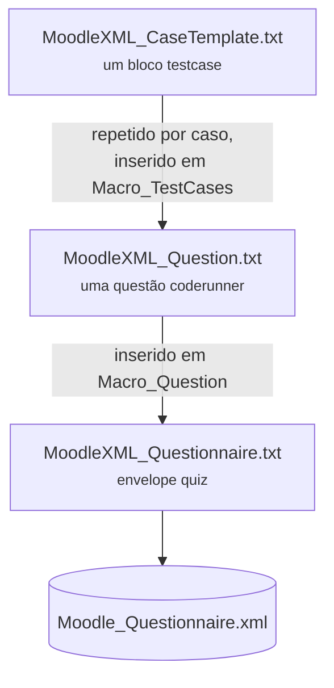

# Templates Moodle XML

<p class="lead">O exportador não usa nenhuma biblioteca XML. Três ficheiros de template em <code>templates/</code> contêm marcadores <code>Macro_*</code> que são substituídos por texto, e o resultado é escrito diretamente em disco.</p>

## Os três templates



| Template | Papel | Marcadores |
| --- | --- | --- |
| `MoodleXML_CaseTemplate.txt` | Um `<testcase>` | `Macro_StdIn`, `Macro_OutputExpected`, `Macro_Display`, `Macro_UseAsExample` |
| `MoodleXML_Question.txt` | Uma `<question type="coderunner">` | `Macro_QuestionNumber`, `Macro_QuestionName`, `Macro_QuestionTextinHTML`, `Macro_Hidden`, `Macro_CoderunnerType`, `Macro_Answer`, `Macro_TestCases` |
| `MoodleXML_Questionnaire.txt` | Envelope `<quiz>` | `Macro_Question` |

## Substituições

### Nível do caso de teste

Para cada entrada em `testcases.json`, `_build_testcases_xml()` copia o template e substitui:

| Marcador | Valor |
| --- | --- |
| `Macro_StdIn` | `case["input"]` com `strip()` |
| `Macro_OutputExpected` | `case["output"]` com `strip()` |
| `Macro_Display` | String vazia |
| `Macro_UseAsExample` | `"1"` nos primeiros três casos, `"0"` nos restantes |

Os blocos resultantes são unidos por `\n`.

!!! warning "As entradas e saídas não são escapadas para XML"
    `Macro_StdIn` e `Macro_OutputExpected` são inseridos dentro de `<text>` sem passar por `html.escape()` — ao contrário do enunciado, que é escapado.

    Um programa cuja saída contenha `<`, `>` ou `&` produz XML mal formado, que o Moodle rejeita na importação. Para exercícios de introdução à programação em C é raro, mas qualquer exercício que imprima uma comparação (`5 < 10`) ou HTML atinge esta limitação.

    A correção é aplicar `escape()` a ambos, como já é feito para o enunciado.

### Nível da questão

| Marcador | Valor | Origem |
| --- | --- | --- |
| `Macro_QuestionNumber` | `"1"` — **sempre** | Fixo no código |
| `Macro_QuestionName` | Título do exercício | `statement.json["name"]` |
| `Macro_QuestionTextinHTML` | Enunciado escapado, `\n` → `<br>` | `statement.json["statement"]` |
| `Macro_Hidden` | `"0"` | Fixo no código |
| `Macro_CoderunnerType` | `"c_program"` | Fixo no código |
| `Macro_Answer` | Código C completo | `solution.c` |
| `Macro_TestCases` | Blocos gerados acima | `testcases.json` |

O enunciado é o único valor tratado:

```python title="services/moodle.py"
statement_html = escape(statement_data.get("statement", "")).replace("\n", "<br>")
```

O código-fonte não precisa de escape porque `MoodleXML_Question.txt` já o envolve numa secção `CDATA`.

## Acumulação

O comportamento mais consequente do exportador:

```python title="services/moodle.py"
if os.path.exists(OUTPUT_FILE):
    existing = open(OUTPUT_FILE).read()
    final_xml = existing.replace("</quiz>", question_xml + "\n</quiz>")
else:
    final_xml = questionnaire_template.replace("Macro_Question", question_xml)
```

- **Ficheiro ausente** → cria a partir do envelope.
- **Ficheiro presente** → insere a nova questão imediatamente antes de `</quiz>`.

Correr o pipeline dez vezes produz um único ficheiro com dez questões — a forma prevista de construir um questionário. Ver [Importar no Moodle](../guides/import-into-moodle.md#acumular-varias-questoes).

Para recomeçar:

```bash
rm Questions/Moodle_Questionnaire.xml
```

!!! danger "A acumulação é silenciosa e sem limite"
    Nada na resposta da API indica se uma questão foi acrescentada ou se o ficheiro foi criado — `status: "success"` em ambos os casos. Um utilizador que corra o pipeline várias vezes a experimentar restrições acaba com todas as tentativas no mesmo ficheiro, incluindo as que não queria manter.

    Verifique a contagem antes de importar:

    ```bash
    grep -c "<question type=" Questions/Moodle_Questionnaire.xml
    ```

## Valores fixos no template

Estes campos estão escritos diretamente em `MoodleXML_Question.txt` e não são configuráveis pela API:

| Campo | Valor | Efeito no Moodle |
| --- | --- | --- |
| `defaultgrade` | `1` | Um ponto por questão |
| `penalty` | `0` | Sem penalização por tentativa |
| `allornothing` | `0` | Pontuação parcial por caso de teste |
| `penaltyregime` | `0` | Sem regime de penalização |
| `precheck` | `0` | Sem verificação prévia |
| `answerboxlines` | `18` | Altura da caixa de resposta |
| `answerboxcolumns` | `100` | Largura da caixa de resposta |
| `validateonsave` | `1` | O Moodle testa a resposta de referência ao gravar |
| `hoisttemplateparams` | `1` | Comportamento por omissão do CodeRunner |
| `extractcodefromjson` | `1` | Comportamento por omissão do CodeRunner |
| `tags` | `Fácil`, `Revisado` | **Aplicadas a todas as questões** |

Alterar qualquer um destes é editar `templates/MoodleXML_Question.txt` — nenhuma alteração de código Python é necessária.

## Limitações conhecidas

!!! danger "As tags contradizem os dados"
    Todas as questões saem etiquetadas como `Fácil` e `Revisado`, independentemente do valor de `difficulty` e sem que qualquer humano as tenha revisto. Uma questão gerada com `difficulty: "muito dificil"` chega ao Moodle marcada como fácil.

    A correção exige um novo marcador — `Macro_Tags` — preenchido a partir da dificuldade pedida, o que implica propagar `StatementRequest` até à etapa de exportação. Hoje essa informação perde-se: `statement.json` guarda apenas nome e texto.

!!! warning "Todas as questões são a questão `1`"
    `Macro_QuestionNumber` recebe sempre `"1"`, pelo que o comentário `<!-- question: 1 -->` se repete. É apenas um comentário XML e a importação funciona, mas torna ficheiros com muitas questões difíceis de navegar. Contar as questões existentes antes de inserir resolveria o problema.

!!! warning "`c_program` está fixo"
    `Macro_CoderunnerType` recebe `"c_program"` no código do exportador, tal como `gcc` está fixo na etapa de casos de teste e os prompts pedem explicitamente código C. Suportar outra linguagem exige alterar os três pontos em conjunto. Ver [Desenvolvimento](../development/index.md#adicionar-outra-linguagem).
