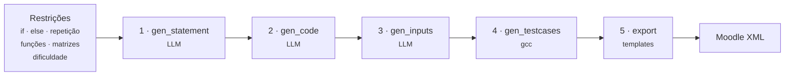
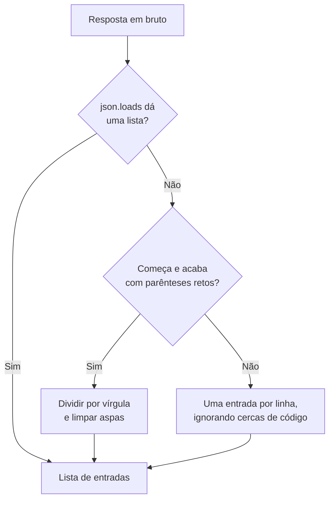
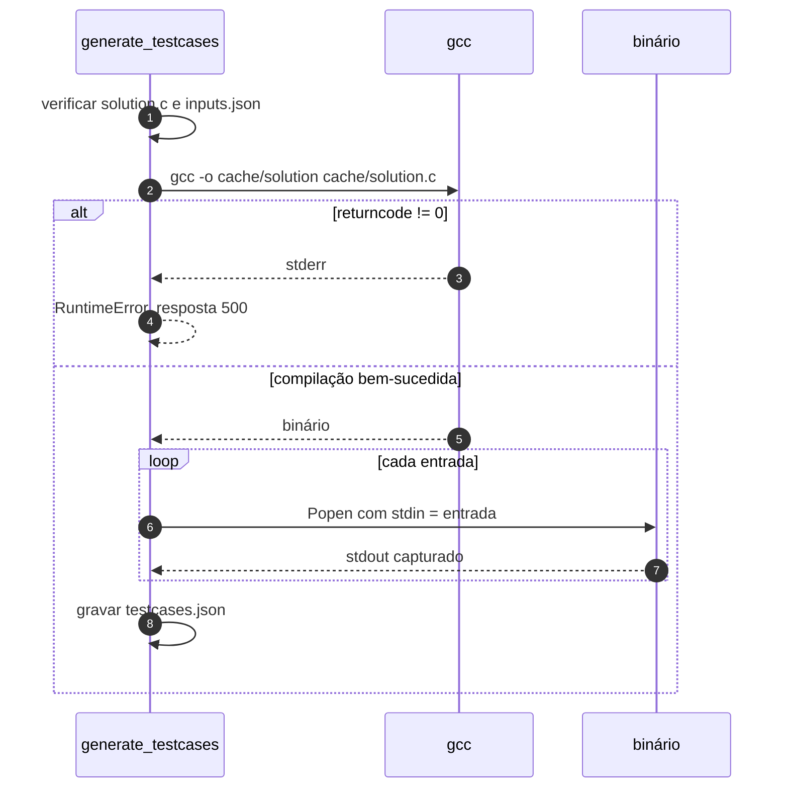
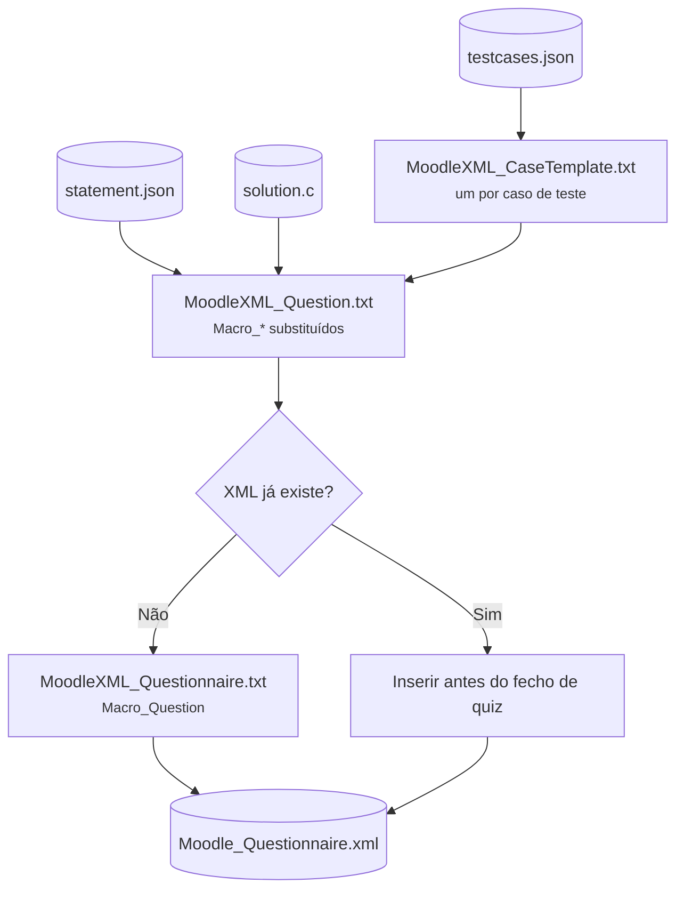

# Pipeline de geração

<p class="lead">Cinco etapas transformam um conjunto de restrições pedagógicas num ficheiro XML importável. Três chamam um modelo de linguagem, uma compila e executa código, e a última monta texto a partir de templates.</p>

## Panorama



| Etapa | Módulo | Usa LLM | Entrada | Saída |
| --- | --- | --- | --- | --- |
| 1 | `services/statement.py` | :material-check: | `StatementRequest` | `cache/statement.json` |
| 2 | `services/codegen.py` | :material-check: | `statement.json` | `cache/solution.c` |
| 3 | `services/inputs.py` | :material-check: | `statement.json` + `solution.c` | `cache/inputs.json` |
| 4 | `services/testcases.py` | :material-close: | `solution.c` + `inputs.json` | `cache/testcases.json` |
| 5 | `services/moodle.py` | :material-close: | os três + `templates/` | `Questions/Moodle_Questionnaire.xml` |

---

## 1 · `gen_statement`

Traduz cinco *flags* booleanas e um nível de dificuldade num prompt em português que descreve o que a solução pode e não pode usar.

### Das restrições ao prompt

`_build_prompt()` monta uma lista de requisitos. A lógica de condicionais é hierárquica — `can_has_else` só é considerado se `can_has_if` for verdadeiro:

| `can_has_if` | `can_has_else` | Requisito emitido |
| --- | --- | --- |
| `false` | *(irrelevante)* | `NÃO deve usar estruturas condicionais (if)` |
| `true` | `false` | `DEVE usar if mas NÃO deve usar else` |
| `true` | `true` | `DEVE usar estruturas condicionais completas (if e else)` |

Os restantes três eixos são binários diretos:

| Campo | `true` | `false` |
| --- | --- | --- |
| `can_has_repetition` | `DEVE usar estruturas de repetição (for, while ou do while)` | `NÃO deve usar estruturas de repetição` |
| `can_has_function` | `DEVE usar funções` | `NÃO deve usar funções` |
| `can_has_matrix` | `DEVE usar vetores ou matrizes` | `NÃO deve usar vetores ou matrizes` |

`difficulty` é comparado contra cinco literais — `muito facil`, `facil`, `medio`, `dificil`, `muito dificil` — e cada um acrescenta a linha correspondente.

!!! warning "`difficulty` não é validado"
    `StatementRequest.difficulty` é um `str` sem validação. Um valor fora dos cinco literais **não gera erro**: nenhum ramo da cadeia `if/elif` corresponde, nenhum requisito de dificuldade é acrescentado e o pedido segue normalmente, apenas sem essa instrução.

    Um `Literal[...]` ou um `Enum` no modelo transformaria o erro silencioso num `422` explícito.

### O formato pedido

O prompt exige uma estrutura de quatro blocos entre parênteses retos:

```text
[Título do problema]
[Descrição do problema]
[Descrição das entradas]
[Descrição das saídas]
```

com quatro instruções negativas: sem exemplos de entrada/saída, sem markdown, sem acentos — esta última porque o texto acaba em código C — e o título derivado do problema.

### Interpretação da resposta

`_parse_statement()` percorre as linhas, trata cada `[bloco]` como início de secção, remove os parênteses e junta as secções com linhas em branco. O título é a primeira linha não vazia do resultado.

!!! note "O parser degrada em vez de falhar"
    Se o modelo ignorar a convenção `[...]`, nenhuma secção é detetada, o texto inteiro fica num único bloco e o título passa a ser simplesmente a primeira linha. O valor `"Exercício"` existe como último recurso, mas só é alcançado com uma resposta completamente vazia.

---

## 2 · `gen_code`

Recebe apenas o campo `statement` de `cache/statement.json` — não as restrições originais.

!!! info "As restrições não chegam a esta etapa"
    A conformidade com `can_has_function`, `can_has_matrix` e restantes depende inteiramente de o enunciado as ter tornado explícitas no seu texto. A etapa de código nunca vê as *flags*.

O prompt impõe seis regras, das quais duas são críticas para o CodeRunner:

1. **Ler de `stdin` sem imprimir mensagens de prompt.** O CodeRunner compara `stdout` literalmente; um `printf("Digite um numero: ")` faz falhar todos os casos.
2. **Sem markdown.** O conteúdo é escrito diretamente para `.c` — uma cerca de código seria um erro de compilação.

A instrução anti-markdown é reforçada no *system prompt*: *"Return only the raw C code without backticks or language indicators."*

!!! warning "Não há saneamento pós-resposta"
    Se o modelo devolver o código dentro de uma cerca de markdown, essas linhas são escritas literalmente em `solution.c` e a falha só aparece na etapa 4, como erro de compilação. Remover cercas com uma expressão regular antes de gravar tornaria a etapa robusta.

---

## 3 · `gen_inputs`

A única etapa que vê **enunciado e código em conjunto**. O prompt instrui explicitamente a seguir os padrões de `scanf` do código para determinar o formato da entrada.

Nove regras governam o formato. As de maior impacto:

- cada entrada corresponde exatamente ao que o código lê de `stdin`;
- se o código não tiver instruções de leitura, devolver um array vazio;
- `\n` separa linhas dentro de uma entrada;
- **cada número numa linha própria** — nunca separados por espaços;
- incluir casos-limite além dos casos normais.

### Interpretação em três níveis

`_parse_inputs()` tenta, por ordem:



O resultado é truncado a `request.qty`.

!!! warning "O terceiro nível pode produzir entradas silenciosamente corrompidas"
    A divisão por vírgulas não respeita aspas: uma entrada que contenha uma vírgula é partida ao meio. E a divisão por linhas destrói entradas multilinha, que são precisamente o caso comum — `"3\n10\n20\n"`.

    Quando este ramo é atingido, o resultado costuma ser saídas vazias na etapa 4. Ver [Resolução de problemas](../development/troubleshooting.md#saidas-vazias-nos-casos-de-teste).

---

## 4 · `gen_testcases`

**Nenhum modelo de linguagem participa nesta etapa.** É o que garante que as saídas esperadas correspondem ao comportamento real do programa.



Cada caso é `{"input": <entrada>, "output": <stdout>}`. O `stderr` é lido mas descartado.

### Limites desta etapa

!!! danger "Execução sem isolamento nem limites"
    O binário corre com os privilégios do processo do servidor. Não há *sandbox*, nem `timeout` no `communicate()`, nem limite de memória.

    Um programa gerado com um ciclo infinito — ou à espera de mais entrada do que a fornecida — bloqueia o *worker* indefinidamente. Não há forma de o cancelar através da API.

!!! warning "O código de saída do programa é ignorado"
    Um programa que termine com `abort()`, falha de segmentação ou código diferente de zero produz um caso de teste com a saída parcial que tiver emitido antes de morrer. Esse caso é exportado como se fosse válido.

---

## 5 · `export_moodle_xml`

Substituição de texto sobre três templates. Sem biblioteca XML.



O enunciado passa por `html.escape()` e os `\n` tornam-se `<br>`. O código-fonte vai dentro de uma secção `CDATA` sem escape.

!!! info "Esta etapa não valida dependências"
    `_load_json()` e `_load_text()` devolvem valores por omissão quando o ficheiro não existe. Uma exportação sobre uma cache vazia produz XML válido e vazio, com `status: "success"`.

Detalhe completo dos marcadores em [Templates Moodle XML](moodle-xml.md).
