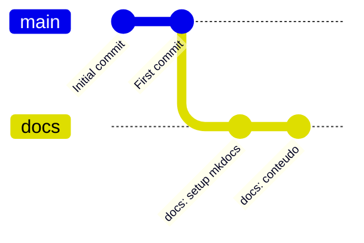

# Contribuir

<p class="lead">O repositório não tem <code>CONTRIBUTING.md</code>, modelos de <em>issue</em> ou de PR, <em>hooks</em> de commit nem CI. Esta página descreve o que o histórico revela e propõe convenções coerentes com o código existente.</p>

!!! info "Convenções propostas, não impostas"
    Com dois commits no histórico e um único autor, não há prática estabelecida a documentar. O que se segue é uma base sensata para quando houver mais do que uma pessoa a trabalhar no código — e deve ser ajustada, não seguida cegamente.

## Antes de começar

| Passo | Onde |
| --- | --- |
| Perceber o que este repositório é dentro do produto | [Contexto do produto](../product/index.md) |
| Pôr o ambiente a funcionar | [Instalação](../getting-started/installation.md) |
| Perceber como o código está organizado | [Estrutura do projeto](../development/project-structure.md) |
| Conhecer as convenções em uso | [Convenções](../development/conventions.md) |

!!! tip "A pergunta a fazer antes de qualquer alteração"
    Este é um protótipo do EPIC-017, fora do MVP. Vale a pena confirmar que o problema que quer resolver **pertence a este código** e não a um épico anterior.

    Autenticação, base de dados, filas e sandbox pertencem à plataforma. Verificação de escopo, rastreabilidade da geração e qualidade das questões pertencem aqui. Ver [O que fazer a seguir](../product/gap-analysis.md#o-que-fazer-a-seguir).

## Branches

O repositório tem `main` e `docs`. `main` é a branch por omissão.



Convenção proposta — ramificar a partir de `main`, com prefixo por tipo:

| Prefixo | Para | Exemplo |
| --- | --- | --- |
| `feat/` | Funcionalidade nova | `feat/verificacao-escopo` |
| `fix/` | Correção | `fix/timeout-execucao` |
| `docs/` | Documentação | `docs/api-erros` |
| `refactor/` | Reestruturação sem mudança de comportamento | `refactor/handlers-excecoes` |
| `chore/` | Manutenção, dependências, configuração | `chore/requirements-txt` |

!!! danger "A branch `docs` e a pasta `docs/` colidem"
    Existe uma branch chamada `docs` **e** um diretório chamado `docs/`. O Git recusa `git checkout docs` por ambiguidade. Use as formas explícitas:

    ```bash
    git switch docs          # mudar de branch
    git checkout -- docs/    # descartar alterações na pasta
    git log -- docs/         # histórico da pasta
    ```

    Renomear a branch para `documentation` — ou fundi-la em `main` e apagá-la — elimina o problema de vez.

## Commits

O histórico atual — `Initial commit`, `First commit` — não estabelece convenção. A proposta é [Conventional Commits](https://www.conventionalcommits.org/), que combina com os prefixos de branch acima:

```text
<tipo>: <descrição no imperativo, minúsculas, sem ponto final>
```

```text
feat: verificar estruturas declaradas com tree-sitter
fix: aplicar timeout na execucao dos casos de teste
docs: documentar o pipeline de geracao
refactor: extrair tradutor de excecoes do router
chore: declarar dependencias em requirements.txt
```

Duas orientações que valem mais do que o formato:

**O corpo explica o porquê.** O *diff* já mostra o quê.

```text
fix: aplicar timeout na execucao dos casos de teste

Sem timeout, um programa gerado com ciclo infinito bloqueia o worker
indefinidamente e o pedido nunca termina. Cinco segundos cobre com folga
qualquer exercicio introdutorio.
```

**Um commit, uma alteração.** Reformatação e mudança de comportamento no mesmo commit tornam a revisão impossível. Se adotar um formatador, a primeira passagem é um commit isolado.

## Pull requests

Sem CI, a revisão é a única barreira de qualidade. Um PR deve trazer o que a automação traria:

- [ ] **O que muda e porquê**, num parágrafo. Ligue à secção relevante desta documentação ou à lacuna que fecha.
- [ ] **Como foi verificado** — o servidor arranca, `GET /config` responde, o pipeline corre. Ver [Verificação manual](../development/testing.md#verificacao-manual).
- [ ] **Documentação atualizada** se o comportamento mudou.
- [ ] **Sem segredos** — nem chaves, nem caminhos absolutos com nome de utilizador.
- [ ] **Artefactos de runtime fora do diff** — nada de `cache/` nem de `Questions/`.

!!! warning "Confirme o diff antes de submeter"
    `cache/` é rastreado pelo Git e o seu conteúdo muda a cada execução. É trivial incluir sem querer o resultado de uma geração de teste — incluindo um binário compilado.

    ```bash
    git status --short
    git diff --stat
    ```

    Se `cache/` aparecer, considere resolver a causa: acrescentar `cache/` e `Questions/` ao `.gitignore` e removê-los do índice com `git rm --cached`. Ver [Cache e estado](../architecture/cache-and-state.md#ficheiros-versionados-que-nao-deviam-estar).

### O que merece revisão cuidada

| Área | Porquê |
| --- | --- |
| **Prompts** | São o ativo transferível deste protótipo. Alterá-los muda o resultado de forma difícil de testar |
| **Analisadores de resposta** | `_parse_statement` e `_parse_inputs` falham em silêncio, não com erro |
| **Templates XML** | Um marcador por substituir passa despercebido até à importação no Moodle |
| **`services/testcases.py`** | É onde código não confiável é compilado e executado |

!!! tip "Ao alterar um prompt, verifique o analisador correspondente"
    `_parse_statement()` depende da convenção `[bloco]` que o prompt pede. `_parse_inputs()` depende de a resposta ser um array JSON. Mudar o formato pedido sem atualizar o analisador produz falhas silenciosas.

## Trabalhar na documentação {#trabalhar-na-documentacao}

A documentação é independente da aplicação e tem as suas próprias dependências.

```bash
uv pip install -r requirements-docs.txt
mkdocs serve
```

Fica em `http://127.0.0.1:8000` com recarga automática.

!!! warning "Colide com a porta da aplicação"
    Ambos usam a 8000. Para os correr em simultâneo:

    ```bash
    mkdocs serve -a 127.0.0.1:8001
    ```

Antes de submeter, o build tem de passar em modo estrito:

```bash
mkdocs build --strict
```

`--strict` transforma avisos em erros — ligações partidas, âncoras inexistentes, ficheiros fora da navegação. O site é gerado em `.dist/site/`.

### Convenções de escrita

Observáveis nas páginas existentes:

| Aspeto | Convenção |
| --- | --- |
| Idioma | Português. Código, identificadores e mensagens de log ficam em inglês, como no código |
| Abertura | Um parágrafo `<p class="lead">` que resume a página |
| Afirmações | Verificáveis no código. Quando algo não é determinável, dizer `A confirmar` |
| Planeado vs. implementado | **Sempre distinguido.** O que vem dos documentos de planeamento é identificado como tal |
| Admonitions | `danger` para o que causa dano silencioso; `warning` para limitações; `tip` para atalhos; `info` para contexto |
| Diagramas | Mermaid, só quando explicam algo que o texto não explica |

!!! danger "A distinção mais importante desta documentação"
    Grande parte do material descreve uma plataforma que **ainda não existe**. Confundir o planeado com o implementado é o erro mais fácil de cometer e o mais caro para quem lê.

    Ao acrescentar conteúdo derivado dos documentos de planeamento, marque-o como tal — como faz a secção [Contexto do produto](../product/index.md).

## Segurança

!!! danger "Nunca comprometa segredos"
    A chave de API vive num ficheiro externo apontado por `Path KEY`, deliberadamente fora do repositório. Mantenha assim.

    Em documentação e exemplos, use sempre valores fictícios: `sk-XXXX`, `/caminho/para/a/chave.txt`.

`config/LLM_Config.txt` está versionado e contém um caminho absoluto de uma máquina de desenvolvimento, com nome de utilizador. Não é um segredo — o ficheiro da chave nunca esteve no repositório — mas é informação de ambiente que não pertence ao histórico e obriga cada pessoa a editar o ficheiro depois de clonar.

A correção recomendada: versionar `config/LLM_Config.example.txt` com valores neutros e adicionar `config/LLM_Config.txt` ao `.gitignore`.

## Lacunas que aceitam contribuição

Ordenadas por retorno sobre esforço, com o contexto completo em [Análise de lacunas](../product/gap-analysis.md#o-que-fazer-a-seguir):

| # | Alteração | Esforço | Porquê importa |
| --- | --- | --- | --- |
| 1 | Remover as tags `Fácil` e `Revisado` do template | Minutos | O XML afirma uma revisão que não aconteceu |
| 2 | `timeout=5` em `communicate()` | Uma linha | Elimina o bloqueio indefinido do servidor |
| 3 | `requirements.txt` | Minutos | Torna o ambiente reproduzível |
| 4 | `cache/` e `Questions/` no `.gitignore` | Minutos | Limpa o `git status` e tira um binário do histórico |
| 5 | `Literal` em `difficulty` | Baixo | Transforma erro silencioso em `422` |
| 6 | Remover cercas de markdown antes de gravar o `.c` | Baixo | Elimina a falha de compilação mais comum |
| 7 | Persistir pedido, modelo e versão do prompt | Baixo | Pré-requisito de três outras lacunas |
| 8 | Testes das funções puras | Médio | Primeira rede de segurança do projeto |
| 9 | Verificação de escopo com tree-sitter | Alto | A lacuna mais grave — FEAT-024 e FEAT-040 |

!!! tip "Se for a sua primeira contribuição"
    Os itens 1 a 4 são independentes entre si, levam minutos e cada um remove fricção real. O item 7 desbloqueia os itens 1, 5 e 9 em simultâneo — é o de maior alavancagem.

## Licença

MIT, © 2026 Hugo Rosa. Contribuições ficam sob os mesmos termos.
