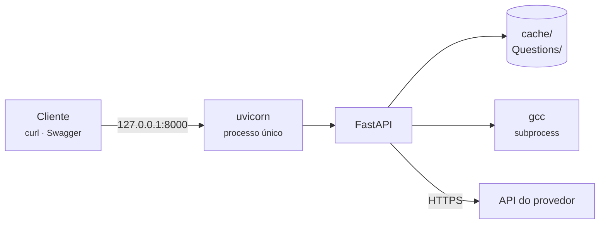

# Deploy

<p class="lead">A documentação tem um workflow de publicação no GitHub Pages. A aplicação ainda não tem artefactos de implantação. Esta página descreve o que existe hoje, o que teria de mudar antes de expor o serviço, e como isso se relaciona com a arquitetura já decidida para a plataforma.</p>

!!! warning "Estado atual"
    Não há `Dockerfile`, `docker-compose.yml`, manifesto de Kubernetes, `Procfile` nem script de implantação da aplicação. Não há ambientes definidos, nem configuração para desenvolvimento, homologação ou produção.

    O modo de execução suportado é **local**: `python main.py` a partir da raiz do repositório.

## Como corre hoje



Um processo, sem estado externo, com duas dependências: um compilador local e uma API remota.

| Aspeto | Valor |
| --- | --- |
| Comando | `python main.py` |
| Bind | `0.0.0.0:8000`, fixo em `main.py` |
| Workers | Um. `uvicorn.run(app)` sem `workers=` |
| Estado | Ficheiros em `cache/` e `Questions/`, relativos ao diretório de trabalho |
| Configuração | `config/LLM_Config.txt` + um ficheiro de chave externo |
| Reinício | Manual |

## O que falta antes de expor o serviço

Cinco bloqueios. Nenhum é opcional se o serviço deixar de correr numa máquina de confiança operada por uma só pessoa.

### 1 · Não há autenticação

!!! danger "Qualquer cliente que alcance a porta consome a sua chave de API"
    Os seis endpoints são públicos. Não há tokens, sessões nem cabeçalhos de autorização.

    Como o servidor liga a `0.0.0.0`, isto inclui qualquer máquina da rede local. Numa rede partilhada, o custo é imediato e mensurável.

Mitigação imediata, sem alterar código:

```bash
uvicorn main:app --host 127.0.0.1 --port 8000
```

A solução adequada pertence ao EPIC-001, não a este protótipo. Ver [Análise de lacunas](../product/gap-analysis.md#nao-ha-identidade-nem-tenancy).

### 2 · Execução de código não confiável {#execucao-de-codigo-nao-confiavel}

!!! danger "Compila e executa sem qualquer isolamento"
    `services/testcases.py` corre `gcc` e depois o binário resultante com os privilégios do processo do servidor. Sem sandbox, sem timeout, sem limite de memória, sem limite de processos, sem restrição de rede ou de sistema de ficheiros.

    O código vem de um LLM instruído a resolver um exercício introdutório, não de um adversário — o risco é menor do que no caso de código de aluno. Mas um ciclo infinito bloqueia o pedido para sempre, e um `malloc` descontrolado afeta a máquina inteira.

A arquitetura alvo resolve isto com **Judge0 autogerido em VPC isolada**, num host tratado como já comprometido — ver [Arquitetura alvo](../product/target-architecture.md#adr-002-terceirizar-a-execucao-judge0-autogerido). É a FEAT-033, na lista *"nunca cortar"*.

Enquanto isso não existe, por ordem de esforço:

| Mitigação | Esforço | Efeito |
| --- | --- | --- |
| `timeout=5` em `communicate()` | Uma linha | Elimina o modo de falha mais provável |
| Correr o servidor num contentor descartável | Baixo | Limita o raio de alcance |
| Limites de recursos no contentor (`--memory`, `--pids-limit`) | Baixo | Contém consumo descontrolado |
| Sandbox real | Alto | Pertence ao EPIC-008 |

### 3 · Um pipeline de cada vez

!!! danger "Não escale horizontalmente este serviço"
    O estado vive em caminhos globais de `cache/`, sem identificador por pedido. Dois pedidos concorrentes escrevem sobre os mesmos ficheiros, e `_clear_cache()` apaga o que o outro está a usar.

    O resultado é uma questão com enunciado de um pedido e código de outro — **sem qualquer erro**.

Isto exclui, hoje: múltiplos *workers* uvicorn, réplicas atrás de um balanceador, e qualquer plataforma que escale automaticamente por número de pedidos.

Ver [Concorrência](../architecture/cache-and-state.md#concorrencia).

### 4 · O estado é efémero e local

`cache/` e `Questions/` são diretórios locais relativos ao diretório de trabalho. Num contentor sem volume persistente, `Questions/Moodle_Questionnaire.xml` — o único artefacto de valor — desaparece a cada reinício.

O comportamento de acumulação torna isto mais consequente do que parece: perder o ficheiro é perder o questionário inteiro, não apenas a última questão.

### 5 · A configuração não é injetável

`config/LLM_Config.txt` é lido de um caminho relativo, e `Path KEY` aponta para um segundo ficheiro no sistema de ficheiros. Nenhuma variável de ambiente é consumida.

!!! warning "Isto colide com a gestão de segredos de qualquer plataforma"
    Cloud Run, Kubernetes e serviços equivalentes injetam segredos por variável de ambiente ou por volume montado. Este código exige dois ficheiros em caminhos relativos ao diretório de trabalho.

    Montar o segredo num volume e apontar `Path KEY` para o caminho montado funciona, mas é um contorno. Ler `OPENAI_API_KEY` do ambiente quando presente — mantendo o ficheiro como alternativa — seria uma alteração pequena com retorno alto.

## Se precisar de implantar mesmo assim

O que se segue **não existe no repositório**. É um ponto de partida coerente com o que o código faz, não uma configuração testada.

!!! danger "Não exponha esta configuração à internet"
    Sem autenticação e sem sandbox, o alcance máximo aceitável é uma rede interna de confiança, atrás de um *proxy* que imponha autenticação. Um único processo, para um único utilizador de cada vez.

```dockerfile title="Dockerfile — esboço, não presente no repositório"
FROM python:3.13-slim

# gcc e necessario em tempo de execucao, nao apenas de compilacao:
# services/testcases.py invoca-o a cada pedido.
RUN apt-get update && apt-get install -y --no-install-recommends gcc \
    && rm -rf /var/lib/apt/lists/*

WORKDIR /app
RUN pip install --no-cache-dir fastapi uvicorn requests pydantic
COPY . .

# Um unico worker: o estado global em cache/ nao suporta concorrencia.
CMD ["uvicorn", "main:app", "--host", "0.0.0.0", "--port", "8000", "--workers", "1"]
```

Três pontos que decorrem diretamente do código:

- **`gcc` é dependência de runtime.** Uma imagem sem compilador falha na etapa 4 de cada pedido, não no arranque.
- **`WORKDIR /app` e `COPY . .` são obrigatórios em conjunto.** Todos os caminhos são relativos ao diretório de trabalho — `config/`, `templates/`, `cache/`, `Questions/`.
- **`--workers 1` não é conservadorismo.** Mais do que um worker corrompe o estado partilhado.

Volumes e segredos:

```bash
docker run --rm \
  -p 127.0.0.1:8000:8000 \
  --memory 512m --pids-limit 128 \
  -v "$PWD/Questions:/app/Questions" \
  -v "/caminho/seguro/chave.txt:/run/secrets/openai_key:ro" \
  codeexpert
```

`config/LLM_Config.txt` teria de apontar `Path KEY` para `/run/secrets/openai_key`.

## CI/CD {#ci-cd}

O workflow `.github/workflows/docs.yml` executa `mkdocs build --strict` nos pushes em `main` e `docs` e nos pull requests. Nos pushes, publica o site gerado em `.dist/site` no GitHub Pages. Permite também execução manual nessas branches.

### Ativar o GitHub Pages

1. Abra **Settings → Pages** no GitHub.
2. Em **Build and deployment → Source**, selecione **GitHub Actions**.
3. Envie o workflow para `main` ou `docs` e acompanhe **Documentation** na aba **Actions**.
4. Se usar `docs`, permita essa branch em **Settings → Environments → github-pages**, caso existam restrições de branches.
5. Abra <https://hugorosa29.github.io/coderunner_v2/> quando terminar.

O site gerado inclui HTML, CSS, JavaScript e os recursos do tema Material. Publicar diretamente os ficheiros fonte em `docs/` não constrói o design.

Este workflow publica a documentação estática. Ainda não existe pipeline de testes ou linter da aplicação FastAPI.

## Ambientes

Não existe qualquer distinção entre ambientes. Sem `ENVIRONMENT`, sem ficheiros de configuração por ambiente, sem *feature flags*.

Um único eixo de configuração existe hoje: o modelo e a chave em `LLM_Config.txt`. Apontar para modelos diferentes — um mais barato em desenvolvimento, um melhor em produção — é a única separação praticável sem alterar código.

## Se este código for absorvido pela plataforma

A arquitetura alvo já responde a quase tudo o que falta aqui:

| Bloqueio | Como o alvo resolve |
| --- | --- |
| Sem autenticação | EPIC-001 e EPIC-002 — identidade, papéis, tenancy com RLS |
| Execução sem isolamento | ADR-002 — Judge0 autogerido em VPC isolada |
| Um pipeline de cada vez | Fila durável (Cloud Tasks) e workers separados |
| Estado efémero | PostgreSQL como fonte da verdade |
| Configuração não injetável | Configuração de modelo e cotas por tenant, em base de dados |

!!! tip "A consequência prática para quem trabalha neste repositório hoje"
    Nenhum destes bloqueios se resolve bem dentro deste protótipo. Implementar autenticação, filas ou uma base de dados aqui é construir duas vezes — e a segunda versão, feita com o contexto das ondas 0 e 1, será melhor.

    O que **vale** a pena fazer aqui são as correções que tornam o resultado confiável: timeout na execução, remoção das tags falsas, e rastreabilidade do que foi gerado. Ver [O que fazer a seguir](../product/gap-analysis.md#o-que-fazer-a-seguir).
