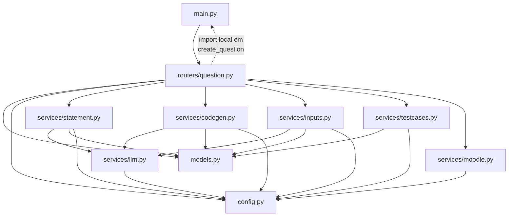

# Estrutura do projeto

<p class="lead">Onze ficheiros Python, três templates e um ficheiro de configuração. A organização segue uma regra simples: cada etapa do pipeline tem o seu módulo, e nenhum módulo de serviço conhece HTTP.</p>

## Árvore

```text
coderunner_v2/
├── main.py                    # app FastAPI, redirect de / e arranque uvicorn
├── config.py                  # singleton Config e constantes de caminhos
├── models.py                  # esquemas Pydantic de pedido e resposta
│
├── routers/
│   └── question.py            # os seis endpoints e o orquestrador
│
├── services/                  # uma etapa do pipeline por ficheiro
│   ├── llm.py                 # cliente HTTP partilhado do provedor
│   ├── statement.py           # etapa 1 · enunciado
│   ├── codegen.py             # etapa 2 · solução em C
│   ├── inputs.py              # etapa 3 · entradas de teste
│   ├── testcases.py           # etapa 4 · compilação e execução
│   └── moodle.py              # etapa 5 · exportação XML
│
├── templates/                 # marcadores Macro_* substituídos por texto
│   ├── MoodleXML_CaseTemplate.txt
│   ├── MoodleXML_Question.txt
│   └── MoodleXML_Questionnaire.txt
│
├── config/
│   └── LLM_Config.txt         # modelo e caminho para a chave de API
│
├── cache/                     # estado entre etapas (runtime)
├── Questions/                 # XML exportado (runtime, criado a pedido)
│
├── docs/                      # esta documentação
├── mkdocs.yml
└── requirements-docs.txt
```

## Direção das dependências



As dependências fluem para baixo, com **uma exceção**: `create_question` importa `app` de `main.py` dentro do corpo da função, para construir o `TestClient`. O `import` é local precisamente para quebrar o ciclo `main → routers → main` — um `import` ao nível do módulo falharia no arranque.

## Papel de cada ficheiro

### `main.py`

Instancia `FastAPI(title="CodeExpert")`, regista o router, define o redirect de `/` para `/docs` e arranca o uvicorn quando executado diretamente. Reconfigura `sys.stdout` para UTF-8 — necessário no Windows, porque os enunciados gerados contêm caracteres não-ASCII.

Sem lógica de negócio.

### `config.py`

Duas responsabilidades:

- **Constantes de caminhos** — `CACHE_DIR`, `QUESTIONS_DIR`, `TEMPLATES_DIR`, `CONFIG_FILE`, `OPENAI_API_BASE_URL`. Todas relativas ao diretório de trabalho.
- **A classe `Config`** — singleton com `get_instance()` (carregamento preguiçoso) e `reload()` (força nova leitura do disco).

Ver [Configuração](../getting-started/configuration.md).

### `models.py`

Esquemas Pydantic, separados por comentários em pedidos e respostas. A única validação real está em `InputRequest.qty`, que exige `1 ≤ qty ≤ 100`.

Todos os modelos de resposta têm valores por omissão para todos os campos — o que significa que uma resposta vazia é sempre construível.

!!! note "API do Pydantic v1 sobre o Pydantic v2"
    `models.py` usa `@validator`, descontinuado a favor de `@field_validator`. Funciona, com um aviso no arranque.

### `routers/question.py`

O ficheiro mais denso do projeto, com três responsabilidades distintas:

1. **Definição das rotas** — os seis endpoints, cada um a chamar uma função de serviço.
2. **Tradução de exceções** — o mesmo padrão repetido em cada endpoint:

    ```python
    try:
        return generate_code()
    except FileNotFoundError as e:
        raise HTTPException(status_code=404, detail=str(e))
    except requests.exceptions.RequestException as e:
        raise HTTPException(status_code=500, detail=f"Error calling OpenAI API: {e}")
    except Exception as e:
        raise HTTPException(status_code=500, detail=str(e))
    ```

3. **Orquestração** — `create_question` e o auxiliar `_clear_cache()`.

!!! tip "A duplicação mais óbvia do projeto"
    O bloco de tradução de exceções repete-se cinco vezes com variações mínimas. Um decorador, ou *exception handlers* registados ao nível da aplicação com `@app.exception_handler(FileNotFoundError)`, eliminariam a repetição — e removeriam o argumento a favor de o orquestrador usar `TestClient`.

### `services/llm.py`

Uma única função, `chat_completion(prompt, system, temperature=0.7)`. É o único ponto do código que fala com o provedor. Ver [Integração com o LLM](../architecture/llm-integration.md).

### `services/statement.py`, `codegen.py`, `inputs.py`

As três etapas que usam o modelo. Todas seguem a mesma estrutura:

```python
SYSTEM_PROMPT = "..."           # constante de módulo
def _build_prompt(...): ...     # opcional, quando há lógica de construção
def _parse_...(raw): ...        # opcional, quando a resposta precisa de análise

def generate_x(request) -> XResponse:
    # 1. verificar dependências em cache/
    # 2. ler ficheiros de entrada
    # 3. chamar chat_completion
    # 4. analisar a resposta
    # 5. escrever o ficheiro de saída
    # 6. devolver o modelo de resposta
```

Funções privadas usam prefixo `_` e são testáveis isoladamente — `_build_prompt`, `_parse_statement` e `_parse_inputs` são funções puras. Ver [Testes](testing.md#o-que-e-facil-de-testar-hoje).

### `services/testcases.py`

A única etapa que não usa o modelo. Dois auxiliares — `_compile_solution()` e `_run_with_input()` — encapsulam as chamadas a `subprocess`.

### `services/moodle.py`

O módulo com mais constantes de caminhos, porque lê cinco ficheiros e escreve um. Três auxiliares de carregamento com estratégias diferentes:

| Função | Ficheiro ausente |
| --- | --- |
| `_load_json(path, default)` | Devolve `default` |
| `_load_text(path, default="")` | Devolve `default` |
| `_load_template(filename)` | **Levanta `FileNotFoundError`** |

A assimetria é deliberada: um template em falta é um erro de instalação; um artefacto de cache em falta é tratado como conteúdo vazio. É também a razão pela qual esta etapa pode responder `200` sem produzir nada de útil.

## Onde acrescentar código

| Para... | Altere |
| --- | --- |
| Um campo novo no pedido | `models.py`, depois o `_build_prompt` correspondente |
| Uma etapa nova no pipeline | Um ficheiro novo em `services/`, um endpoint em `routers/question.py`, uma entrada em `steps` no orquestrador |
| Alterar o XML gerado | `templates/*.txt` — sem tocar em Python, desde que não sejam precisos marcadores novos |
| Um marcador novo no XML | O template **e** a substituição correspondente em `services/moodle.py` |
| Suportar outro provedor LLM | `config.py` para a URL base, `services/llm.py` se os cabeçalhos diferirem |
| Suportar outra linguagem | Quatro pontos — ver [Adicionar outra linguagem](index.md#adicionar-outra-linguagem) |

## Diretórios de runtime

`cache/` e `Questions/` não fazem parte do código. São criados a pedido por `os.makedirs(..., exist_ok=True)` e o seu conteúdo é descartável.

!!! warning "Ambos estão parcialmente versionados"
    `cache/` contém quatro ficheiros rastreados pelo Git, incluindo um binário `.exe` compilado. São sobrescritos na primeira execução. Ver [Cache e estado](../architecture/cache-and-state.md#ficheiros-versionados-que-nao-deviam-estar).
