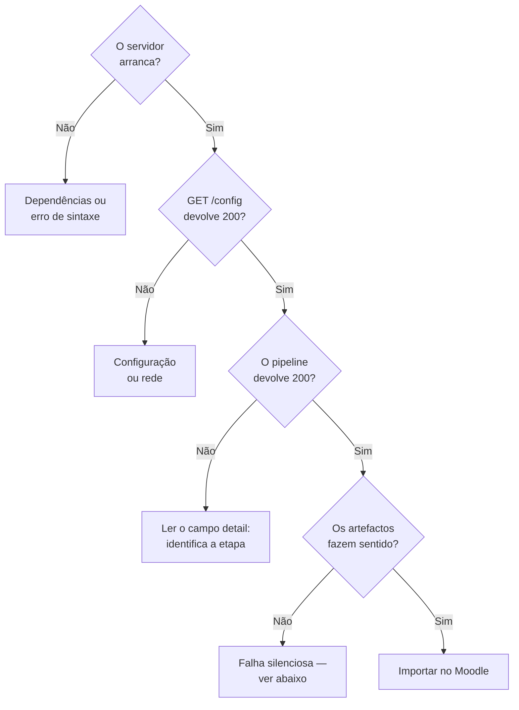

# Resolução de problemas

<p class="lead">Os sintomas mais frequentes, com diagnóstico e correção. Os erros com código de estado estão em <a href="../../api/errors/">Erros da API</a>; esta página cobre sobretudo os casos em que o serviço responde <code>200</code> e o resultado ainda assim está errado.</p>

## Diagnóstico rápido



---

## O servidor não arranca

### `ModuleNotFoundError`

O ambiente virtual não está ativo, ou faltam dependências:

```bash
source .venv/Scripts/activate    # Windows (Git Bash)
uv pip install fastapi uvicorn requests pydantic
```

Como o repositório não declara dependências, não há forma de as instalar a partir de um ficheiro. Ver [Instalação](../getting-started/installation.md#instalar-as-dependencias).

### `ImportError` a mencionar `routers`

O servidor está a ser arrancado a partir do diretório errado. Todos os caminhos são relativos ao diretório de trabalho:

```bash
cd /caminho/para/coderunner_v2
python main.py
```

### Avisos de descontinuação do Pydantic

```text
PydanticDeprecatedSince20: Pydantic V1 style `@validator` validators are deprecated.
```

Esperado. `models.py` usa `@validator` e o router usa `.dict()`, ambos da API v1 sobre Pydantic 2.13. Funciona; ver [Convenções](conventions.md#modelos-pydantic).

---

## `GET /config` falha

O primeiro passo em qualquer diagnóstico, porque isola configuração e conectividade:

```bash
curl -i http://127.0.0.1:8000/config
```

| Resposta | Causa | Correção |
| --- | --- | --- |
| `404` | Ficheiro de configuração não encontrado | Confirme o diretório de trabalho e a existência de `config/LLM_Config.txt` |
| `500` `'Modelo' not found` | Linha `Modelo:` ausente ou vazia | Acrescente `Modelo: gpt-4o-mini` |
| `500` `Failed to read API key` | O caminho em `Path KEY` não resolve | Verifique o caminho e as permissões do ficheiro |
| `500` `Failed to connect` | Chave rejeitada, sem rede, ou modelo inexistente | Ver [Erros](../api/errors.md#500-falha-do-provedor-llm) |

!!! tip "O caminho em `Path KEY` é lido tal como está"
    Não há expansão de `~` nem de variáveis de ambiente. Um caminho como `\Users\nome\chave.txt`, sem letra de unidade, resolve relativamente à unidade atual — o que funciona ou não consoante o diretório de onde arrancou o servidor. Use caminhos absolutos completos.

---

## Falha de compilação

```json
{ "detail": "Compilation failed:\ncache/solution.c:1:1: error: expected identifier..." }
```

**Se o erro apontar para a linha 1**, a causa quase certa é uma cerca de markdown na resposta do modelo. Abra `cache/solution.c` e verifique a primeira linha:

```bash
head -3 cache/solution.c
```

Apague a cerca e repita apenas a etapa 4 — as etapas 1 a 3 já foram pagas em tokens e não precisam de ser refeitas:

```bash
curl -X POST http://127.0.0.1:8000/gen_testcases
```

**Se o erro apontar para o meio do ficheiro**, o modelo gerou código inválido. Corrija diretamente ou regenere com `POST /gen_code`.

### `gcc` não encontrado

```json
{ "detail": "[WinError 2] O sistema não conseguiu localizar o ficheiro especificado" }
```

O compilador não está no `PATH` **do processo Python**, o que não é o mesmo que estar no `PATH` do terminal:

```bash
gcc --version
python -c "import shutil; print(shutil.which('gcc'))"
```

Se o primeiro funcionar e o segundo devolver `None`, reinicie o servidor — provavelmente arrancou antes de o `PATH` ser atualizado.

---

## Saídas vazias nos casos de teste {#saidas-vazias-nos-casos-de-teste}

O sintoma silencioso mais comum. A API responde `200`, o XML é gerado, e os casos de teste têm `output` vazio.

```bash
python -c "import json; d=json.load(open('cache/testcases.json',encoding='utf-8')); print(sum(1 for t in d['testcases'] if not t['output'].strip()), 'vazias de', len(d['testcases']))"
```

### Causa

As entradas geradas não correspondem ao que a solução lê de `stdin`. O programa bloqueia à espera de dados que não chegam, ou lê valores mal formados e termina sem imprimir nada.

### Diagnóstico

Compare o que o código espera com o que foi gerado:

```bash
grep -n "scanf\|gets\|fgets" cache/solution.c
python -c "import json; [print(repr(i)) for i in json.load(open('cache/inputs.json',encoding='utf-8'))['inputs'][:3]]"
```

Se as entradas aparecerem como uma linha só, ou cortadas a meio, o analisador caiu num dos níveis de recurso — ver [Interpretação em três níveis](../architecture/pipeline.md#interpretacao-em-tres-niveis).

### Correção

Edite `cache/inputs.json` à mão para corresponder aos `scanf`, e repita a etapa 4:

```bash
curl -X POST http://127.0.0.1:8000/gen_testcases
```

!!! note "Uma lista vazia pode ser o resultado correto"
    Se a solução não ler nada de `stdin`, o prompt instrui o modelo a devolver um array vazio. Um exercício sem entrada tem zero casos de teste, e isso está certo.

---

## O pedido nunca termina

O servidor não responde e o `curl` fica pendurado indefinidamente.

!!! danger "Não há timeout na execução dos binários"
    Se o programa gerado entrar num ciclo infinito, ou esperar mais entrada do que a fornecida, `communicate()` bloqueia para sempre. Não há forma de cancelar através da API.

**Resolução imediata:** ++ctrl+c++ no servidor e reinicie.

**Diagnóstico:** procure ciclos sem condição de saída ou leituras a mais:

```bash
grep -nE "while\s*\(\s*1\s*\)|for\s*\(\s*;\s*;|scanf" cache/solution.c
```

**Mitigação permanente**, uma linha em `services/testcases.py`:

```python
stdout, _ = process.communicate(input=test_input, timeout=5)
```

É a correção de maior retorno neste código. Ver [lacuna 4](../product/gap-analysis.md#execucao-sem-isolamento).

---

## A questão não respeita as restrições pedidas

Pediu `can_has_repetition: false` e a solução gerada usa `for`.

!!! danger "Não é um erro recuperável — é uma lacuna conhecida"
    **Nada no protótipo verifica se a solução respeitou as restrições declaradas.** O modelo é instruído no prompt, mas a conformidade não é validada em ponto nenhum.

    É a [lacuna 1](../product/gap-analysis.md#as-restricoes-nao-sao-verificadas), e corresponde à FEAT-024 e FEAT-040 — ambas na lista *"nunca cortar"* do MVP.

Verifique à mão antes de exportar:

```bash
grep -nE "\b(for|while|do)\b" cache/solution.c     # repetição
grep -nE "\belse\b" cache/solution.c               # else
grep -nE "\[[0-9]*\]" cache/solution.c             # vetores
```

!!! warning "Estas verificações produzem falsos positivos"
    Uma expressão regular encontra `for` num comentário, numa string ou dentro de `format`. Servem para triagem manual, **nunca** como base de uma verificação automática — é exatamente o falso positivo que o critério de saída nº 2 do MVP proíbe. A verificação correta exige um parser de AST.

Se a solução não respeitar as restrições, regenere:

```bash
curl -X POST http://127.0.0.1:8000/gen_code
curl -X POST http://127.0.0.1:8000/gen_inputs -H "Content-Type: application/json" -d '{"qty": 10}'
curl -X POST http://127.0.0.1:8000/gen_testcases
```

---

## A dificuldade parece ignorada

`difficulty` não é validado. Um valor fora dos cinco literais não gera erro — nenhum ramo corresponde e nenhuma instrução de dificuldade chega ao prompt.

Os valores aceites, exatamente assim — minúsculas, sem acentos, com o espaço:

```text
muito facil · facil · medio · dificil · muito dificil
```

`"médio"`, `"MEDIO"` e `"media"` são todos silenciosamente ignorados.

---

## O XML tem questões a mais

O exportador **acumula**: cada exportação insere uma questão antes de `</quiz>` em vez de substituir o ficheiro.

```bash
grep -c "<question type=" Questions/Moodle_Questionnaire.xml
```

Para começar um ficheiro novo:

```bash
rm Questions/Moodle_Questionnaire.xml
```

Ver [Acumulação](../architecture/moodle-xml.md#acumulacao).

---

## O XML está vazio ou incompleto

`export_moodle_xml` **não valida as suas dependências**: ficheiros ausentes em `cache/` são substituídos por valores vazios, e a resposta é `200` com `status: "success"`.

```bash
ls -la cache/
grep -c "Macro_" Questions/Moodle_Questionnaire.xml   # deve ser 0
```

Um `Macro_` remanescente significa um marcador por substituir — verifique se mexeu nos templates sem atualizar `services/moodle.py`.

---

## O Moodle recusa a importação

| Sintoma | Causa provável |
| --- | --- |
| *"Tipo de questão desconhecido"* | O plugin CodeRunner não está instalado no Moodle de destino |
| *"XML mal formado"* | Uma saída do programa contém `<`, `>` ou `&` — entradas e saídas **não são escapadas** |
| A questão importa mas a resposta de referência falha ao gravar | `validateonsave=1`: a solução não passa nos próprios testes no sandbox do Moodle |

O segundo caso é uma limitação conhecida do exportador. Verifique antes de importar:

```bash
python -c "import xml.dom.minidom as m; m.parse('Questions/Moodle_Questionnaire.xml'); print('XML valido')"
```

Ver [Templates](../architecture/moodle-xml.md#nivel-do-caso-de-teste).

---

## Todas as submissões dos alunos falham

!!! danger "Quase sempre: a solução não é determinística"
    Se a solução usar `rand()`, `srand(time(NULL))` ou qualquer outra fonte de variação, a saída capturada no momento da geração não se repete na execução do aluno. Nenhuma submissão passa — incluindo a própria resposta de referência.

    Um pedido para um *"jogo de adivinhação"* leva o modelo a gerar exatamente esse padrão.

```bash
grep -nE "\b(rand|srand|time|clock)\s*\(" cache/solution.c
```

Se houver correspondências, descarte a questão ou reescreva a solução para ser determinística. Não há correção parcial: a reprodutibilidade é binária.

---

## Resultados incoerentes entre etapas

O enunciado fala de matrizes, o código resolve outra coisa.

**Causa:** os endpoints individuais **não limpam a cache**, e as verificações confirmam que os ficheiros existem, não que se relacionam entre si. Sobras de uma execução anterior são reutilizadas em silêncio.

**Correção:**

```bash
rm -rf cache/*
```

Ou use `POST /create_question`, que limpa antes de começar. Ver [Cache e estado](../architecture/cache-and-state.md#verificacao-de-existencia-nao-de-coerencia).

!!! danger "Dois clientes em simultâneo produzem sempre isto"
    O estado vive em caminhos globais. Dois pedidos concorrentes escrevem sobre os mesmos ficheiros, e o `_clear_cache()` do segundo apaga o que o primeiro está a usar.

    Não corra este serviço com mais do que um utilizador ativo, nem com múltiplos *workers* uvicorn.

---

## Alterações à configuração sem efeito

`Config` é um singleton com cache. Editar `LLM_Config.txt` com o servidor a correr não tem efeito até:

```bash
curl http://127.0.0.1:8000/config
```

É a única forma de recarregar sem reiniciar o processo.
