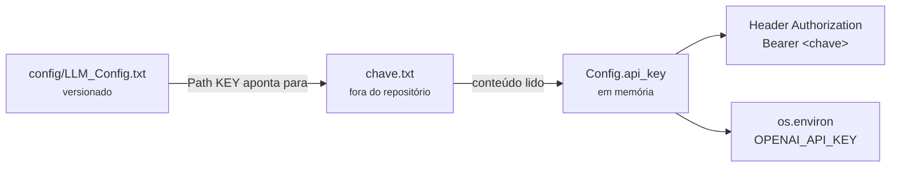

# Configuração

<p class="lead">Toda a configuração da aplicação vive num único ficheiro de texto, <code>config/LLM_Config.txt</code>, lido por <code>config.py</code>. Não há variáveis de ambiente de entrada e não há valores por omissão para o modelo ou para a chave.</p>

## O ficheiro `config/LLM_Config.txt`

O formato é `Chave: valor`, uma por linha:

```text title="config/LLM_Config.txt"
Fornecedor: OpenAI
Modelo: gpt-4o-mini
Path KEY: C:\caminho\para\a\sua\chave.txt
```

O parser reconhece exatamente **duas** chaves:

| Chave | Obrigatória | Significado |
| --- | --- | --- |
| `Modelo` | <span class="ce-badge ce-badge--req">Sim</span> | Identificador do modelo enviado no campo `model` de cada pedido de *chat completion* |
| `Path KEY` | <span class="ce-badge ce-badge--req">Sim</span> | Caminho para um ficheiro de texto **cujo conteúdo é a chave de API** |
| `Fornecedor` | <span class="ce-badge ce-badge--opt">Não</span> | Presente no ficheiro de exemplo, mas **ignorado** por `config.py`. Não tem efeito |

Duas particularidades do parser em [`config.py`](https://github.com/hugosousa9202/coderunner_v2/blob/main/config.py):

- Linhas iniciadas por `-` são aceites — o prefixo é removido com `lstrip("-")`. `- Modelo: gpt-4o-mini` funciona.
- Linhas sem `:` são silenciosamente ignoradas, o que as torna utilizáveis como comentários.

## A chave de API nunca fica no ficheiro de configuração

`Path KEY` **não é a chave**: é o caminho para um ficheiro separado que contém apenas a chave. Este nível de indireção mantém o segredo fora do repositório.



Crie o ficheiro da chave em qualquer local fora da árvore do repositório:

```bash
# O ficheiro contém apenas a chave, sem aspas, sem prefixos, sem linha extra.
echo "sk-XXXXXXXXXXXXXXXXXXXXXXXX" > ~/OpenAiKey.txt
```

Depois aponte `Path KEY` para ele.

!!! danger "O ficheiro de configuração está versionado"
    `config/LLM_Config.txt` é rastreado pelo Git e o valor atualmente em `main` contém um caminho absoluto de uma máquina de desenvolvimento, incluindo o nome de utilizador do sistema.

    Não é um segredo — o ficheiro da chave em si nunca esteve no repositório — mas é informação de ambiente que não pertence ao histórico e que obriga cada programador a editar o ficheiro depois de clonar.

    A correção recomendada é versionar um `config/LLM_Config.example.txt` com valores neutros e adicionar `config/LLM_Config.txt` ao `.gitignore`. Ver [Lacunas conhecidas](../development/index.md#lacunas-conhecidas).

## Variáveis de ambiente

A aplicação **não lê nenhuma variável de ambiente**. Toda a configuração vem do ficheiro acima.

Escreve uma, no entanto:

| Variável | Direção | Descrição |
| --- | --- | --- |
| `OPENAI_API_KEY` | Escrita por `Config._load()` | Definida em `os.environ` após o carregamento, para conveniência de bibliotecas que a leiam por convenção. O código do projeto **não a consome** — `services/llm.py` usa `config.api_key` diretamente |

## Base URL

`OPENAI_API_BASE_URL` é uma constante em `config.py`, fixada em `https://api.openai.com/v1`. Não é configurável através do ficheiro nem por variável de ambiente.

Para apontar a aplicação a um endpoint compatível com OpenAI — Azure OpenAI, Ollama, vLLM, LM Studio — é preciso alterar essa constante no código. Ver [Integração com o LLM](../architecture/llm-integration.md#trocar-de-provedor).

## Carregamento e recarga

`Config` é um *singleton* com carregamento preguiçoso:

- `Config.get_instance()` — lê o ficheiro na primeira chamada e devolve a instância em cache nas seguintes. É o que as camadas de serviço usam.
- `Config.reload()` — força uma nova leitura do disco, substituindo a instância. É o que `GET /config` faz.

Na prática, isto significa que **alterar `LLM_Config.txt` com o servidor a correr não tem efeito imediato**. Chame `GET /config` para aplicar a alteração sem reiniciar:

```bash
curl http://127.0.0.1:8000/config
```

## Erros de configuração

| Situação | Exceção levantada | Resposta de `GET /config` |
| --- | --- | --- |
| `config/LLM_Config.txt` não existe | `FileNotFoundError` | `404` |
| Chave `Modelo` ausente ou vazia | `ValueError` | `500` |
| Ficheiro apontado por `Path KEY` ilegível ou inexistente | `OSError` | `500` |
| Chave presente mas rejeitada pela API | — | `500`, com a mensagem do `requests` |

Cada caso está detalhado em [Erros da API](../api/errors.md).

## Passo seguinte

Com o ficheiro no sítio, avance para [Executar o servidor](running.md).
