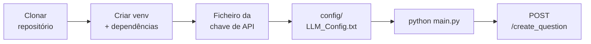

# Primeiros passos

<p class="lead">Do repositório clonado ao primeiro XML gerado. Esta secção cobre os pré-requisitos, a instalação das dependências, o ficheiro de configuração do LLM e o arranque do servidor.</p>

## O caminho mais curto



## Pré-requisitos

| Requisito | Versão verificada | Porque é necessário |
| --- | --- | --- |
| **Python** | 3.13.15 | Runtime da aplicação. `models.py` usa a sintaxe `X \| None`, que exige 3.10+ |
| **`gcc`** | 16.1.0 (MSYS2) | `services/testcases.py` invoca `gcc` diretamente para compilar a solução gerada |
| **Chave de API OpenAI** | — | Todas as etapas de geração fazem chamadas a `/v1/chat/completions` |
| **`uv`** *(opcional)* | 0.11.21 | Gestor de ambientes usado no projeto. `venv` + `pip` funcionam igualmente |

!!! danger "`gcc` não é opcional"
    Sem `gcc` no `PATH`, `POST /gen_testcases` falha com `FileNotFoundError` do `subprocess` e o pipeline completo aborta na quarta etapa. Confirme com:

    ```bash
    gcc --version
    ```

    No Windows, o `gcc` do MSYS2, do MinGW-w64 ou do WSL servem — desde que o executável seja alcançável a partir do processo Python.

## Verificar o ambiente

Antes de instalar seja o que for, três comandos dizem se a máquina está pronta:

```bash
python --version   # deve reportar 3.13.x (mínimo 3.10)
gcc --version      # deve reportar uma versão qualquer, sem erro
```

Se algum falhar, resolva-o antes de continuar — nenhum dos dois é substituível dentro da aplicação.

## Ordem recomendada

<div class="grid cards" markdown>

-   :material-numeric-1-circle-outline: **[Instalação](installation.md)**

    ---

    Clonar, criar o ambiente virtual e instalar as quatro dependências diretas. Inclui a nota sobre a ausência de um ficheiro de dependências no repositório.

-   :material-numeric-2-circle-outline: **[Configuração](configuration.md)**

    ---

    O formato de `config/LLM_Config.txt`, como a chave de API é lida a partir de um ficheiro externo e o que acontece quando a configuração está incorreta.

-   :material-numeric-3-circle-outline: **[Executar o servidor](running.md)**

    ---

    Arrancar com `python main.py` ou com `uvicorn`, confirmar a configuração via `GET /config` e chegar ao Swagger UI.

</div>
