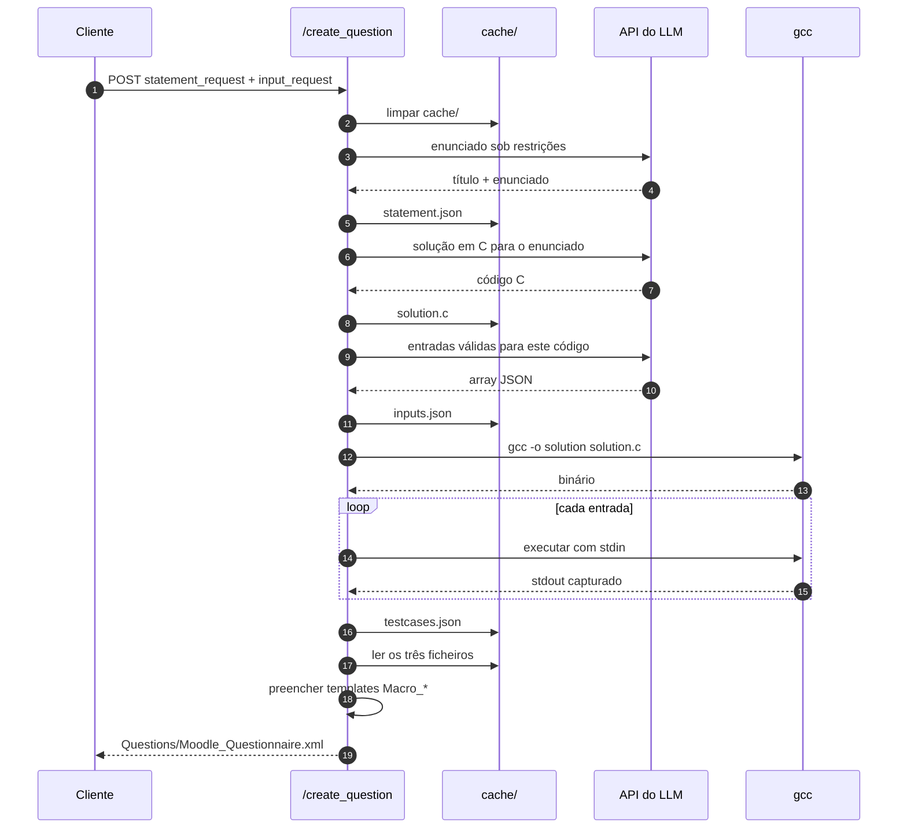

# Gerar uma questão completa

<p class="lead">Um pedido a <code>POST /create_question</code> executa as cinco etapas em sequência e devolve o resultado de cada uma. Este guia acompanha uma execução real, do corpo do pedido ao XML no disco.</p>

## Antes de começar

O servidor deve estar a correr e a configuração validada:

```bash
curl http://127.0.0.1:8000/config
```

Se esta chamada não devolver `200`, resolva-o primeiro — as cinco etapas dependem todas do mesmo provedor. Ver [Configuração](../getting-started/configuration.md).

## O pedido

O corpo tem dois objetos aninhados, porque o endpoint declara dois modelos Pydantic como parâmetros:

```bash
curl -X POST http://127.0.0.1:8000/create_question \
  -H "Content-Type: application/json" \
  -d '{
        "statement_request": {
          "can_has_if": true,
          "can_has_else": true,
          "can_has_repetition": true,
          "can_has_function": true,
          "can_has_matrix": false,
          "difficulty": "medio"
        },
        "input_request": { "qty": 10 }
      }'
```

| Campo | Obrigatório | Omissão |
| --- | --- | --- |
| `statement_request` | <span class="ce-badge ce-badge--req">Sim</span> | `422` — não tem valor por omissão |
| `input_request` | <span class="ce-badge ce-badge--opt">Não</span> | Usa `InputRequest()`, ou seja `qty: 10` |

Os campos dentro de `statement_request` têm todos valores por omissão, pelo que `"statement_request": {}` é um pedido válido. A referência completa está em [Endpoints de geração](../api/generation.md#gen_statement).

!!! tip "Comece pequeno enquanto explora"
    Cada entrada gerada implica uma execução do binário compilado. Com `qty: 3` o ciclo completo é visivelmente mais rápido e o custo em tokens menor. Suba para 10–20 quando a combinação de restrições já produzir o exercício que quer.

## O que acontece durante o pedido



O detalhe de cada etapa está em [Pipeline de geração](../architecture/pipeline.md).

## A resposta

`200 OK` com o resultado de cada etapa sob a sua própria chave:

```json
{
  "statement": {
    "name": "Jogo de Adivinhacao com Niveis de Dificuldade",
    "statement": "Jogo de Adivinhacao com Niveis de Dificuldade\n\nVoce deve criar um jogo...",
    "file_path": "cache/statement.json"
  },
  "code": {
    "code": "#include <stdio.h>\n#include <stdlib.h>\n...",
    "file_path": "cache/solution.c"
  },
  "inputs": {
    "inputs": ["facil\n3\n1\n2\n3\n", "medio\n2\n25\n30\n"],
    "file_path": "cache/inputs.json"
  },
  "testcases": {
    "testcases": [
      { "input": "facil\n3\n1\n2\n3\n", "output": "Muito baixo!\nMuito alto!\n..." }
    ],
    "file_path": "cache/testcases.json"
  },
  "moodle_xml": {
    "status": "success",
    "file_path": "Questions/Moodle_Questionnaire.xml"
  }
}
```

## Quando uma etapa falha

O orquestrador **para na primeira falha** e devolve o corpo de erro dessa etapa, com o seu código de estado. Não há reversão: os ficheiros que as etapas anteriores escreveram continuam em `cache/`.

```json
{ "detail": "Compilation failed:\nsolution.c:12:5: error: ..." }
```

Esse estado parcial é útil — pode corrigir `cache/solution.c` à mão e retomar a partir de `POST /gen_testcases`, sem repetir as etapas já pagas. Ver [Pipeline passo a passo](step-by-step-pipeline.md#retomar-a-meio).

A tabela completa de falhas por etapa está em [Erros da API](../api/errors.md).

## Ficheiros no disco

Depois de uma execução bem-sucedida:

```text
cache/
├── statement.json     # { "name": ..., "statement": ... }
├── solution.c         # código C da solução de referência
├── solution(.exe)     # binário compilado por gcc
├── inputs.json        # { "inputs": [...] }
└── testcases.json     # { "testcases": [ { input, output } ] }

Questions/
└── Moodle_Questionnaire.xml
```

!!! note "O XML acumula entre execuções"
    Se `Questions/Moodle_Questionnaire.xml` já existir, a nova questão é **inserida antes de `</quiz>`** em vez de substituir o ficheiro. Correr `/create_question` cinco vezes produz um questionário com cinco questões.

    Para começar um questionário novo, apague o ficheiro. Ver [Templates Moodle XML](../architecture/moodle-xml.md#acumulacao).

## Verificar o resultado

Antes de importar, vale a pena confirmar que os casos de teste fazem sentido:

```bash
# Quantas questões tem o ficheiro?
grep -c "<question type=" Questions/Moodle_Questionnaire.xml

# As saídas capturadas estão vazias?
python -c "import json; d=json.load(open('cache/testcases.json')); print(sum(1 for t in d['testcases'] if not t['output'].strip()), 'saidas vazias de', len(d['testcases']))"
```

Saídas vazias indicam quase sempre que as entradas geradas não correspondem ao que a solução lê de `stdin`. [Resolução de problemas](../development/troubleshooting.md#saidas-vazias-nos-casos-de-teste) cobre esse caso.

## Passo seguinte

[Importar no Moodle](import-into-moodle.md), ou [Pipeline passo a passo](step-by-step-pipeline.md) para controlar cada etapa individualmente.
