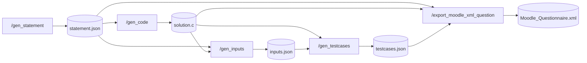

# Pipeline passo a passo

<p class="lead">As cinco etapas invocadas uma a uma. Cada endpoint lê o que a etapa anterior deixou em <code>cache/</code> e escreve o seu próprio ficheiro — o que permite inspecionar, editar e repetir qualquer ponto do percurso.</p>

## Porquê o percurso manual

`POST /create_question` é o caminho normal. Chamar as etapas individualmente vale a pena quando:

- quer **ver o enunciado** antes de gastar uma chamada a gerar código;
- a solução gerada está quase certa e quer **corrigi-la à mão** antes dos casos de teste;
- só quer **mais entradas** para uma questão já gerada;
- está a **depurar** qual das etapas está a produzir resultados inesperados.

!!! danger "Limpe a cache antes de começar"
    Ao contrário do orquestrador, os endpoints individuais **não limpam `cache/`**. Se lá estiverem ficheiros de uma execução anterior, `gen_code` pode gerar código para um enunciado antigo sem que nada o assinale.

    ```bash
    rm -rf cache/*
    ```

## As dependências entre etapas



Cada endpoint verifica as suas dependências à entrada e devolve `404` se faltarem.

## 1. Enunciado

```bash
curl -X POST http://127.0.0.1:8000/gen_statement \
  -H "Content-Type: application/json" \
  -d '{"can_has_repetition": true, "can_has_function": true, "difficulty": "medio"}'
```

```json
{
  "name": "Jogo de Adivinhacao com Niveis de Dificuldade",
  "statement": "Jogo de Adivinhacao com Niveis de Dificuldade\n\nVoce deve criar...",
  "file_path": "cache/statement.json"
}
```

O corpo é opcional por completo — `curl -X POST .../gen_statement` sem dados usa todos os valores por omissão.

!!! tip "Repita até gostar do enunciado"
    Esta é a única etapa que não depende de nada. Chame-a as vezes que quiser; cada chamada substitui `cache/statement.json`. Só avance quando o enunciado servir.

**Editar à mão** é perfeitamente válido — as etapas seguintes leem o ficheiro, não a resposta HTTP:

```bash
# Ajustar o texto ou o título antes de gerar a solução
${EDITOR:-notepad} cache/statement.json
```

## 2. Solução em C

```bash
curl -X POST http://127.0.0.1:8000/gen_code
```

```json
{
  "code": "#include <stdio.h>\n\nvoid getUserInput(char *difficulty, int *rounds) {\n...",
  "file_path": "cache/solution.c"
}
```

Sem corpo. Lê `cache/statement.json`; devolve `404` se não existir.

!!! warning "Esta é a etapa que mais compensa rever"
    A solução gerada define tudo o que vem a seguir: as entradas são geradas a partir dos `scanf` deste código e as saídas esperadas são o que este binário imprime. Um erro aqui propaga-se silenciosamente até ao Moodle.

    Abra `cache/solution.c` e confirme sobretudo que **não imprime mensagens de prompt** antes de ler — o CodeRunner compara `stdout` literalmente.

## 3. Entradas de teste

```bash
curl -X POST http://127.0.0.1:8000/gen_inputs \
  -H "Content-Type: application/json" \
  -d '{"qty": 10}'
```

```json
{
  "inputs": ["facil\n3\n1\n2\n3\n", "medio\n2\n25\n30\n", "dificil\n1\n50\n"],
  "file_path": "cache/inputs.json"
}
```

`qty` é obrigatório e tem de estar entre 1 e 100. O modelo recebe o enunciado **e** o código, para que as entradas correspondam aos `scanf` reais.

!!! note "`qty` é um limite superior, não uma garantia"
    A lista devolvida é truncada a `qty` elementos, mas se o modelo devolver menos, menos ficam. E se a solução não ler nada de `stdin`, o prompt instrui-o a devolver um array vazio — o que é o comportamento correto para exercícios sem entrada.

## 4. Casos de teste

Esta é a única etapa que **não usa o LLM**:

```bash
curl -X POST http://127.0.0.1:8000/gen_testcases
```

```json
{
  "testcases": [
    { "input": "facil\n3\n1\n2\n3\n", "output": "Muito baixo!\nMuito alto!\nMuito baixo!\n" }
  ],
  "file_path": "cache/testcases.json"
}
```

O que acontece: `gcc -o cache/solution cache/solution.c`, seguido de uma execução do binário por cada entrada, com `stdin` alimentado e `stdout` capturado.

!!! danger "Falha de compilação aborta a etapa"
    Se o `gcc` devolver um código diferente de zero, a etapa levanta `RuntimeError` com o `stderr` completo e responde `500`. Nada é escrito.

    Corrija `cache/solution.c` diretamente e volte a chamar este endpoint — não é preciso repetir as etapas 1 a 3.

!!! warning "O código gerado é compilado e executado sem isolamento"
    O binário corre com os privilégios do processo do servidor, sem *sandbox*, sem limite de tempo e sem limite de memória. Um programa gerado com um ciclo infinito bloqueia o pedido indefinidamente. Ver [Deploy](../deployment/index.md#execucao-de-codigo-nao-confiavel).

## 5. Exportação para XML

```bash
curl -X POST http://127.0.0.1:8000/export_moodle_xml_question
```

```json
{ "status": "success", "file_path": "Questions/Moodle_Questionnaire.xml" }
```

!!! info "Esta etapa tolera ficheiros em falta"
    Ao contrário das anteriores, `export_moodle_xml` usa valores por omissão para o que não encontrar: enunciado vazio, código vazio, lista de casos de teste vazia. Uma exportação sobre uma cache vazia produz um XML sintaticamente válido mas sem conteúdo — sem qualquer erro.

    Confirme sempre que `cache/` tem os três ficheiros antes de exportar.

## Retomar a meio

Como o estado vive no disco, retomar é apenas chamar a etapa certa. Falhas típicas e o ponto de retoma:

| Falhou em | Corrigir | Retomar em |
| --- | --- | --- |
| `gen_code` (`404`) | Gerar o enunciado | `/gen_statement` |
| `gen_testcases` (erro de compilação) | Editar `cache/solution.c` | `/gen_testcases` |
| `gen_testcases` (saídas vazias) | Editar `cache/inputs.json` | `/gen_testcases` |
| `export` (XML sem conteúdo) | Verificar os três ficheiros em `cache/` | `/export_moodle_xml_question` |

## Passo seguinte

[Importar no Moodle](import-into-moodle.md).
