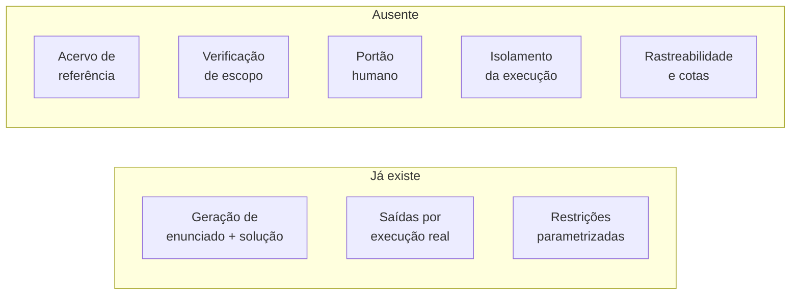
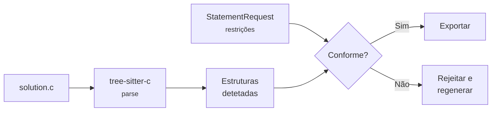

# Análise de lacunas

<p class="lead">O que este protótipo faz, confrontado com o que o EPIC-017 e o SAD exigem. Nem toda a lacuna é um defeito — um protótipo tem o direito de não implementar a plataforma inteira. As que importam são as que produzem <strong>resultados errados sem produzir erros</strong>.</p>

## Sumário



| # | Lacuna | Gravidade | Silenciosa |
| --- | --- | --- | --- |
| [1](#as-restricoes-nao-sao-verificadas) | As restrições declaradas não são verificadas | :material-alert-octagon:{ style="color:#b3261e" } Alta | :material-check: Sim |
| [2](#o-portao-humano-nao-existe) | Não há portão humano, mas o XML declara `Revisado` | :material-alert-octagon:{ style="color:#b3261e" } Alta | :material-check: Sim |
| [3](#nao-ha-acervo-de-referencia) | Geração sem acervo de referência | :material-alert:{ style="color:#c07000" } Média | :material-close: Não |
| [4](#execucao-sem-isolamento) | Execução sem isolamento nem limites | :material-alert-octagon:{ style="color:#b3261e" } Alta | :material-close: Não |
| [5](#nao-ha-rastreabilidade) | Sem registo de modelo, prompt ou custo | :material-alert:{ style="color:#c07000" } Média | :material-check: Sim |
| [6](#sem-governanca-de-ia) | Sem cache, cota ou degradação | :material-alert:{ style="color:#c07000" } Média | :material-close: Não |
| [7](#o-modelo-de-dados-e-mais-pobre) | Casos de teste sem categoria nem visibilidade real | :material-alert:{ style="color:#c07000" } Média | :material-check: Sim |
| [8](#nao-ha-identidade-nem-tenancy) | Sem utilizadores, papéis ou tenancy | :material-information:{ style="color:#666" } Baixa | :material-close: Não |

**Silenciosa** significa que o sistema responde `200` e produz um artefacto de aparência correta. São estas as que merecem atenção primeiro.

---

## 1 · As restrições não são verificadas {#as-restricoes-nao-sao-verificadas}

!!! danger "A lacuna mais consequente deste protótipo"
    O pedido declara `can_has_repetition: false`. O prompt pede ao modelo que não use repetição. **Nada verifica se a solução gerada respeitou o pedido.**

    Se o modelo usar um `for`, a questão é exportada na mesma, com a restrição a constar apenas do enunciado em texto livre.

### O que o alvo exige

Duas features, ambas na lista **"nunca cortar"**:

- **FEAT-024** — validação automática antes de aprovar: a solução de referência compila, passa em 100% dos seus próprios testes **e respeita as próprias restrições declaradas**.
- **FEAT-040** — verificação de estruturas permitidas, proibidas e obrigatórias, por parser determinístico.

### O que existe hoje

| Parte da FEAT-024 | Estado |
| --- | --- |
| A solução compila | :material-check-circle:{ style="color:#1a7f5a" } `gcc` na etapa 4; falha aborta o pipeline |
| Passa em 100% dos seus testes | :material-check-circle:{ style="color:#1a7f5a" } **Por construção** — os testes são derivados da execução dela própria |
| Respeita as restrições declaradas | :material-close-circle:{ style="color:#b3261e" } **Não verificado** |

!!! note "O segundo item passa por uma razão trivial"
    As saídas esperadas *são* o que a solução imprime. A solução de referência não pode falhar nos seus próprios testes porque foi ela que os definiu. Isto satisfaz a letra do requisito, não o seu espírito: o requisito existe para detetar questões inválidas, e esta construção não consegue detetá-las.

### Porque é grave

O documento de visão é explícito quanto à consequência: um aluno penalizado por uma estrutura que não usou destrói a confiança na plataforma, e uma única ocorrência basta. A versão inversa — a questão declara *"sem repetição"* e a solução de referência usa repetição — é igualmente corrosiva: o professor descobre-o em frente à turma.

### Como fechar



Uma etapa nova entre `gen_code` e `gen_inputs`. Três notas de implementação:

- **tree-sitter-c**, não `pycparser` nem expressões regulares — é a decisão já tomada no ADR-005, e a razão está registada em D-2. Uma expressão regular sobre `\bfor\b` encontra a palavra num comentário, numa string ou num identificador; é exatamente o falso positivo que o critério de saída nº 2 do MVP proíbe.
- As restrições teriam de **chegar à etapa de verificação**, o que hoje não acontece: `statement.json` guarda apenas `name` e `statement`. Persistir o `StatementRequest` original é pré-requisito.
- Um ciclo de regeneração com limite de tentativas é o comportamento natural em caso de não conformidade.

---

## 2 · O portão humano não existe {#o-portao-humano-nao-existe}

!!! danger "O XML afirma algo que não aconteceu"
    Todas as questões exportadas recebem as tags `Fácil` e `Revisado`, fixas no template — independentemente da dificuldade pedida e **sem que qualquer humano as tenha revisto**.

### O que o alvo exige

- **Gate obrigatório:** questão gerada nunca vai ao aluno sem aprovação humana.
- **Fluxo revisar → editar → aprovar**, com estados de ciclo de vida.
- **Regra aprovador ≠ solicitante**, ou, quando inviável, confirmação explícita de que a solução de referência foi executada e revista.

A justificação está registada: se a mesma pessoa aciona a geração, edita e aprova, o humano no circuito *"vira carimbo"* — precisamente o controlo que sustenta o Pilar 1.

### O que existe hoje

`POST /create_question` vai do pedido ao XML importável sem qualquer ponto de paragem. Não há noção de utilizador, estado ou aprovação.

!!! warning "A tag `Revisado` é pior do que a ausência de tag"
    Uma questão sem tags é obviamente não curada. Uma questão marcada `Revisado` afirma uma revisão que não ocorreu, e essa afirmação sobrevive à importação — fica no banco de perguntas do Moodle, indistinguível de uma questão realmente revista.

    A dificuldade tem o mesmo problema em menor grau: uma questão gerada com `difficulty: "muito dificil"` chega etiquetada como `Fácil`.

### Como fechar

**Correção imediata, sem código:** remover as duas tags de `templates/MoodleXML_Question.txt`. Deixa de afirmar o que é falso e leva menos de um minuto.

**Correção adequada:** um marcador `Macro_Tags` preenchido a partir da dificuldade real, o que exige propagar o `StatementRequest` até à exportação — o mesmo pré-requisito da lacuna 1.

**Correção completa:** estados de ciclo de vida e um passo de aprovação explícito antes da exportação. Ver [Templates](../architecture/moodle-xml.md#limitacoes-conhecidas).

---

## 3 · Não há acervo de referência {#nao-ha-acervo-de-referencia}

O EPIC-017 é *"geração **ancorada** no acervo institucional"* — a IA imita o padrão que já existe, em vez de inventar um novo. É um dos três diferenciais defensáveis do produto.

Este protótipo gera **a partir do nada**: os prompts descrevem as restrições, mas não incluem nenhuma questão de exemplo.

### A regra de habilitação

!!! info "8 questões por combinação"
    A geração por IA só é habilitada para a combinação conteúdo × nível que tiver **pelo menos 8 questões aprovadas** de referência. As restantes mostram ao professor porque estão indisponíveis e quantas faltam — o *cold start* transformado em barra de progresso.

    O raciocínio: 300 questões em 14 eixos × 4 níveis dão ~5 por combinação, e com 5 exemplares a saída tende a ser paráfrase próxima de uma delas — que reaparece como *"questão duplicada"*.

### O que isto significa para o protótipo

Não é um defeito a corrigir aqui. É a razão pela qual o EPIC-017 está na Onda 3 e depende do EPIC-005.

!!! tip "O que este protótipo pode validar mesmo assim"
    A hipótese H7 — *"a IA reproduz o padrão pedagógico do banco"* — **não** pode ser validada sem acervo. Mas a hipótese anterior pode: *que a geração produz questões utilizáveis de todo*.

    O teste recomendado nos documentos é barato: gerar ~10 questões e submetê-las a avaliação cega do professor. Critério de invalidação: menos de 50% aprovadas com edição no máximo ligeira.

---

## 4 · Execução sem isolamento {#execucao-sem-isolamento}

!!! danger "Risco R1, o único classificado como crítico e de alta probabilidade"
    `services/testcases.py` compila com `gcc` e executa o binário com os privilégios do processo do servidor. Sem sandbox, sem timeout, sem limite de memória, sem limite de processos.

### O que o alvo exige

**FEAT-033**, na lista *"nunca cortar"*: execução isolada, sem rede, FS efémero, limites de CPU, memória, processos, tempo e tamanho de saída. Em Judge0 autogerido, em VPC própria, num host tratado como já comprometido.

### A diferença de contexto

O risco R1 descreve código **do aluno**, potencialmente adversarial. Aqui o código vem de um modelo instruído a resolver um exercício introdutório. A probabilidade de conteúdo malicioso é muito menor.

Mas duas propriedades mantêm-se:

| Propriedade | Consequência no protótipo |
| --- | --- |
| **Sem timeout** | Um ciclo infinito — plausível num exercício de repetição mal gerado — bloqueia o pedido para sempre. A única saída é reiniciar o servidor |
| **Sem limite de memória** | Uma alocação descontrolada afeta a máquina inteira |

!!! tip "A mitigação de maior retorno é de uma linha"
    `subprocess.Popen.communicate()` aceita `timeout`. Acrescentá-lo transforma um servidor bloqueado indefinidamente num caso de teste que falha de forma limpa:

    ```python
    stdout, _ = process.communicate(input=test_input, timeout=5)
    ```

    Não substitui um sandbox, mas elimina o modo de falha mais provável. Ver [Deploy](../deployment/index.md#execucao-de-codigo-nao-confiavel).

---

## 5 · Não há rastreabilidade {#nao-ha-rastreabilidade}

**FEAT-048** exige registo de modelo, versão do prompt e evidências usadas. **FEAT-057** exige registo de consumo por submissão. A entidade `FEEDBACK` do modelo de dados tem colunas `modelo`, `versao_prompt`, `custo` e `origem`.

Neste protótipo, nada disso é persistido. `cache/statement.json` guarda `name` e `statement`; o modelo que os produziu, o prompt usado e o custo desaparecem.

### Porque importa mesmo num protótipo

| Sem registo, não é possível... | Consequência prática |
| --- | --- |
| Saber que modelo gerou uma questão do acervo | Ao trocar de modelo, não se sabe o que reavaliar |
| Comparar versões de prompt | Melhorar os prompts vira tentativa e erro sem memória |
| Medir custo por questão | A hipótese H9 — custo dentro do orçamento — fica por validar |
| Reproduzir uma geração | Nenhum diagnóstico de uma questão má é possível depois do facto |

!!! tip "Uma alteração pequena com retorno desproporcionado"
    Acrescentar `modelo`, `versao_prompt` e um carimbo temporal a `statement.json` é trabalho de minutos e é o único registo que sobreviverá se este código for absorvido pelo EPIC-017.

    Versionar os prompts começa por lhes atribuir um identificador — `STATEMENT_PROMPT_V = "v1"` ao lado de cada `SYSTEM_PROMPT` — e gravá-lo junto com o resultado.

---

## 6 · Sem governança de IA {#sem-governanca-de-ia}

O EPIC-013 define quatro barreiras antes de qualquer chamada ao modelo. O protótipo não tem nenhuma:

| Barreira | Alvo | Protótipo |
| --- | --- | --- |
| Acionamento condicional | Não chama em casos previsíveis | :material-close-circle:{ style="color:#b3261e" } Chama sempre, três vezes |
| Cache por chave composta | `hash + versão + prompt + modelo` | :material-close-circle:{ style="color:#b3261e" } Nenhum |
| Cota com alerta aos 80% | Degrada, não bloqueia | :material-close-circle:{ style="color:#b3261e" } Nenhuma |
| Deduplicação em janela | Texto base partilhado | :material-close-circle:{ style="color:#b3261e" } Nenhuma |

E não há degradação graciosa: sem retentativas nem *circuit breaker*, qualquer falha do provedor aborta o pipeline com `500`.

!!! note "Aqui a lacuna é menos grave do que parece"
    As barreiras existem para absorver o pico da véspera do prazo — 120 alunos a submeter em simultâneo. A geração de questões é operada por um professor, uma questão de cada vez. O padrão de carga não é comparável.

    O que **falta mesmo** é o registo de consumo (lacuna 5), sem o qual não se sabe quanto custa uma questão.

O que salva o protótipo em caso de falha é o estado ficar em `cache/`, permitindo retomar sem repetir as etapas já pagas. Ver [Retomar a meio](../guides/step-by-step-pipeline.md#retomar-a-meio).

---

## 7 · O modelo de dados é mais pobre {#o-modelo-de-dados-e-mais-pobre}

### Casos de teste

| Campo em `CASO_TESTE` | Protótipo |
| --- | --- |
| `visibilidade` — público / privado | :material-alert-circle:{ style="color:#c07000" } Aproximado: os 3 primeiros são exemplo, por ordem de chegada |
| `categoria` — típico / limite / borda / inválido | :material-close-circle:{ style="color:#b3261e" } Não existe |
| `entrada`, `saida_esperada` | :material-check-circle:{ style="color:#1a7f5a" } Existem |

!!! warning "A categoria não é acessória"
    **FEAT-030** permite ao professor atribuir **pesos diferentes por categoria** de caso de teste, e esse peso entra no cálculo da nota. Sem categoria, todos os casos valem o mesmo — um caso-limite pesa tanto como um caso trivial.

    O prompt de `gen_inputs` já pede *"casos-limite e casos normais"*. A informação é pedida ao modelo e depois deitada fora, porque a resposta é uma lista simples de strings. Pedir um array de objetos com `{entrada, categoria}` capturaria o que já está a ser gerado.

### Restrições

O protótipo tem cinco booleanos. O modelo alvo tem três listas de estruturas nomeadas — `estruturas_permitidas`, `estruturas_proibidas`, `estruturas_obrigatorias` — sobre um vocabulário controlado (**FEAT-015**).

A diferença não é apenas de expressividade. As listas nomeadas são **verificáveis por AST**; os booleanos, na prática, não o são — é a lacuna 1.

### Metadados ausentes

| Campo | Para que serve |
| --- | --- |
| `situacao_direitos` | Questões de origem restrita não podem ser servidas a outras instituições. Deve ser preenchido na curadoria, nunca depois |
| `status` | Os cinco estados do ciclo de vida da questão |
| `numero_versao` | Versionamento; a nota depende da versão da questão usada |
| `nivel` | Existe como `difficulty`, mas não é persistido em `statement.json` |

---

## 8 · Não há identidade nem tenancy {#nao-ha-identidade-nem-tenancy}

Sem autenticação, sem papéis, sem `tenant_id`, sem RLS. Os seis endpoints são públicos.

!!! note "Aceitável num protótipo local, e nada mais"
    Um protótipo operado pelo próprio autor numa máquina de desenvolvimento não precisa de EPIC-001 nem EPIC-002. A lacuna só se torna um problema no momento em que o serviço for exposto a outra pessoa — e nesse momento torna-se imediato, porque qualquer cliente que alcance a porta consome a chave de API.

    Ver [Deploy](../deployment/index.md#o-que-falta-antes-de-expor-o-servico).

---

## O que fazer a seguir

Ordenado por retorno sobre esforço, não por gravidade:

<div class="grid cards" markdown>

-   :material-numeric-1-circle: **Remover as tags falsas**

    ---

    Apagar `Fácil` e `Revisado` de `templates/MoodleXML_Question.txt`. Um minuto, sem código, e deixa de afirmar o que é falso.

    Lacuna [2](#o-portao-humano-nao-existe)

-   :material-numeric-2-circle: **Timeout na execução**

    ---

    `timeout=5` em `communicate()`. Elimina o modo de falha em que o servidor bloqueia para sempre.

    Lacuna [4](#execucao-sem-isolamento)

-   :material-numeric-3-circle: **Persistir o pedido original**

    ---

    Guardar `StatementRequest`, modelo, versão do prompt e carimbo temporal em `statement.json`. É pré-requisito das lacunas 1, 2 e 5 em simultâneo.

    Lacunas [1](#as-restricoes-nao-sao-verificadas), [2](#o-portao-humano-nao-existe), [5](#nao-ha-rastreabilidade)

-   :material-numeric-4-circle: **Categorizar as entradas**

    ---

    Pedir a `gen_inputs` um array de objetos com categoria, em vez de strings soltas. A informação já está a ser gerada e deitada fora.

    Lacuna [7](#o-modelo-de-dados-e-mais-pobre)

-   :material-numeric-5-circle: **Verificação de escopo com tree-sitter**

    ---

    A lacuna mais grave, e a de maior esforço. Depende do passo 3 estar feito.

    Lacuna [1](#as-restricoes-nao-sao-verificadas)

</div>

!!! info "O que não vale a pena fazer aqui"
    Autenticação, tenancy, base de dados, filas e cotas pertencem à plataforma, não a este protótipo. Implementá-los aqui é construir duas vezes — e a segunda versão, feita com o contexto das ondas 0 e 1, será melhor.

    As lacunas que vale a pena fechar são as que tornam o **resultado deste protótipo confiável**: verificação de escopo, ausência de afirmações falsas, e rastreabilidade do que foi gerado.
