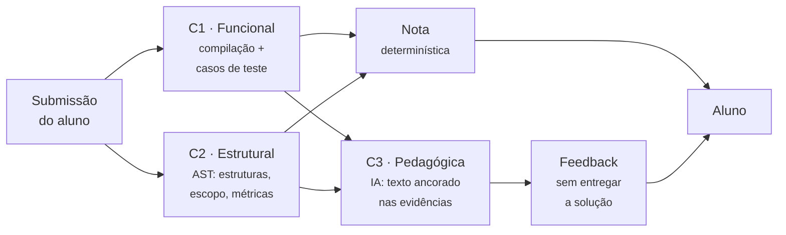

# Contexto do produto

Este repositório não é o produto. É um protótipo de uma das suas partes. Esta secção resume a visão da plataforma que os documentos de planeamento descrevem, para que o código seja lido no lugar certo.

!!! info "Fonte desta secção"
    O conteúdo aqui resume quatro documentos de planeamento externos ao repositório:

    | Documento | Versão | Conteúdo |
    | --- | --- | --- |
    | Etapa 1 — Visão do produto | v0.1 | Problema, proposta de valor, personas, riscos, hipóteses |
    | Etapa 2 — Mapa de épicos | v0.1 | 19 épicos, modelo de nota, matriz de permissões, ondas |
    | Etapa 3 — Definição do MVP | — | Recorte por épico, critérios de saída, sequenciamento |
    | SAD — Arquitetura do MVP | v0.1 (rascunho) | C4, ADRs, modelo de dados, resiliência, segurança |

    São documentos **de planeamento, com decisões ainda em aberto**. Descrevem o que se pretende construir, não o que existe. O que existe está documentado em [Arquitetura](../architecture/index.md).

## O problema

O ensino de programação introdutória tem alta reprovação, e a ferramenta de apoio habitual — o juiz automático — mede a coisa errada: verifica se o programa produz a saída esperada, e nada mais.

Daí decorrem três problemas encadeados:

-   :material-alert-circle-outline: **O aluno recebe um veredito, não um diagnóstico**

    ---

    *"Wrong Answer"* não diz onde está o erro nem que conceito falhou. O comportamento racional passa a ser tentativa e erro — o oposto do que a disciplina quer ensinar.

-   :material-eye-off-outline: **O professor vê o resultado, não o processo**

    ---

    Uma folha de acertos não responde às perguntas que importam para a aula seguinte. Lê-las exige abrir código um a um, o que não escala para 40, 80 ou 200 alunos.

-   :material-scale-balance: **O que é pedagogicamente relevante não é verificável**

    ---

    *"Resolva sem usar condicionais"* é a restrição típica de uma introdutória. Um juiz tradicional aprova quem usou `if`, porque a saída está correta.

### A premissa mudou em 2025

Com LLMs amplamente disponíveis, *"o código do aluno passa nos casos de teste"* deixou de ser evidência de aprendizagem em exercícios introdutórios.

!!! warning "Consequência de posicionamento"
    Os documentos de visão são explícitos: construir isto como *"juiz automático melhorado com IA"* seria resolver um problema já ultrapassado por fora. O posicionamento adotado é **plataforma de avaliação formativa e diagnóstica**, não instrumento de avaliação somativa.

    Daí decorre uma decisão que afeta diretamente este repositório: os dados de processo — histórico de tentativas, evolução entre submissões, padrões de erro — são o núcleo do produto, não *analytics* acessório.

## Os três pilares

| Pilar | O que faz | Onda | Estado |
| --- | --- | --- | --- |
| **Pilar 2** — Correção e feedback | Avalia submissões em três camadas e devolve feedback formativo | 1 | O coração do MVP |
| **Pilar 3** — Analytics pedagógico | Transforma submissões em diagnóstico agregado por conceito | 2 | Depende dos dados do Pilar 2 |
| **Pilar 1** — Geração de questões | Gera questões alinhadas ao padrão pedagógico da instituição | 3 | **É o que este repositório prototipa** |

A ordem é deliberada: `Pilar 2 → Pilar 3 → Pilar 1`. O Pilar 2 é o que gera os dados dos outros dois; o Pilar 1 é o mais tolerante a erro, porque tem um humano no portão de aprovação — e o mais dependente de um acervo que ainda pode não existir.

Ver [Roadmap e enquadramento](roadmap.md) para onde este código se situa.

## As três camadas de avaliação

O desenho central do Pilar 2, e o contexto que explica várias decisões do protótipo:

| Camada | Natureza | Entra na nota |
| --- | --- | --- |
| **C1 — Funcional** | Determinística | :material-check: Sim |
| **C2 — Estrutural** | Determinística, via AST | :material-check: Sim (conforme o modo) |
| **C3 — Pedagógica** | IA, não determinística | :material-close: **Nunca** |

!!! danger "A regra que atravessa todo o produto"
    **RN-NOTA-01 — Nenhuma saída de modelo de linguagem entra no cálculo da nota, em nenhuma proporção.**

    A IA produz apenas texto, ancorado em evidências que C1 e C2 já produziram. A justificação é direta: avaliação por LLM é não determinística e não auditável, e dois códigos equivalentes com notas diferentes destroem a confiança do professor de forma irreversível.

    Este repositório não calcula notas, pelo que a regra não o afeta diretamente. Mas explica porque é que a etapa de casos de teste do protótipo **compila e executa** em vez de perguntar ao modelo qual seria a saída — ver [Pipeline](../architecture/pipeline.md#4-gen_testcases).

!!! warning "C2 não pode ser feita por LLM"
    Perguntar a um modelo *"este código usa `while`?"* é lento, caro e probabilístico — um comentário, uma string ou uma variável chamada `whileCount` induzem erro. Uma única ocorrência de aluno penalizado por uma estrutura que não usou derruba a confiança na plataforma.

    A verificação de estruturas permitidas e proibidas é sempre por parser determinístico. Ver [Arquitetura alvo](target-architecture.md#adr-005-tree-sitter-c).

## Personas

| Persona | Papel | Relevante para este repositório |
| --- | --- | --- |
| **Professor** | Cria questões, publica atividades, sobrescreve notas | :material-check: É quem opera a geração e aprova o resultado |
| **Tutor** | Cria, edita e valida questões | :material-check: Também aprova questões no banco |
| **Aluno** | Submete código, lê feedback | Consome as questões geradas |
| **Monitor** | Lê submissões e relatórios da sua turma | Somente leitura |
| **Coordenador** | Consome relatórios agregados | Não opera o sistema |
| **Administrador** | Tenant, utilizadores, cotas de IA | Configura o provedor e os limites |

!!! note "O comportamento crítico do professor"
    Os documentos de visão registam-no de forma explícita: o professor **desconfia de avaliação dada por IA** e abandona o sistema se discordar de duas ou três avaliações.

    É a razão pela qual o Pilar 1 tem um portão humano obrigatório, e pela qual o valor `Revisado` fixo no template deste protótipo é um problema real e não cosmético. Ver [Análise de lacunas](gap-analysis.md#o-portao-humano-nao-existe).

## Objetivos e métricas

A métrica-norte proposta é o **número de submissões que resultam em melhoria observável na submissão seguinte do mesmo aluno** — mede aprendizagem a acontecer, não utilização da ferramenta.

Dos seis objetivos definidos, dois tocam diretamente o Pilar 1:

| # | Objetivo | Indicador | Meta inicial |
| --- | --- | --- | --- |
| **O1** | Reduzir o esforço de criação de questões | Tempo mediano entre iniciar a geração e publicar | < 10 min, com ≤ 1 ronda de edição em 70% dos casos |
| **O5** | Confiabilidade da avaliação | Concordância com avaliação humana em amostra auditada | ≥ 85%, com ≤ 5% de divergência grave |

O1 é o objetivo que este protótipo persegue.

## Fora de escopo

Itens explicitamente excluídos, com o motivo registado:

| Item | Motivo |
| --- | --- |
| Deteção de plágio ou de uso de IA pelo aluno | Impreciso, caro, e consequências disciplinares sobre falsos positivos |
| Provas somativas com nota oficial | Exige integridade académica e contestação formal |
| Integração com LMS (LTI, sincronização de notas) | Alto custo; validar valor primeiro |
| Geração de casos de teste sem solução de referência | Risco de teste incorreto reprovar aluno certo |
| Gamificação, *rankings*, medalhas | Sem evidência de valor; risco pedagógico |
| Mais de duas linguagens | Cada linguagem multiplica sandbox, parser, rubrica e prompts |

!!! info "A integração com o Moodle está fora do MVP"
    Este protótipo exporta para Moodle XML. Nos documentos de planeamento, a integração com LMS está explicitamente adiada e a plataforma tem interface própria.

    Não é uma contradição: exportar XML é a forma de o protótipo entregar valor **hoje**, sem depender de nenhuma das ondas 0 a 2. É também o que o torna descartável quando a plataforma existir. Ver [Roadmap](roadmap.md#o-que-acontece-a-este-codigo).

## Riscos que tocam este repositório

Dos doze riscos identificados, cinco aplicam-se diretamente ao que este código faz:

| # | Risco | Prob. | Impacto | Como se manifesta aqui |
| --- | --- | --- | --- | --- |
| **R1** | Execução de código malicioso | Alta | Crítico | O protótipo compila e executa sem qualquer isolamento |
| **R5** | *Cold start* do banco de questões | Alta | Alto | O protótipo gera sem acervo de referência |
| **R6** | Custo e latência do provedor de IA | Alta | Médio | Três chamadas sequenciais por questão, sem cache nem cota |
| **R7** | Indisponibilidade do provedor | Média | Alto | Sem retentativas; qualquer falha aborta o pipeline |
| **R9** | Questão gerada sem solução válida ou com enunciado ambíguo | Alta | Alto | A validação existe em parte — compila e executa, mas não verifica as restrições declaradas |

Cada um está desenvolvido em [Análise de lacunas](gap-analysis.md).

## Continuar

O [Backlog do MVP](mvp-backlog.md) transforma o recorte das ondas 0 e 1 em requisitos priorizados, dependências, critérios de aceite e marcos de entrega.

-   :material-map-outline: **[Roadmap e enquadramento](roadmap.md)**

    ---

    As quatro ondas, os 19 épicos e exatamente onde este repositório se situa.

-   :material-sitemap-outline: **[Arquitetura alvo](target-architecture.md)**

    ---

    O que o SAD v0.1 define — C4, ADRs, modelo de dados, sandbox — e o que já é compatível com este código.

-   :material-compare: **[Análise de lacunas](gap-analysis.md)**

    ---

    Este protótipo confrontado com os requisitos do EPIC-017, item a item.

