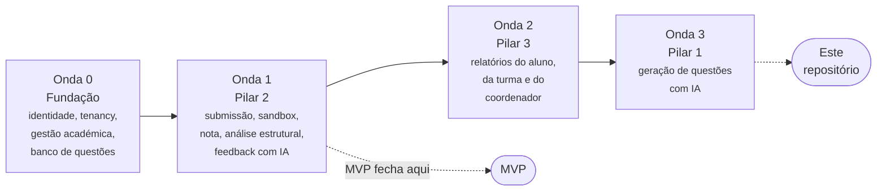
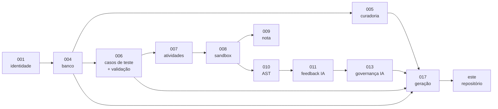

# Roadmap e enquadramento

Dezanove épicos distribuídos por quatro ondas. Este repositório prototipa o EPIC-017, que está na última — e fora do MVP. Esta página explica porquê, e o que isso significa para quem trabalha neste código.

## As quatro ondas

| Onda | Conteúdo | Resultado |
| --- | --- | --- |
| **0 — Fundação** | EPIC-001 a 007, 018, 019 | Uma turma real existe na plataforma, com questões válidas publicadas |
| **1 — Pilar 2** | EPIC-008 a 013 | **MVP.** O aluno submete, recebe nota determinística e feedback; o professor vê resultados |
| **2 — Pilar 3** | EPIC-014 a 016 | O professor decide a aula seguinte com base em dados |
| **3 — Pilar 1** | EPIC-017 | O acervo cresce com apoio de IA |

!!! quote "O MVP numa frase"
    Uma turma real de 120 alunos consegue, durante um semestre inteiro, resolver questões de C publicadas pelo professor, receber nota determinística e explicável e feedback pedagógico que não entrega a resposta — e o professor consegue ver o resultado de todos sem abrir código um a um.

Nada além disso precisa de existir no v1.

## Onde este repositório se situa

!!! danger "EPIC-017 está fora do MVP"
    A geração de questões com IA é o **último** épico da **última** onda. No recorte do MVP, é substituída por **EPIC-005 — Curadoria e importação em lote**, que resolve a mesma dor do professor — ter questões suficientes — com risco muito menor.

    Este repositório é, portanto, um **protótipo antecipado** de trabalho planeado para depois do MVP. Não está no caminho crítico e nada na Onda 0 ou 1 depende dele.

### As três razões do adiamento

| Razão | Detalhe |
| --- | --- |
| **Depende de acervo** | A geração ancorada exige questões de referência. Uma regra explícita: a geração só é habilitada para combinações de conteúdo × nível com **pelo menos 8 questões aprovadas** de referência |
| **É o mais tolerante a erro** | Tem um humano no portão de aprovação, ao contrário da nota, que chega ao aluno diretamente |
| **Depende de outros épicos** | EPIC-004 (banco), 005 (curadoria), 006 (casos de teste e validação) e 013 (governança de IA) são todos pré-requisitos |

### O grafo de dependências

Os quatro pré-requisitos do EPIC-017 — banco, curadoria, casos de teste com validação, e governança de IA — **nenhum existe neste código**. O protótipo cobre a etapa final da cadeia sem nenhuma das anteriores.

## O que o EPIC-017 exige

A definição do épico, confrontada com o que este repositório faz:

| Requisito do EPIC-017 | Neste protótipo |
| --- | --- |
| Parametrização (linguagem, conteúdo, nível, estruturas, objetivo, perfil da turma) | :material-check-circle:{ style="color:#1a7f5a" } **Parcial** — estruturas e nível existem; linguagem, conteúdo e perfil não |
| Recuperação de questões similares como referência | :material-close-circle:{ style="color:#b3261e" } Não existe acervo |
| Geração de enunciado + solução + casos de teste | :material-check-circle:{ style="color:#1a7f5a" } **Sim** — é o núcleo do protótipo |
| Validação automática obrigatória antes de exibir ao professor | :material-alert-circle:{ style="color:#c07000" } **Parcial** — compila e executa, mas não verifica as restrições declaradas |
| Alerta de similaridade com o acervo | :material-close-circle:{ style="color:#b3261e" } Não |
| Fluxo revisar → editar → aprovar | :material-close-circle:{ style="color:#b3261e" } Exporta diretamente para XML |
| Regra aprovador ≠ solicitante | :material-close-circle:{ style="color:#b3261e" } Não há noção de utilizador |
| Rastreabilidade completa | :material-close-circle:{ style="color:#b3261e" } Sem registo de modelo, versão de prompt ou custo |
| Habilitação por cobertura mínima de 8 questões | :material-close-circle:{ style="color:#b3261e" } Não |

Detalhe de cada linha em [Análise de lacunas](gap-analysis.md).

## O que este protótipo já valida

Ser um protótipo fora do caminho crítico não o torna inútil. Duas coisas concretas:

-   :material-flask-outline: **A hipótese H7, de forma barata**

    ---

    *"A IA reproduz o padrão pedagógico do banco de referência."* Os documentos recomendam explicitamente um **teste manual barato** — gerar ~10 questões e submetê-las a avaliação cega do professor. Não exige produto; exige uma tarde.

    Este código é exatamente o instrumento desse teste, com uma ressalva importante: gera **sem** banco de referência, pelo que valida a viabilidade da geração, não a ancoragem no acervo.

-   :material-check-decagram-outline: **A validação por execução**

    ---

    Que se pode obter saídas esperadas fiáveis compilando e executando a solução, em vez de perguntar ao modelo. É o mesmo princípio da FEAT-024 e antecipa o desenho da camada C1.

!!! tip "O valor imediato é independente da plataforma"
    Enquanto as ondas 0 a 2 não existirem, este serviço produz questões importáveis num Moodle CodeRunner que já esteja em uso. É entrega de valor real a um professor, hoje, sem depender de nada do roadmap.

    O que **não** deve acontecer é confundir esse valor com a maturidade que o EPIC-017 exigirá.

## O que acontece a este código

Três destinos possíveis, e os documentos não fecham a questão:

| Destino | Quando faz sentido |
| --- | --- |
| **Ferramenta autónoma, mantida à parte** | Se o valor de exportar para Moodle sobreviver à plataforma. Mantém-se pequeno e desacoplado |
| **Base do EPIC-017** | Se, na Onda 3, o pipeline for absorvido: prompts e etapas reaproveitados, exportação Moodle substituída por escrita no banco de questões |
| **Descartado** | Se, chegada a Onda 3, a plataforma tiver evoluído ao ponto de reescrever sair mais barato que adaptar |

!!! warning "A decisão não precisa de ser tomada agora — mas o acoplamento sim"
    Independentemente do destino, uma escolha de hoje afeta os três: **manter os prompts e as etapas de geração separados da exportação Moodle**. Os prompts são o ativo transferível; o exportador XML é o que quase de certeza será descartado.

    A separação já existe na estrutura atual — `services/moodle.py` é o único módulo que conhece o formato Moodle. Preservá-la é barato agora e caro depois. Ver [Estrutura do projeto](../development/project-structure.md).

## Ordem de sacrifício

Se o prazo apertar, os documentos definem o que cortar primeiro. Vale conhecê-la, porque delimita o que **nunca** se corta:

!!! danger "Nunca cortar"
    | Feature | Porquê |
    | --- | --- |
    | **FEAT-024** — Validação automática da questão | Uma questão sem solução válida reprova alunos certos |
    | **FEAT-033** — Isolamento da execução | Execução de código não confiável sem sandbox |
    | **FEAT-040** — Verificação de escopo | O aluno perde ponto por estrutura que não usou |
    | **FEAT-045** — Ancoragem do feedback | Feedback inventado |
    | **FEAT-047** — Filtro anti-solução | A IA entrega a resposta ao aluno |
    | **FEAT-058** — Degradação sem IA | A indisponibilidade do provedor derruba a nota |
    | **FEAT-061/062** — Menores e minimização | Ilegalidade |

    Cada uma, se cortada, produz uma falha que o utilizador interpreta como **injustiça, insegurança ou ilegalidade** — não como funcionalidade ausente.

Três destas tocam este repositório: **FEAT-024** (parcialmente cumprida), **FEAT-033** (ausente) e **FEAT-040** (ausente). Ver [Análise de lacunas](gap-analysis.md).

## Critérios de saída do MVP

Doze critérios verificáveis fecham o MVP. Estes são os que um futuro EPIC-017 herda:

| # | Critério | Meta |
| --- | --- | --- |
| 1 | Reprodutibilidade da nota | 200 submissões reexecutadas, nota idêntica em 100% |
| 2 | Precisão da verificação de escopo | Zero falsos positivos num conjunto adversarial |
| 7 | Segurança de execução | Bateria de código malicioso contida em 100% dos casos |
| 12 | Acervo | ≥ 8 questões aprovadas por combinação eixo × nível nos eixos E1–E4 |

!!! note "O critério 12 é o que habilita este épico"
    Oito questões por combinação é exatamente o limiar que liga a geração por IA. Até lá, o EPIC-017 não pode ser ativado para essa combinação — e a interface deve mostrar ao professor **quantas faltam**, transformando o *cold start* numa barra de progresso em vez de num resultado mau.
